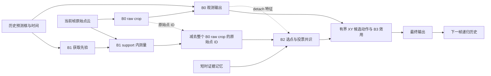

# CT-SeqTrack v29 面向涨分的代码审计

日期：2026-09-14。审计代码：`525eb54`（2026-09-11）。

本次核对当前 v29 / v29 perf 的数据读取、采样、短 roll-in、B0 前向与监督、B1 获取、B2 证据与共识、B3 效用及闭环校准、优化器事务、mini/full 配置。生产代码和历史 output 均未修改；诊断脚本、输出及本报告仅写入本目录。

## 核心判断

当前最值得投入的方向是提高整条纠错链的有效率：**先让 B0 学到正确的有效测量，再让 B1 真正拿到裁剪外目标，让 B2 从已取得的测量中选出正确模式，最后让 B3 识别值得执行的恢复动作。**

已经复现四类算法/监督问题：B0 无效槽参与真实监督、B2 共识重复奖励点数、B2 种子遗漏真正共识、B3 阈值预筛遗漏闭环更优策略。另外确认 B1 的局部几何覆盖瓶颈和 B3 的一步指标恢复死区。它们比立即增大 hidden dimension、更换时间后端或增添模块更值得优先处理。

| 优先级 | 问题 | 当前证据 | 建议投入 |
|---|---|---|---|
| P0 | B0 空测量/缺失历史仍参与 Seg、BC 监督及上游特征聚合 | 真实 sampler、host loss 和梯度已复现 | 先修有效监督，随后修聚合语义 |
| P0 | B1 默认 support 可完全落在 B0 raw crop 内 | 真实几何函数已复现；v28 有历史供给不足证据 | 让范围相对实际 B0 边界定义，统计恢复需求 |
| P0 | B2 共识偏向密集低分背景、种子被孤立误检占满 | 两个真实函数反例；两个候选规则分别消除反例 | 小修改、零新增网络参数，最适合先做对照 |
| P1 | margin loss 的无需求样本占比可压过稀有恢复需求 | 真实 loss 的条件性混合分布反例 | 按需求分别归约，保留负例 |
| P1 | B3 H1 标签对较远但有用的恢复动作无信号 | 真实指标函数与合法半径联合反例 | 连续几何目标 / 明确未来效用，评估执行目标 |
| P1 | B3 按 never 轨迹 mask 去重阈值不保持闭环等价 | 真实校准函数的确定性反例 | 数值去重、少量闭环粗搜再细化 |
| P1 | 最多三步 B0 roll-in 对长时间漂移覆盖有限 | 当前输入构造和递归分布确认 | 少量更长窗口 / 困难状态采样 |
| P2 | aux 整云读取、H3 抽样晚、线性轨迹索引 | 输出等价专项、调用计数、局部微基准 | 节约 full 训练与后续实验时间 |

这里的优先级是代码审计判断。反例证明失败方式存在；本轮没有真实 v29 nuScenes 点云/CUDA实验，因此没有把反例大小换算成实际 S/P 损失或收益。

## 1. 当前实际数据通路与耦合

### 推理链

B0 的点采样预算为每帧 1024，使用 3 个历史帧。B1 学相对物理运动与获取 margin；B2 的新增测量通过原始 ID 排除整个 B0 raw crop，而不只是 B0 抽样到的 1024 点。证据 pool 768，selected 256，配额为 relation 128 / spatial 96 / exploration 32。B2 读取 B0 第二层 64 维分割特征的 detach 版本，短记忆保留过去的证据。B3 基于 observation 和 B2 raw proposal 形成有界 XY 修正，预测即时 S/P 增益，q 为二者均值。

### 训练链

观测流在四候选总体上 shuffle/drop_last；原请求 candidate0 走 teacher，candidate1–3 使用当前 B0 的短 roll-in。局部起点为 `max(0,t-4)`，最多三步 `eval + no_grad + observation-only` 预测历史，端点一次有梯度前向。teacher 重抽保持原分支语义，因此请求比例不能直接当作实际干净历史比例。

机制流覆盖全部非首帧端点，以 never / always / threshold0 / threshold0 的轨迹哈希行为生成递归状态。其 accepted 历史进入后续机制输入；共享 B0 观测训练流仍独立。机制调用 B0 时使用 eval/no_grad，B1、B2、B3 各自损失学习。单个 Adam 管理互不重叠的参数组，detach/BN 隔离并不等于冻结。

本轮未发现最终输出被 observation 意外覆盖、B3 根本不执行、所有合法候选被 presence 硬门屏蔽、当前/未来 GT 灌回部署历史、B2 raw ID 未排除完整 B0 crop 等接线错误。也没有发现 full 仍被限制为 mini 的固定更新步数。

源码入口：`main.py:856`、`:980`；`utils/dual_stream.py:82`；`utils/v29_rollin.py:30`、`:138`；`models/seqtrack3d.py:3374`、`:8939`；`utils/v29_policy.py`。

## 2. B0：有效性信息没有贯穿监督和特征提取

### 2.1 空当前帧被当成 1024 个前景点监督

`datasets/sampler.py:1574` 在 regularization 后的点数组上计算 `seg_label_this`。零点输入会填零；当原点落在 GT 框内，1024 个零槽全被赋成前景。`models/ct_v2/observation_reference.py:7`、`:38` 的 CE 不读取 `b0_point_valid_mask`。`:65` 的 BC SmoothL1 同样对全部槽归约。

真实 v29 sampler 的合成输入实测：

| 量 | 结果 |
|---|---:|
| 当前 raw 点数 | 0 |
| 当前有效槽数 | 0 |
| 当前前景监督槽数 | 1024 |
| 当前 BC 目标平均值 | 2.231738 |
| 当前 Seg 输出收到的梯度绝对值和 | 0.046694 |
| 当前 BC 输出收到的梯度绝对值和 | 0.224263 |

这不是只影响日志：真实 host 的 B0 loss 确实向这些无效输出反传。若原点在 GT 外，它们可能变成 1024 个背景标签，仍然是不存在测量的监督。

建议先让 Seg/BC loss 使用真实点有效性，并将缺失历史共同排除；加权 CE 的分母为有效标签的类别权重和，BC 按有效测量归约。保留现有三维 log_softmax→二维 NLL 的确定性修复，不恢复曾在 CUDA 上出错的空间 NLL mean。

这里要区分“有效”与“唯一”：1/2 个真实点的重复补槽仍源于真实测量；第一步不必把全部重复槽也忽略，避免同时改变点数权重和有效性语义。先修空测量与缺失帧，再独立评估 unique-aware weighting。

历史 ref loss 也对全部历史位置取 mean（`observation_reference.py:43`）。即使无效 query 的预测已经被 mask，分母仍包含它们，会稀释有效历史监督；应按有效历史归约。

### 2.2 Transformer mask 之前已经发生缺失历史混入

`sampler.py:2191` 把缺失历史的 ID/valid/unique 置空，但对应 XYZ 仍可保存复制的首帧点。`models/seqtrack3d.py:3542` 先经过 SegPointNet，`:3880` 才传 attention 可见性。Seg/Mini 网络存在全序列池化和普通 BatchNorm。

保持历史 mask `[1,0,0]` 和有效测量不变，只改变缺失历史槽的 XYZ/BC：

- eval 当前帧分割 logits 最大变化 0.009384；该随机初始化案例的 eval 最终框变化为 0，不能据此声称已复现 eval 框漂移。
- 两份相同模型、相同训练 RNG 下，training observation box 最大变化 0.462939。

这证明缺失槽仍会影响有效输出/训练特征。BatchNorm1d 对 `(N,L)` 聚合统计，上游混入不会被后续 attention mask 自动消除。[PyTorch BatchNorm1d 文档](https://docs.pytorch.org/docs/stable/generated/torch.nn.modules.batchnorm.BatchNorm1d.html)

建议第二步将有效性提前至 Seg/Mini/FeaturePointNet 的聚合边界：全无效样本返回明确零特征，有效池化屏蔽无效槽，并处理 BN 的无效统计贡献。不要只把 XYZ 置零后便声称解决，也不建议未经对照直接全网 BN→LN/GN。

证据：[监督](empty_current_supervision.json)、[梯度](empty_current_gradients.json)、[无效历史影响](invalid_history_influence.json)、[诊断脚本](test_b0_probes.py)。

## 3. B1：搜索范围需要相对实际 B0 裁剪边界定义

### 3.1 默认 XY support 不一定产生新测量

生产几何函数的静止、朝向一致、wlh=(2,4,2)m Car 案例：

| 范围 | XY 半尺寸 |
|---|---|
| 实际 B0 raw crop | (4.5, 3.25)m |
| 初始化 margin≈(2.04,1.02) 的 B1 support | (4.04, 2.02)m |
| 最大 margin=(6,3) 的 B1 support | (8,4)m |

初始 support 在 XY 完全被 B0 crop 包含。减去 B0 所有 raw ID 后，新增集合自然为空；最大横向搜索也只比 B0 多 0.75m。当前 corridor 对 stationary 历史直接返回空。

真实函数进一步确认：crop 外目标点 `(0,3.5,0)` 在最大 support 内，但初始取不到，需要横向 margin 2.75；`(0,4.01,0)` 即使最大 margin 也取不到。这是特定低运动/横向漂移的可复现瓶颈，不能外推为所有旋转与运动状态的统一上限。

源码：`datasets/sampler.py:850`；`utils/ct_search.py:494`、`:1304`、`:1590`；`utils/acquisition_v29.py`。

建议将获取范围表示为“实际 B0 crop 在获取坐标系中的投影边界 + 有界新增带”，方向和新增带宽度由 B1 调节。这样 extension 的物理含义直接对齐新增测量。较小的对照是低质量/空 crop 时启用有限备用环带，或者单独提高最小横向 margin；保持 768→256 预算和原始 ID 排除不变。

已有 v28 报告记录 192/2179 个预测帧存在 crop 外目标机会、22715 个 novel 目标点，进入 support 的只有 4 点。这是历史版本证据；v29 已修 Z 包络，但 XY 特例表明“Z 修好”不等于获取供给问题全部消失。

### 3.2 无需求行的最小 margin 标签会影响稀有恢复状态

`utils/acquisition_v29.py:132` 将无 novel 目标的合法行设为最小 margin；`models/ct_v2/motion.py:256` 使用 q=.9 pinball。假设某组输入难以区分，91% 无需求标签为 (2,1)，9% 恢复标签为 (4,2.75)，真实 loss 为：

| 恒定预测 | loss |
|---|---:|
| (2,1) | 0.151875 |
| (3,2) | 0.161875 |
| (4,2.75) | 0.170625 |

中间值处两轴梯度均为 +0.005，优化方向为缩小范围。总体需求占比低不能证明网络必然坍缩，关键是条件需求率和输入是否可分；但当前目标确实存在这种压力。

建议对“最大范围内有 novel 目标”与“无需求”分别归约再配权，保留负例控制背景成本；将真正可达但漏取的恢复行提高训练权重。按 reachable→support→pool→selected 四级统计目标保留率，优先修最早丢失的一层。

证据：[B1/B2 诊断输出](b1b2/probe_results.json)、[脚本](b1b2/probe_b1b2.py)。

## 4. B2：两个可以先做小改动对照的共识问题

### 4.1 模式分数重复奖励点数

`models/ct_v2/evidence_memory.py:543` 的当前排名分数为：

`normalized_targetness_mass × unweighted_inlier_ratio × exp(-trace(covariance))`

第一项已经包含加权支持量，第二项又奖励未加权点数。真实函数反例：

- 5 个正确目标 votes 全在 (0,0)，每点 .9，质量合计 4.5。
- 100 个背景 votes 全在 (5,0)，每点 .02，质量合计 2。
- 当前实现选择 100 点背景模式，中心错误 5m。

在该构造中，raw 回归对正确 votes 的梯度为 0，对背景 votes 的梯度范数 .05，targetness 梯度约 1.8e-15。结合 `seqtrack3d.py:5386` 只要 selected 含目标便启用该行 raw 回归，说明训练可以在修错误模式的 vote 位置，而未直接修正模式排名。

候选规则：排名只使用 `normalized_mass × exp(-trace(covariance))`，inlier ratio 留作诊断/B3 特征。在诊断函数副本中仅去掉这一个乘子，输出立即回到正确 5 点模式。

### 4.2 K=3 的 seed 被高分孤立误检占满

`evidence_memory.py:502` 按单点 targetness 排序，使用 0.75m seed 间距取三个候选。

反例：三个孤立误检的分数为 .99/.98/.97，votes 在 5/7/9m；20 个正确目标 votes 全在 0m、每点 .9。目标总质量 18，误检只有 2.94，但三个 seed 全落在误检，20 点完美目标共识未被计算。

候选规则：以每个 vote 周围 1m 内的 targetness 总质量给 seed 排名，再沿用 K=3 和空间 NMS。诊断中仅改 seed 排序便选中 20 点正确模式。256 点最多 65536 对距离，可分块实现；不增加网络参数和最终假设预算。

这两项应分别做对照，再合并。它们消除了已知反例，但具体局部质量定义、尺度和真实收益仍由现有点云上的 mode recall、raw error 和闭环 S/P 决定。

## 5. B3：当前目标偏向即时微调，难以学习多步恢复

### 5.1 H1 离散指标与动作限幅产生恢复死区

当前 `r=min(0.5+0.5dt,2)`，dt=.5s 时 r=.75m；动作只改 XY。Precision 的有效距离范围到 2m。起始中心误差大于 2.75m 时，任何合法单步动作都无法获得 Precision 正增益；若修正前后 IoU 都为 0，Success 增益也为 0。

真实指标函数实测：

| 修正前后 | ΔS | ΔP |
|---|---:|---:|
| 无重叠，3m→2.25m | 0 | 0 |
| 无重叠，2.01m→1.99m | 0 | .025 |

因此较大几何改善可能没有 help 标签，2cm 跨阈值改善却有。落在同一离散区间的变化也不被区分。这是目标信息缺失，不是 MSE 反传代码写错。v29 的 H3 仅诊断，不会提供长期恢复监督。

建议先统计 `H1=0 但几何误差明显下降` 的合法动作占比，按误差、限幅饱和、可达性分层。随后增加独立连续几何改善目标，或明确的未来恢复价值头。若执行仍只看原 H1 q，单独增加辅助 loss 不能彻底解决接受多步恢复动作的问题；执行分数也需要明确表达未来价值。半径可再根据证据质量与不确定性调整，不宜只全局放大上限。

源码：`utils/tracking_metrics_v27.py:12`、`:28`；`utils/v27_training.py:43`、`:69`、`:88`；`models/ct_v2/action_v27.py:11`。

### 5.2 校准预筛会删掉闭环不等价的阈值

`utils/action_calibration_v27.py:229` 先在 never 轨迹取 41 个 q 分位阈值，按 action mask 的 bytes 去重，再按 one-step 排名最多保留 3 个阈值。后面的闭环重跑是真的，但前面的 mask 等价并不成立。

真实筛选/拟合函数的四帧合成系统：

| 策略 | 完整闭环 U |
|---|---:|
| never | 62.5 |
| always | 45 |
| 保留的 tau=.2 | 45 |
| 被删掉的 tau=.5 | 75 |

.2 和 .5 在 never 路径上的 mask 相同；执行首个动作后，下一帧 q=.4，两策略行为分化。因而不能以 never mask 相同证明闭环等价。表内数字是反例系统分数，不是 nuScenes 成绩。

建议只按阈值数值去重，采用少量阈值实际闭环粗搜，再局部细化。若保留最多三个的计算预算，至少覆盖 0 和不同分位区间，而不全靠 one-step 最前几名。此项可优先利用现有 checkpoint 比较策略，但改动后需要重新生成匹配的策略产物。

证据：[B3 诊断输出](b3/diagnostic_results.json)、[脚本](b3/diagnose_b3.py)。

## 6. mini/full 参数适配判断

nuScenes mini 与 full 采用相同传感器和 2Hz 标注关键帧协议，因此物理时间尺度不随训练集大小改变。项目使用 LIDAR_TOP 对应的同实例 annotation 链，不能把 `key_frame_only=False` 理解成已经使用 20Hz sweeps。[官方 schema](https://github.com/nutonomy/nuscenes-devkit/blob/master/docs/schema_nuscenes.md#sample)

full 的 350 train_track / 150 val 接线正确；350 是登记的跟踪训练半集，不能在论文中笼统写成使用全部 700 个训练场景。[官方 splits](https://github.com/nutonomy/nuscenes-devkit/blob/master/python-sdk/nuscenes/utils/splits.py)

| 参数/维度 | 当前配置 | 判断与优化依据 |
|---|---|---|
| 时间 | real time；B1 time_scale/default_dt=.5s | mini/full 可共用；B0 主干仍是 order 时间编码 |
| 历史 | hist_num=3，约1.5s | 合理共同基线；长遮挡/漂移支持不随数据量自动增加 |
| roll-in | 最多3步，局部 t-4 起点 | 可考虑少量8–12步窗口或困难状态重采样，与当前共享观测语义一起设计 |
| B0 点预算 | 1024/帧 | 先修空槽/无效历史，不能用增加点数解决无测量问题 |
| B2 预算 | 768→256；128/96/32 | 先修获取和共识；只有真实目标已进入 pool 却被丢掉才优先调配额 |
| B1 宽度 | hidden128 / step64 | 当前没有容量不够的证据；先修需求标签和几何覆盖 |
| 获取 margin | [2,1]→[6,3]m | 物理范围应按目标类别和漂移分布检验；Car XY 已有具体不足例 |
| B3 半径 | dt=.5时 .75m，上限2m | 参数与恢复任务有实质耦合，结合效用目标和证据质量调整 |
| 优化 | batch16；60epoch；LR每20epoch×.1 | full 更新更多是自然曝光，不自动意味着 LR 错；以训练/闭环曲线及有效事务数决定 |
| 读取 | workers4，不preload | 优先修无效 IO，再按资源调并发和有界缓存 |

本轮构造真实 v29 网络并统计参数：

| 参数组 | Full-CfC | Full-GRU |
|---|---:|---:|
| B0 | 3,704,085 | 3,704,085 |
| B1 | 102,191 | 102,150 |
| B2 | 116,166 | 116,166 |
| B3 | 9,124 | 9,124 |
| 合计 | 3,931,566 | 3,931,525 |

B0 单独为 3,704,085。两种 Full 只差 41 个参数；CfC 插件合计约占 B0 参数量的 6.14%。mini/full 沿用这些宽度是合理基线，当前没有据此扩大网络的优先理由。详见 [参数清单](parameter_inventory.json)。

当前只登记 v29 full YAML，不能只替换数据根便运行 mini；需要同步 version、scene splits 和 mini 预期步数。内存配置修改后，设置 `ct_v28_expected_mini_car_updates_per_epoch=1262`，三臂真实合同校验均可通过：v29 不是代码硬性 full-only，但目前缺正式 mini 配置文件。

主观测 epoch 自然长度约为 `4F//16`，机制端点为所有非首帧，约 `F-K`（F 总帧数、K 轨迹数）；完整机制流均匀嵌入观测 epoch。full 不会因仍沿用 mini 常数而只训练小段数据，也不应按场景数量倍数直接缩放模块 loss。

## 7. 状态分布与优化目标仍有可改善空间

短 roll-in 已显著改变 teacher-only 的输入方式，但局部最多三步主要覆盖短时误差。真实部署会积累长时间共同偏移，而 B1 的相对运动输入无法唯一识别共同绝对偏移。扩大到 full 增加样本多样性，却不会自动延长递归状态覆盖。

建议先分 teacher/roll-in、当前真实点数0/1/2/3+、合法历史数、相对初始化累计误差记录有效损失与恢复成功率。若后段误差分布明显超出训练，再对小比例样本增加更长 roll-in 或时间相关的困难扰动，不必一开始把所有样本的窗口都加长。

现有 detach 是可解释的模块所有权设计，不建议为了“端到端”一次全部解除。下游得分不能直接修复不可达证据和错误模式选拔；先改善各模块可学习的目标、正负样本构成与共享状态覆盖，再评估是否需要更深的联合优化。

## 8. full 上可直接节省时间的三处 IO/索引问题

1. **B1 aux 历史只消费 bbox 和时间，却加载完整点云。** `sampler.py:2816` 每普通 Full 机制行额外读取3幅整云；消费者 `:649` 只读 metadata。真实 v29 perf sampler 删除 aux 的全部 pc 后，所有输出逐项一致。普通 perf 行的整云调用可从7降至4。
2. **H3 的10%采样判定发生在未来点云已读完之后。** `sampler.py:2831` 对所有 scheduled 事件构建未来 raw，`v27_training.py:138` 才筛选。应把同一稳定 hash 判定前移，保留 scheduled/not_sampled/future_exists 语义，跳过未采集事件的未来 IO/IPC。
3. **轨迹定位为线性扫描。** `sampler.py:2650` 可用已有累计边界的 bisect 等价替换。4000次、合成10000轨迹查询从2023ms降至1.88ms，索引一致；这只是局部微基准，不能当训练加速比。

后续可按 sample_data token 建有界只读整云缓存，保留原点顺序和 ID；不要直接用按轨迹重复全量 preloading 替代。详细依据、调用计数和 mini 配置验证见 [数据专项报告](data/REPORT.md)。

## 9. 建议执行顺序

**第一批：低成本、可明确定位的修改。** B0 有效 Seg/BC/ref 监督；B2 去重复点数乘子；B2 局部加权 seed；B3 数值去重及闭环阈值搜索。B0 修改在三臂共享；B2 两条规则分别检查后合并。IO 等价优化独立处理。

**第二批：恢复供给。** 在第一批共识规则基础上，对比实际 B0 边界外的有界新增带，以及按恢复需求平衡的 margin 目标。主要中间指标为 crop 外目标可达率、support recall、selected target recall、raw proposal 几何误差，最终仍看闭环 S/P。

**第三批：恢复决策与训练状态。** 连续几何/未来效用、证据条件动作半径、少量更长 roll-in。先判断是哪一类样本被 H1 零标签或短状态窗口压制，再增加相应目标与计算。

三臂长跑适合回答最终系统和时间后端比较，小修改阶段应使用同一代表性数据子集和固定预算识别有效方向，避免每一个开关都先消耗三套完整60轮。mini 用于快速检查与筛选；其两场景验证和已有 seed 波动使它不足以单独决定 full 最终参数。已有运行的日志/checkpoint 可用于只读诊断，不需要为了本报告停止或重启它们。

## 10. 本轮验证记录

- B0 三项真实 sampler/模型/梯度诊断：`python -m pytest -q -s artifacts/ct_checks/20260914_code_audit/test_b0_probes.py`，当时文件含3项，3 passed，7.40s。
- 随后新增参数统计，单独运行 `.../test_b0_probes.py::test_parameter_inventory`，1 passed，2.59s。
- aux metadata 等价专项：`python -m pytest -q artifacts/ct_checks/20260914_code_audit/data/test_aux_metadata_equivalence.py`，1 passed，2.98s。
- B1/B2 真实函数反例及候选规则对照脚本执行成功，输出在 `b1b2/probe_results.json`。
- B3 真实指标与校准函数反例脚本执行成功，输出在 `b3/diagnostic_results.json`。
- 数据读取计数、线性索引/bisect等价微基准、三臂 mini 配置合同检查已执行，详见 data 子目录。

以上为 CPU 合成诊断和只读代码核对。没有运行全量回归或服务器训练，没有修改正式 YAML、模型实现、历史结果或冻结参考，也没有把历史测试数累加成新的全量通过数。
