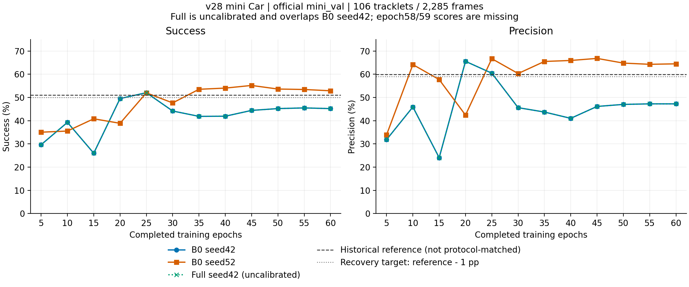

# v28 mini 三组实验分析与下一步判断

分析日期：2026-09-10。读取 `output/20260909-003318-28_*` 三组原始结果，未修改训练代码、checkpoint 或原始输出。

**结论：训练工程已跑通，B0 已能达到历史健康分数，但尚未稳定恢复；现在适合补评、校准和定位，不建议直接铺开完整 nuScenes 五类的大规模论文实验。** B0 seed52 达到预定健康点估计目标，最初固定的 seed42 仍明显不足；不能挑 seed52 或中途最佳轮次替代原定验收。Full 已完成插件训练，但当前分数来自未校准的 B0 回退，尚不能判断选择策略的实际收益。

## 1. 最终分数与恢复判断

以下是第60轮、官方 mini_val 的完整闭环结果，S/P 均以百分数表示，差值为百分点。

| 运行 | Success | Precision | 相对历史参照 ΔS | 相对历史参照 ΔP | 本次判断 |
| --- | ---: | ---: | ---: | ---: | --- |
| 历史健康 SeqTrack（20260528） | 50.986 | 59.962 | — | — | 预先登记的健康参照，非完全匹配对照 |
| B0 seed42 | **45.200** | **47.243** | **−5.786** | **−12.719** | 未达到 S≥49.986 且 P≥58.962 |
| B0 seed52 | **52.876** | **64.478** | **+1.891** | **+4.516** | final 达到健康数值目标 |
| Full seed42，未校准 | **45.200** | **47.243** | −5.786 | −12.719 | 实际为 observation fallback，不能视为已评估 Full 策略 |

两组 B0 相差 **7.676 / 17.235 个百分点**。两 seed 算术均值为49.038/55.861，仅用于描述，不能替代分别验收。两个训练 seed 也不足以给出可靠的种子方差估计或稳定性保证。

历史参照同属 mini_train 八场景和官方 mini_val、60轮/75720更新，但历史实现存在尺寸输入及执行路径等差异。因此 seed52 超过历史数字不等于已证明公平算法增益，seed42未达恢复目标也不单独证明仍有某个实现bug。当前 `28_seqtrack_reference.yaml` 直接继承 B0，只有实验标签差异；不能把再次运行这份共享实现当作独立原 SeqTrack 的算法对照。严格“差距≤1分”仍需独立、协议匹配且健康的参考实现。具体边界见 [协议复核](protocol_review.md)。

**late-3 尚缺。** 三组均保存了58/59/60 checkpoint，但目前只有5/10/…/60的验证结果，58和59没有独立评测。不能用50/55/60代替，也不能从checkpoint文件存在推断late-3已达标。固定 final 的 seed42 已失败，缺少 late-3 不会使当前结果自动变成通过。

## 2. 本次实验是否真的正常完成

三组日志均有 `Trainer.fit stopped: max_epochs=60 reached`，没有发现本次运行中的 Traceback/RuntimeError。checkpoint 与训练日志交叉证明：

- 每组自然展开20204候选样本，batch16、drop_last尾部12行；每轮1262个观测更新，总计 **75720**。
- 58/59/60的全局更新分别为73196/74458/75720，完整epoch边界标记为真。
- 都是scratch，初始化/恢复checkpoint为空，没有冻结参数。B0两个seed的Adam参数均完成75720步。
- 运行提交为`749bc13`，两次CUDA修复均已包含；环境实记Python3.9.19、PyTorch2.0.1+cu118、Lightning2.0.2、CUDA11.8、cuDNN8700、A40、驱动535.247.01。严格确定性仍开启，未使用warn_only。

这证明此前 CE 和 AP 两个显式 CUDA 阻断已在本次完整训练路径中解决。它不能替代独立的同卡重复运行与epoch边界恢复对照，也不能证明历史低分是CUDA非确定性造成的。

实际参数训练为8个mini_train场景、274条轨迹/5051帧；实际验证为 **scene-0103、scene-0916，106条轨迹/2285帧**，含106个初始化帧及2179个预测帧。汇总脚本对全部36份逐帧CSV重算S/P、检查每条轨迹帧号连续及首帧仅出现一次，与对应JSON一致。

`dev_diagnostics/`、TensorBoard的`success/dev`和CSV的`partition=dev`是旧标签；根据运行provenance，本次确实是官方mini_val，不能和v27内部dev混淆。CSV的`scene_id`全为`unknown`，使summary记成`scenes=1`；这是元信息缺口，不是真只评了一个场景。整体/逐轨迹分数可复核，但不能据此做可信的逐场景拆分。以后补评应修正日志元信息或导出可信映射，保留这些原始文件。

## 3. B0 的剩余问题体现在哪里

图中每个点都是实际每5轮验证，无平滑或推算。历史线只是健康参照；58/59缺失，未画出虚构评测。数据见 [validation_curve.csv](validation_curve.csv)，矢量图见 [PDF](validation_curve.pdf)。

| 完成轮次 | seed42 S/P | seed52 S/P |
| --- | --- | --- |
| 20 | 49.533 / 65.557 | 38.872 / 42.405 |
| 25 | 52.043 / 60.449 | 51.988 / 66.696 |
| 30 | 44.170 / 45.606 | 47.653 / 60.301 |
| 50 | 45.209 / 47.007 | 53.625 / 64.798 |
| 55 | 45.496 / 47.248 | 53.434 / 64.274 |
| 60 | 45.200 / 47.243 | 52.876 / 64.478 |

seed42在第25轮曾达到健康区间，但随后下降，第50/55/60轮都稳定在约45/47。问题不是最后一轮的单次偶发低分；也说明网络并非完全无法学到健康表现。不能通过选25轮或延长训练掩盖原定60轮结果。

四项训练损失（total、seg、BC、motion classification）各75720条均有限。两组末轮total平均 **0.225643 / 0.226455**，几乎相同；seed42训练损失继续降低，闭环跟踪却退化。现有证据更支持继续检查种子相关的优化轨迹、训练泛化和递归误差，而不是简单的loss爆炸。仅两个seed、又分配在不同物理卡，不能把全部差异严格归因于某个单一随机源；也没有证据要求再次随意改Adam或关闭确定性。

| 第60轮诊断（不含初始化，除轨迹计数外） | seed42 | seed52 |
| --- | ---: | ---: |
| 出现过 IoU<0.1 的轨迹 | 38/106 | 29/106 |
| 出现过 IoU=0 的轨迹 | 25/106 | 21/106 |
| 当前raw crop为空 | 178/2179（8.17%） | 167/2179（7.66%） |
| 当前raw crop≤2点 | 312/2179（14.32%） | 308/2179（14.13%） |
| 最长连续空crop | 33帧 | 16帧 |
| 中心距离中位数 | 1.053m | 0.480m |
| 中心距离>1m的预测帧 | 52.09% | 26.98% |
| 中心距离>2m的预测帧 | 23.54% | 15.60% |

两组空crop比例接近，不能独自解释17.235分Precision差。按相同tracklet/frame配对，seed52的Precision在77条轨迹上更好、20条更差、9条相同；差异不限于一条异常轨迹。贡献最大的10条改善轨迹合计贡献7.737个全局Precision百分点，完整贡献表见 [paired_tracklet_seed_deltas.csv](paired_tracklet_seed_deltas.csv)。各run的点数桶由各自闭环crop形成，不能把不同桶的均值差当成相同样本的因果分解。

空crop中发生失跟的段，两个seed均未在报告规定的后续窗口观测到重新达到IoU≥0.5；存在右删失，不能说永远无法恢复。具体首次失跟、稀疏桶和删失定义见 [B0复核](b0_review.md) / [完整提取JSON](b0_review.json)。

## 4. Full 说明了什么、还没有说明什么

**插件没有污染这次 B0 训练，是本次明确的正面证据。** Full与B0 seed42：

- 全部75720次观测事务的B0 loss逐值相同。Full额外记录18000条机制shadow B0 loss，比较时按global step选择真实观测记录，不能把93720条一股脑平均。
- 初始化、早期与各epoch共63组B0指纹一致；第60轮全部320个B0参数/BN张量逐位一致，236个B0参数对应的Adam状态也一致。
- 第60轮2285个端点的observation/final S/P、IoU、距离完全一致；12次验证的最终S/P曲线也重合。

Full的B1/B2/B3各完成 **18000个机制事务**，没有冻结阶段；首个非零插件损失在epoch0即出现。B2部分参数实际Adam步数17177，小于18000是条件梯度路径的记录，不能仅凭步数不同认定冻结。详细优化证据见 [Full复核](full_review.md)。

但是，所有验证都未加载B3校准策略，实际accepted动作 **0**。当前Full S/P只是B0回退，不能据此下结论“Full已经有提升”或“B3没有用”。需要各checkpoint独立内部校准，再做完整闭环验证。

此外，B2证据获取存在明显瓶颈，不能指望单靠阈值调节消除：

- 第60轮2179个预测帧中，567帧结构候选合法。
- 按当前B0轨迹，192帧存在crop外真实目标点，总计22715个新增目标点机会；support只在2帧获取到共4个新增目标点，微平均召回约 **0.0176%**。这4点均被后续pool/selected保留，本次瓶颈首先出现在获取阶段。
- 这只描述本次轨迹下的新增测量供给，不证明坐标/采样实现必然有bug；需区分本来就不缺测量的帧、失跟后的获取范围、候选先验偏移及筛选损失。
- B1物理位移平均误差0.212m（CV为0.254m），但递归endpoint平均误差仍为2.770m（CV为2.816m）。物理运动预测改善不等于能够消除既有递归漂移；需要按有新增测量机会的失败端点核对获取区域。
- 在同一B0当前状态上离线比较结构合法候选：bounded动作有益157帧、有害321帧；raw有益21、有害491（判定用记录的效用）。这说明当前有界动作也不能直接全接受。

| 同一B0状态上的逐帧输出汇总 | S | P |
| --- | ---: | ---: |
| observation / 当前accepted final | 45.200 | 47.243 |
| raw候选 | 36.065 | 38.044 |
| bounded候选 | 42.200 | 46.554 |

raw/bounded表只是当前状态的一步反事实汇总，**不是各自动作写入后重新递归的Full或Full−B3完整闭环成绩**。官方val上的这些诊断也不能用来拟合B3阈值。运行时记录包含GT sidecar诊断和共享采样开销，不能把表中的诊断吞吐率当成论文部署FPS。

## 5. 可以开始哪些后续工作

| 下一步 | 判断 | 目的 |
| --- | --- | --- |
| 用现有三组checkpoint补58/59，必要时同入口复核60 | **可以，优先** | 完成固定final/late-3，无需重训；不补造缺失分数。 |
| 对Full 58/59/60分别内部校准并固定策略后评官方mini_val | **可以，作为诊断** | 区分未启用策略与实际动作收益；calibration/dev与训练重叠需披露。 |
| 针对seed42的固定输入/梯度与闭环失跟定位；B1获取和B2新增目标漏斗核对 | **可以，优先于扩规模** | 同卡固定seed控制变量，查训练损失正常但递归表现退化，以及新增测量为何几乎取不到。 |
| 独立上游SeqTrack同协议包装与对照 | **需要补齐** | 同样首帧尺寸、样本与更新预算、评价器及数值设置；不直接重跑共享标签当独立参考。 |
| 直接启动完整nuScenes五类、全部模块和多seed大矩阵 | **目前不建议** | 固定seed42未达恢复目标，late-3/Full策略及证据供给问题尚未解释。 |

优先保留当前代码/配置/checkpoint作为v28已完成事实。若后续确认要修改B0或B2，应单独登记新版本、改动理由与对照，不覆写本轮结果、不冻结后换checkpoint，也不选择对当前官方val最有利的seed/epoch来宣布成功。

## 6. 可复核交付

- [final_metrics.csv](final_metrics.csv)：三组final60与历史差值，late-3缺失明确记空。
- [validation_curve.csv](validation_curve.csv)：36个实际验证点及逐条来源。
- [summary.json](summary.json)：分数、恢复指标、配对差异和判断。
- [source_manifest.json](source_manifest.json)：原始输入文件大小与SHA256；文件本身只读。
- [analyze_runs.py](analyze_runs.py)：重算全部CSV主指标、连续帧覆盖、配对差值并出图；无需运行模型或访问nuScenes原数据。
- [figure_manifest.json](figure_manifest.json)：图形定义、缺失值、处理方式及软件版本；非期刊格式认证。
- [B0专项](b0_review.md)、[Full专项](full_review.md)、[协议专项](protocol_review.md)：checkpoint/TensorBoard/协议独立复核。

本轮分析不修改生产代码，不启动新的服务器训练，不从checkpoint反推未评测分数。以前两次CUDA启动故障的历史记录继续保存在[排错文档](../../../../docs/CTSEQTRACK_V28_CUDA_TROUBLESHOOTING.md)，此次60轮完成证据更新其状态，不改写历史根因判断。
