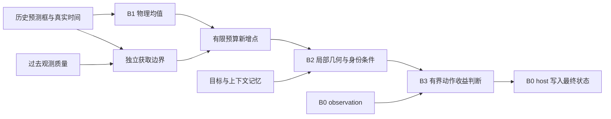

# CT-SeqTrack 下一版模块设计建议

审阅：2026-09-05；源码 HEAD：`b445ecd04fcdc41474c29d829b2626f3780f759d`。依据当前 v26 实现、原始实验日志、前次项目审阅及主源论文。未参考 trajtrack。本轮只新增审阅文档和 CPU 诊断，不修改源代码、正式配置、实验输出或 git 历史。

**建议下一版采用：时间感知 GRU 的物理均值 + 独立获取边界，B2 新增点局部几何 + 目标/上下文分路，B3 实际有界动作的收益判断 + 全帧效用校准。** CfC 保留对照，先不扩大网络、点预算或记忆长度。这里是有源码依据的研究判断，尚未通过修复后的正式实验确认涨分。

| 部分 | 下一版主改动 | 应证明什么 | 现在不优先做什么 |
| --- | --- | --- | --- |
| B0 | 修复可比性与接口，保持 SeqTrack observation 基线合同 | 同输入下主干学习可比，机制收益可归因 | 同时换主干、改 crop 或四视图 loss |
| B1 | GRU 保留；物理位移与实际获取需求分开监督 | 固定预算下补回真正新增的目标测量 | 因 CfC 名字更适合 CT 就直接定为主模型 |
| B2 | 选点前加一层局部几何；目标与背景上下文分路 | 新增目标点能形成正确实例候选 | 扩大范围/点数后把背景投票当证据 |
| B3 | 统一实际动作标签；扩大 H3 监督覆盖；校准全帧净收益 | 独立闭环上超过裁剪和简单置信门 | 加深 MLP、先放宽风险阈值或扩大动作半径 |
| Memory | 保持 36 slots，先修坐标轴与角色、质量信息 | 同预算 real memory 优于 empty/shuffled | 直接增加历史或另设递归状态写入者 |

**B1：当前先用 GRU，但现有 S/P 不能判定它赢了 CfC。**

`models/ct_v2/motion.py` 的两个后端都输入速度、位移、yaw 差、真实历史间隔及 query/history 时间比例。当前 `hist_num=3` 只构成两次历史 transition；CfC 每次 endpoint 编码从零 hidden 开始，没有跨 endpoint 持久神经状态。CfC 的显式 elapsed 用在历史 transition，query gap 通过特征和 context 进入，没有最后一步面向当前时刻的独立 CfC 演化。

所以 GRU 已经是时间感知模型，当前 CfC 也并非完整连续时间状态估计器。两者 recurrent 参数分别是 74,496 与 74,537，几乎匹配，不能用“CfC 参数多很多”解释结果。CfC 的原文优势涉及显式时间建模及避免数值 ODE 求解，不等于在本项目中天然优于或快于 GRU。[CfC 原文](https://www.nature.com/articles/s42256-022-00556-7)，[官方实现](https://github.com/raminmh/CfC/blob/main/torch_cfc.py)。

现有 mini B1-GRU 与 B1-CfC final S/P 为约 51.97/61.95 与 28.80/28.02，但 B1-only 的最终输出仍是 observation，且跨 arm 的 B0 参数轨迹已分开；这些数不能归因于运动后端。现有 own-rollout RMSE 同样混入不同历史，不能直接选胜者。

选择 GRU 作为工程主线的理由，是先减少后端选择的不确定性，把算力用于已有清晰任务错位的获取分支。只在修复后的同历史、同预算诊断及 Full 闭环中，CfC 稳定改善获取和跟踪，才将其晋升主线。

**B1 最值得改的是 acquisition 目标。**

当前 `utils/candidate_utils.py:82` 定义纯物理目标：

`d_GT = R_anchor^T (c_GT,t - c_GT,t-1)`。

它不含上一帧递归预测框的平移误差，符合 history-only 物理均值的职责。但是 `models/seqtrack3d.py:5770` 将同一目标交给 `acquisition_margin_pinball_loss`，margin 实际拟合 `abs(d_GT - mu)` 的方向分位数。

真实预测终点误差为：

`e_endpoint = (d_GT - mu) + R_anchor^T (c_GT,t-1 - c_hat,t-1)`。

也就是物理运动误差另加已有 anchor 漂移。示例：一维 GT 从 0 移到 1，递归预测起点却在 5，mu=1。物理误差为 0，预测终点却在 6，离目标 5 米。运动预测完全准确并不代表获取区域正确。

这里必须按真实 crop 几何设计标签：`utils/ct_search.py:489–517` 的 corridor 中心在 `anchor + 0.5*mu`，平行半径包含 `0.5*|mu| + 0.5*object_length + margin`，垂直半径包含 `0.5*object_width + margin`。因此 endpoint error 用来揭示遗漏项；不能把完整 endpoint error 不加处理地当作最小额外 margin。应计算当前 GT 目标框投影或真实目标点相对实际 corridor 的覆盖缺口，扣除既有几何范围，再监督有界额外 margin。

建议最小改法：

1. 保留物理 mean 的监督和有界 residual，不让 acquisition loss 反传并扭曲 mean。
2. acquisition 分支独立学习实际支持需求，先实现几何一致的边界目标，再比较基于可见目标点覆盖的目标。GT 仅生成训练标签。
3. 在 detached 历史 context 外加入过去可用的 B0 点数、segmentation/质量摘要、prior-observation 分歧和状态 age；用小 MLP 学获取条件，参数从 epoch 0 正常训练。
4. 评价固定 768→256 预算下的 novel-target recall、目标点占比、搜索体积和后续候选收益，不能仅看 margin loss 或范围扩大。

纯相对框历史不能辨识所有历史共同发生的未知平移。上述改动提供条件误差覆盖，不保证估计出漂移方向；这一可辨识性边界必须写清。当前 residual 在 0.5 秒匀速情况下约限制为平行 0.375m、垂直 0.275m，换 cell 也无法通过 mean 修复数米偏移。

sigma 与 margin 目前读 `context.detach()`；sigma 的误差标签也 detach，β-NLL 只更新 sigma 分支，不会改善均值训练。保留这类隔离，不建议整体取消 detach。若 acquisition 需要不同表征，用独立小分支承接自己的梯度。

`bias=-8` 也不是现有证据下的首要修改：原始 TensorBoard 表明 margin 确实在学习，例如 GRU 平行 margin 的某些 batch 均值到过 5.89。该统计不是 held-out coverage，但足以排除“只因初始化就完全死头”的说法。

若以后专门研究不规则时间，可单独增加 B1 box-only 历史、引入 query-conditioned decoder，并输出有界速度/加速度残差后乘 dt/dt²。GRU 必须获得相同历史、时间输入和 decoder。不要同时延长 B0 点云历史和 memory 后把收益归给 CfC。当前已有辅助间隔下采样，不能宣称训练从未接触不规则时间。

**B2：先解决“看清新增点、识别被跟踪实例”。**

`models/ct_v2/evidence_memory.py:548` 中，extension 点先经过 5 维逐点 MLP，没有显式 extension 邻域聚合。`:568` 的 relation 选点又发生在 cross-attention 前，主要依靠 base/memory 的全局 mean/max context；详细的历史条件交互发生在 256 点已选出之后。

建议只加一层、64 维、k=8 或 16 的局部块，在 768 点选 256 点之前建立局部几何：

`g_i = h_i + max_{j in N(i)} MLP(h_i, h_j-h_i, p_j-p_i)`。

邻居仅来自实际有效 extension 点，padding/重复点必须 mask；极稀疏样本要有明确定义。局部块不是现成的论文创新，但能检验当前逐点表征是否不足。用等参数逐点 MLP 作容量对照，并实测 kNN、聚合及整个 pipeline 时延。

第二项是把 memory 中预测目标框内 token 与外围 context token 分开汇聚，让 relation 同时看到目标支持、背景支持及两者差异，再结合 B1 几何。框内 token 只是预测身份线索，不等于真实目标。保留 base 作为上下文，只有新增 extension 点投票，避免把 B0 自身的特征重新包装为新增测量。

CXTrack 将目标线索传播与局部聚合结合；MBPTrack 将几何和目标线索分路处理。这些支持上述适配方向，但本项目的一层局部块与角色条件不是原论文已经验证过的 CT 方案。[CXTrack](https://arxiv.org/html/2211.08542v1)，[MBPTrack](https://arxiv.org/html/2303.05071v1)。

当前 targetness/relation 标签已经来自被跟踪目标的 GT 框，不是“所有车辆都标正例”。问题更可能在身份条件表达、同类负例和实际目标证据不足。先分析真实邻车负例；只有确认此类失败集中出现，才考虑 StreamTrack 式负轨迹增广，并作为机制流的新训练协议注册。[StreamTrack](https://arxiv.org/html/2303.07605v2)。

还应同步修正两个输入/输出语义：

- presence head 读 selected 256 点，但 `seqtrack3d.py:5165` 用 prepool 768 点是否有目标作标签。供 B3 使用的 presence 应监督 selected 是否仍有目标证据；prepool presence 作为获取诊断。
- 几何共识不等于目标可信度。CPU 调用真实 consensus 函数，将所有权重乘 0.01，中心和 consistency 不变，有效质量从 1.5 变为 0.015。B3 已有全局 targetness/presence 等信息，并非完全没有置信度，但应补充获胜模式的绝对证据质量、有效点数及目标/上下文匹配差异。不要仅凭聚集程度接受一个邻车候选。

保留 selected target-bearing 的 raw 回归 mask：纯背景只能学习不存在目标及拒绝相关信号，不应被 GT 中心回归强行训练出“凭空恢复”。先不同时调 focal、深度、128/96/32 采样比例或 memory 长度。

**B3：先把动作和收益定义正确，维持轻量网络。**

当前 64 维 MLP 已输出 help、harm 和两个 expected-gain 头；部署只用 `sigmoid(help)*(1-sigmoid(harm))`，后两个头不直接参与选动作。因此主要问题不是网络不够复杂。

推荐依次修改：

1. H1/H3/calibration 使用同一个实际有界动作、真实有向 IoU 及正式中心误差标签。标签是 detached，不需要可微 IoU。先修已有 wlh 轴序问题。
2. 给 B3 显式传入执行后的归一化位移、raw/radius 比和裁剪比例；当前看 raw disagreement，最终执行的是 clipped action。
3. H3 监督按结构有效、有限且有实际残差的候选独立轮转抽样，保持现有 shadow 总预算。当前 presence>=0.5 会把低置信但可能需要学习的区间截掉。
4. 阈值选择改成风险约束下的全帧净效用，先比较现有 score 与指标对齐的 expected-gain 排序，再决定是否更换。
5. calibration 定阈值后冻结，在独立 dev 上完整执行 selective 递归；不能用 observation 历史上的静态重筛代替实际部署。

当前 `utils/action_calibration.py:217` 最大化已接受动作的平均中心收益加平均 IoU 收益，既混合米和 IoU，也可能偏向极少数大收益动作。建议使用正式 Success 的逐帧贡献作为主效用，Precision 作为约束，或预先注册无量纲组合；在原风险、最少样本和覆盖要求内最大化：

`J(tau) = sum_all_frames A_tau(i) * Delta_u(i) / N_all_frames`

即 `coverage × mean accepted utility`。1% 帧每次提升 0.4 的总体收益为 0.004，10% 帧每次提升 0.1 的总体收益为 0.01。选择后者并不需要放宽风险约束。该式用于校准筛选，闭环后历史分布变化仍须实际评估。

风险控制和有效覆盖可以借鉴 Learn then Test、SelectiveNet，但现有 bootstrap 网格选择并不自动拥有 LTT 的有限样本理论保证，相关视频帧尤其不能直接视为独立样本。[Learn then Test](https://arxiv.org/html/2110.01052v5)，[SelectiveNet](https://arxiv.org/abs/1901.09192)。

H3 当前是“一次修正，随后两帧走 observation”的短期动作价值；它不等于持续 selective 策略的长期价值。H3 本身包含 H1，再平均 `.5*(H1+H3)` 会形成 2/3、1/6、1/6 的时间权重。应明确注册该权重，或比较 H1 与等权 H3，而不是把不同目标混写。

必须增加 bounded-always 对照：Full−B3 的 raw 与 Full 的 bounded+gate 同时改变了裁剪和选择，不能单独归因于 B3。比较 observation、raw、bounded-always、presence/consensus 简单门和 learned gate；简单门要给相同校准数据，并在匹配覆盖下比较。

先保持动作 `{0, bounded_delta}`。只有 oracle 证明“方向对、整步过冲”常见，才试 `{0, 0.5*bounded_delta, bounded_delta}`；这需要动作条件评分，且 H3 未来 observation forward 从 4 次增加到 6 次。当前 B3 是局部修正器，不能将其描述为大范围失锁重捕获。

**实验顺序：先确认收益能传过每个接口，再做复杂模块。**

前置问题沿用前次 [代码审阅](../20260905_project_review/code_audit.md)：B1 prepass 缺 acquisition-margin 字段、point ID 浮点去重、FPS 重复索引、memory/H1 坐标轴、空点判定、time override、校准分区与闭环。修复这些之后应新建配置版本并 scratch 重跑，旧结果只作为历史证据。参数哈希不同本身不能证明梯度泄漏，还要隔离 CUDA 非确定性并比较数值。

| 阶段 | 最小实验 | 进入下一阶段的依据 |
| --- | --- | --- |
| 获取 | 固定 shell / CV / GRU，自适应边界前后；CfC 匹配对照 | 相同有效输入和预算下，新增目标点召回/占比有可重复改善 |
| 候选 | 修复原 B2 / local only / role only / local+role | 目标已获取时，候选中心/IoU 与 oracle 可用率改善，背景候选不增加 |
| 决策 | 同 checkpoint 的 observation / raw / bounded-always / 简单门 / learned gate | 完整 dev 闭环有非零净收益，优于裁剪和匹配覆盖简单门 |
| 正式模型 | B0 / B0+B1 / B0+B1+B2 / Full，各自 scratch | final 和真正 late-3 一致报告；mini 后再 full，多 seed/场景区间 |

固定同一历史做 backend/selector 诊断是只读分析，不授权复用 checkpoint 初始化正式 arm。当前 scratch_only、canonical B2、B0 四视图、所有 enabled 参数可学习、BN/detach 隔离和唯一状态写入者均保留。尤其 B1-only 输出 observation，它用于控制主干与测运动；“不直接涨 S/P”本来就不意味着 B1 没价值。

不要只看最终 S/P，也不要只看条件很苛刻的小分桶：同时报告全帧效果、全局可见目标但 B0 缺测量的子集、获取成功率、selected retention、raw 有益率和动作覆盖。若 B2 的 oracle 仍接近零，先解决获取与候选，继续训练 B3 不能创造上游不存在的证据。

**论文主张应围绕一个因果链。**

推荐表述为研究问题：在有限新增点预算下，真实时间和递归质量如何决定去哪里获取测量，如何确认新增测量属于目标，以及何时值得改变 observation 的递归状态。

局部几何、memory、CfC、confidence gate 单独都不是充分的新颖性依据。HVTrack 已研究历史、扩张搜索及上下文，是必须认真比较的近邻；CT 需要通过相同预算和逐环节证据证明 acquisition、novel measurement 与 selective recursion 的具体贡献。[HVTrack](https://www.ecva.net/papers/eccv_2024/papers_ECCV/papers/01145.pdf)。

如果 B1+B2 在修复后形成稳定收益而 B3 不超过简单门，应保留两项有实证的核心贡献，把 B3 降为部署选项。若 true/fixed/shuffled 在真正生效后没有差异，不把因果时间收益写成结论；若 CfC 不胜 GRU，也不影响基于真实时间获取机制的论文成立。

详细依据：[B1](b1_design.md)、[B2](b2_design.md)、[B3](b3_design.md)。CPU 复现与原始 TB 统计：[design_probes.py](design_probes.py)、[design_probes.json](design_probes.json)。本轮未重跑 GPU 训练或真实数据闭环，不能据此承诺涨分幅度。
