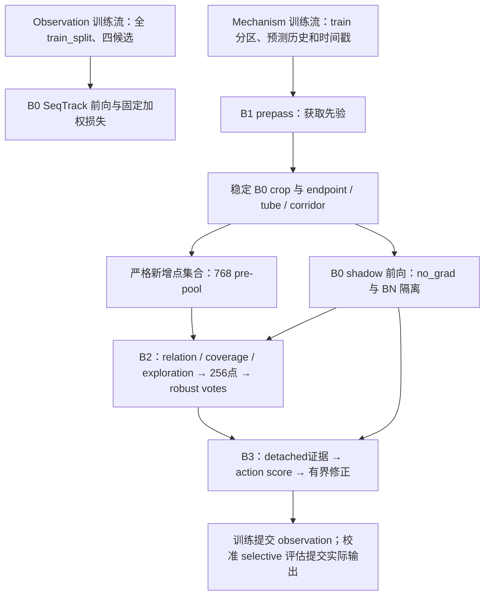

**CT-SeqTrack 总览、问题诊断与下一步建议｜2026-09-05**

我的判断是：项目有值得继续验证的方法方向，但当前最急需的工作是修通证据获取链和建立可信的匹配 baseline。现有五臂结果还不能说明“在 SeqTrack3D 上增加模块后涨分”。若现在继续加模块或直接投入完整 nuScenes，新增计算很可能仍被接口缺陷、几何标签错误和 B0 轨迹分歧掩盖。

本报告基于 `HEAD=b445ecd` 的当前源码、解析后的 v26 配置、Git 历史，以及原始 TensorBoard/checkpoint/provenance/候选 CSV；并定向审读了 10 篇相关原论文。没有参考用户排除的模型，也没有修改源码、正式配置、历史或受保护的实验输出。本次审阅产物都在本目录。

配套材料：[代码审计与复现](code_audit.md)、[实验及提交历史](experiment_inventory.md)、[校准/协议审计](calibration_and_protocol_audit.md)、[文献审读](literature.md)、[论文定位草案](paper_story.md)、[项目清单与验证边界](project_inventory.md)。

**1. 我如何理解你的模型。**

你已经从早期给运动、搜索、融合不断补分支的方式，收敛到有明确责任的 v26：B0 保持 SeqTrack 观测预测；B1 以真实时间间隔建模因果框历史，决定从哪里补取证据；B2 只允许新增点产生定位投票；B3 判断这些投票形成的有界修正是否值得执行。

这里有两套需要同时看清的数据流：

在线预测先从历史框/时间做 prepass，再构造点云支持；B0 在稳定 crop 上提特征、预测框，机制前向随后再计算 B1/B2/B3。B1 的 prepass 与后续可训练 forward 是两个入口，因此“B1 有 loss/非零梯度”不等于“学到的 B1 实际控制了 crop”。本轮恰好在这个接口上失效。

B0 的损失固定为 `0.5*L0+(L1+L2+L3)/6`，B2 只读 canonical view0。统一 Adam 的 B0/B1/B2/B3 参数组都可训练，detach 和 BN 隔离用于限制耦合，不是冻结。当前架构有意阻断下游对 B0 的梯度，所以 B1-only 的价值主要应体现在先验/获取机制指标；在真正匹配的 B0 轨迹下，不应该期待它直接改变 observation-only 跟踪分数。

B1 包含固定运动学锚点、归一化有界残差、统计 sigma 和独立的 q=0.90 acquisition-margin head。v26 设计上由后者控制 crop 边界，统计 sigma 不直接扩 crop；当前 prepass 接口缺陷使在线获取实际回退。GRU 是主后端，CfC 是独立诊断。B2 按量化 XYZ 键做差集，意图排除 B0 原始点，但其物理点身份存在后文复现的漏洞；memory/base 是上下文，关系/空间/探索采样后做模式一致投票。B3 主要执行 XY 修正，保留 B0 的其他框自由度；未校准精确回退观测。

**2. 真实进展：实现已多次推进，有效性证据仍不完整。**

Git 的关键转折是：`62e1f90` 恢复安全 SeqTrack 双流与自动优化；`b8222bb` 修复 B1 均值/不确定性目标并加入 CfC；`e9a2d6d/d384282` 加入获取漏斗；`5225ff0` 实现 v26 的自适应有界支持、corridor、采样/投票和校准；`ad70d36` 修正部分 novel 诊断；`b445ecd` 注册本轮五臂 mini。

当前 mini Car / seed42 / batch16 原始结果为：

| 臂 | 已完整保存/验证的 epoch | Success | Precision | 实际解释 |
|---|---:|---:|---:|---|
| B0 | 60 | 26.903 | 25.601 | 当前观测 baseline |
| B1-GRU | 60 | 51.973 | 61.953 | 输出 observation；不是已证实的 B1 跟踪增益 |
| B1-CfC | 60 | 28.795 | 28.018 | 输出 observation；不能直接与 GRU 选优 |
| Full−B3 | 8 | 28.211 | 29.429 | 未完成；presence 门使 raw 候选全部回退 |
| Full | 60 | 48.802 | 54.888 | 尚未校准，action=0，输出 observation |

四个完成臂有 e58/e59/e60 checkpoint，但 e59 尚未独立评估。已有最后三个验证点是 e56/e58/e60，不能替代正式 late-3。

五臂 B0 初始化和前 100 个输入指纹相同，但 step1 参数/Adam hash 已分歧。这使上述跨臂差值无法归因给模块；hash 分歧本身也不能证明梯度泄漏，要通过同一 GPU 的数值差异审计区分 CUDA 非确定性、随机流或优化器路径差异。

历史 B0 的 final S/P 曾从 53.360/64.382、31.415/31.103、50.690/59.280、29.870/30.398、54.826/66.340 再到本轮 26.903/25.601。各轮协议不同，不能拼接高分。旧 d86990c 使用逐帧 GT 尺寸，不能当当前严格对照；但近期高低分都已使用安全首帧尺寸，因此近期退化不能全部归咎于该修复。

状态文件也需要更新：need_to_do 把五臂仍都标待执行，README 残留直接 full/no mini 的顺序，部分旧方法文档仍写独立优化器或 v25/v24 主线。应明确“训练完成”“检查通过”“方法有效”是三种状态。

**3. 必须优先修改的问题。**

| 优先级 | 事实及源码位置 | 对研究结论的影响 | 建议修复与验收 |
|---|---|---|---|
| P0 | `seqtrack3d.py:2546` 的 public motion 输出遗漏 acquisition margin；`:2650` 又要求它存在 | 学到的 prepass 一律无效，实际使用 CV/base fallback；B1 日志仍可正常出现 | 传输完整 typed prior，贯通 train/eval prepass；有效历史应得到 learned source 和正确 margin，非法历史才 fallback |
| P0 | `evidence_memory.py:26` 的 FPS 不屏蔽已选 index；相同 XY 不同 Z 可重复选点 | 256 名额重复、集合合同失败；可触发唯一性检查异常 | 按 index 排除已选项，补退化 XY、少点和预算借用真实接口用例；本地复现 256 个位置仅 161 unique |
| P0 | `base_model.py:1892` 用全部输入 XYZ 的代数和等于零判断 empty | 可能误判非空对称点；该分支绕过 forward/B2 和候选诊断 | 用明确数量/valid mask 判空；稳定回退仍需完整诊断；存在有效 extension 时应走可定义的恢复分支，不能用虚构 base 特征掩盖空输入 |
| P0（实验归因） | 同初始 B0/同输入，但 step1 参数与 Adam 分歧 | B1-GRU +25 Success 等大差距没有模块因果含义 | 同 GPU 顺序重跑单臂重复及跨臂 step1/100；记录前向、loss、梯度、更新误差及 RNG/BN。先查清，不通过挑 seed 规避 |
| P1（核心合同） | `points_utils.py:304` 各 support 分别变换点；`ct_search.py:1225` 用 1e−6 坐标键作身份 | 同一物理点可被误当 novel，影响 extension-only 的核心论据 | 保留原始点 index，集合差/union 按 index；或统一一次 anchor 变换后以原索引筛选。不要只放宽容差 |
| P1 | `evidence_memory.py:106` 将 wlh 前两维当 local xy 尺寸 | memory 可能将车前部当背景、车侧背景当前景；v26 memory=real，路径活跃 | 全项目显式区分 wlh 与 xyz extent；旋转、非正方形框和 inside/context 用例统一验证 |
| P1 | `seqtrack3d.py:5197` 的 B3 IoU proxy 同样使用错误轴序，还忽略真实姿态 | helpful/harmful 标签可颠倒，B3 会学习错误决策 | 用一致几何计算监督；这些标签本来 detach，可采用真实有向 IoU。核对 H1/H3/calibration 的标签语义 |
| P1 | `ct_variant.py` 的 ct_time_mode 覆盖 `main.py` 的 dynamics_time_mode CLI | true/fixed/shuffled 消融可能实际都跑 true | 统一时间参数优先级、拒绝冲突，并验证解析值和实际时间张量；本地已复现 fixed/shuffled 被覆盖 |
| P1 | 静态 observation rows 上的 B3 promotion、mechanism-only 留出及多 seed 分区不一致 | 不能代表整模型独立校准，也不能保证改变递归状态后的收益 | 明确留出对象；统一 partition seed；冻结阈值后增加独立 dev selective 全轨迹评估 |

上表的坐标身份问题已用实际 crop 函数复现：两份 crop 都含相同 100 个原始点，却得到 8 个伪 novel；最大坐标差仅约 4.77e−7m。它证明实现存在可触发漏洞，不说明真实数据中已污染了多少点。当前线上数据占比必须通过原始索引审计重算。

B3 标签也有明确反例：车框 wlh=(2,4,2)，观测中心(1.5,0)，有界动作到(1,0.5)，错误轴序给出 IoU gain +0.1371，正确轴序为 −0.06324。即使没有 yaw 变化，标签符号也能反转。

并非所有复杂实现都有问题：当前已复现 robust voting 对 votes 和 weights 均有有限非零梯度，不能笼统说硬选择使 B2 完全不可训练；参数审计也没有启用模块被冻结。应修具体接口和几何错误，而非把所有 detach 或离散选择全部去掉。

**4. 数据已经告诉你：先解决获取，再解决辨认。**

Full e60 原始 CSV 中，实际 B1 获取来源为 0 行，1846 行 fallback_cv、82 行 base_only。日志定义的 globally-observable need 集合中，只有 106/1676=6.32% 含新增目标点；B0 raw 完全漏目标的 123 行中只补获 1 行。进入 prepool 的目标点，selection 保留率反而为 97.38%。这组数字不能证明修复后的 v26 无效，却足以说明当前不应优先继续增加 768/256 的预算或 attention 深度。

此外，结构可用的 249 行 raw 候选平均 center gain=−0.526m、IoU gain=−0.156；60.24% 的行中心误差恶化超过 0.1m。这里的“harm”定义不同于 B3 校准的任意 center/IoU 变差，不应混用。

Full−B3 e8 虽配置 raw_search，presence 最大只有 0.385678，未越过 0.5，search_valid 全零。因此它的跟踪分数尚未实际检验 raw B2 部署能力。Full 的 60 epoch 成绩也不能当 B3 成绩，因为校准和动作覆盖均为零。

还要先修统计分母：Full 只记录 1928/2179 个非首帧候选 endpoint，缺 251 行；Full−B3 缺 227 行。现有候选图表不能代替完整 tracking 指标。counterfactual 中 raw/novel 目标计数逐行相同，递归年龄有效标记全为零，也使相关分层无法用于主张。修复后应完整记录每个 endpoint 的 observation 空点、全局不可观测、支持不含目标、采样丢失、投票失败、presence 拒绝和 B3 拒绝原因。

B1 自身也尚未显示稳固机制收益：GRU e60 learned RMSE 6.315m，CV 6.302m；CfC 在自己的轨迹上 12.492m vs CV 12.759m，且 95% coverage 只有约60.29%。两臂历史本身不同，不能据此证明 CfC 胜出。先固定共同 endpoint/预测历史，再比较 learned-minus-CV 的配对差异、NLL、coverage 与最终 support 质量。

**5. 优化方向应该怎样选择。**

第一，保留 SeqTrack B0 和当前耦合责任，先稳定数值对照。B0-only、B1-only、未校准 Full 的 observation 应具有可解释的共同训练行为。服务器先用同一物理 GPU、相同 batch 顺序验证，再调查 workers、preloading、验证频率、CUDA scatter/PointNet++ 算子、Adam 参数组/RNG 等；未建立这层对照前不做新的涨分归因。

第二，把 B1 优化目标对准获取价值。先修 prepass 后，再比较相同预算的 fixed support、CV support 与 learned support。RMSE 降低不必然让 support 多含目标，sigma coverage 合格也不等于 acquisition margin 合格。分别报告每轴 q90 的覆盖、获取体积、背景数、novel target recall，按真实 Δt、速度、稀疏度、历史漂移分层。不要把更大的空间体积收益都算成物理时间贡献。

第三，B2 的主要升级候选应是目标身份判别。只有在 support/selected 确实含目标而候选仍被邻车吸引时，才引入局部几何编码、同类难负样本或 target-specific relation。可借鉴 CXTrack 的上下文身份线索和 StreamTrack 的同类负轨迹训练，先限定在 mechanism stream，以免同时改变 B0。[CXTrack](https://arxiv.org/html/2211.08542v1)、[StreamTrack](https://ojs.aaai.org/index.php/AAAI/article/download/28196/28389)。

第四，检查 robust consensus 是否只是在奖励“背景几何自洽”。低 covariance、高 inlier_ratio 不能自动表示属于当前目标；需共同看独立有效点数、空间覆盖、关系/targetness 校准与竞争模式。已有 B3 输入包含点数、voxel 数和 ESS，不能笼统说“缺少所有支持量”；可在纠正标签后检验加入 absolute effective mass 是否真正改善排序。K、NMS/inlier 半径等先以首帧尺寸归一化做单独对照，再考虑跨类别。[MBPTrack](https://arxiv.org/html/2303.05071v1)。

第五，明确局部修正的能力边界。默认 Δt=0.5s 时 B3 半径约0.75m；日志中 B0 完全漏目标行的漂移可达十几米。corridor 虽扩到更远，最终有界动作也无法一步完成长距离重捕获。短期可将目标聚焦“轻中度漂移与时间变化下的保守恢复”；若要长期失跟恢复，应另注册有更强身份证据支持的重捕获机制，保留单一状态写入入口，不能简单扩大所有半径。

第六，B3 在上游 raw 候选有正收益后再优化。先修标签和数据留出，导出完整 rows，阈值冻结后做 selective 全轨迹评估。经验 bootstrap 的零伤害上界可能退化为零，必须保持经验校准措辞；不要通过降低正式风险门槛制造非零覆盖。未来若改阈值目标，应把 coverage 与实际跟踪效用纳入预注册目标，避免简单相加不同量纲的 center/IoU 均值。[Learn then Test](https://arxiv.org/html/2110.01052v5)。

**6. 哪些能成为创新，哪些目前不该扩展。**

最值得凝练的论文主题是“有限预算下的新增测量获取与可拒绝修正”。可以形成两条主贡献：时间条件的、来源可归因的额外测量获取；基于新增测量质量而非单纯先验置信度的选择性修正。B1/B2/B3 是实现这条研究假设的阶段，不必机械地各占一条创新点。

必须正面比较 HVTrack。它已经研究高帧间变化、记忆、扩张后的背景和重要性分配；你的区别在严格 raw-point 集合差、上下文/测量责任和失效回退，不在“也有 base 和 expansion”。因此原始点身份的实现漏洞对论文尤其重要。[HVTrack 官方全文](https://www.ecva.net/papers/eccv_2024/papers_ECCV/papers/01145.pdf)。

SeqTrack3D 本身已有历史框与时间通道，不能说 baseline 不用时间；v26 主后端是 GRU，不能把 CfC 的连续时间能力当已实现主贡献；sigma 与 crop 分离后，也要避免“统计不确定性直接控制搜索”的误述。[SeqTrack3D](https://arxiv.org/html/2402.16249v1)、[CfC](https://www.nature.com/articles/s42256-022-00556-7)。

memory 已有 MBPTrack、StreamTrack，2026 年 ChronoTrack 也研究紧凑前景 tokens 和时间一致性。当前不建议扩长 memory、恢复 B4、同时换 backbone 或加入更多一致性 loss；这些方向会增加消融成本，而且解决不了当前获取入口没有新目标点的问题。[ChronoTrack 原文](https://arxiv.org/html/2604.13789v1)。

**7. 下一轮工作顺序。**

1. **完成一组集中修复。** prepass 字段、FPS 唯一性、empty 分支与全 endpoint 诊断、原始点身份、memory/B3 轴序、时间 CLI、partition seed；同步现行文档。保留旧结果，给新一轮明确代码与配置身份。
2. **做必要的工程验收。** CPU 合同测试之外，服务器真实 batch/point-box 可视化、相同 B0 step1/100/Adam 对照、验证频率隔离、epoch-boundary resume 等价。所有工程 checkpoint 丢弃；这些验收不是根据中间分数挑选正式训练。
3. **修复后从 epoch0 重跑已注册匹配 mini 臂。** 每臂 60 epoch，无跨臂初始化；正式结果必须来自同一修复版本。已有 e58/e59/e60 可补评估用于诊断，但不能转化成修复版的正式证据。
4. **用漏斗回答机制问题。** 同 checkpoint 的强制 B1 invalid/no-extension 等对照用于定位依赖；要做训练层面的因果主张，再新增预注册、同点/体积预算的 fixed/CV/learned scratch 对照。真值 oracle 只用于诊断可恢复上限，绝不用于正式推理。
5. **完成 B3 与真实部署评估。** final/late-3 每个 checkpoint 独立 calibration/dev artifact；先静态 rows，再冻结阈值的闭环 dev；无可行阈值就如实报告失败。测试用完整 tracklet-paired S/P 和置信区间。
6. **有效 mini 后进入完整 nuScenes。** 同一训练/评估口径运行外部 SeqTrack reference 与 CT matched B0；然后补 seeds52/62、时间对照、memory 对照和 KITTI-HV 等高时间变化协议。训练 seed 与 partition seed 必须统一管理。

其中外部“SeqTrack-strict”现有配置继承 shared_se2，CT B0 是 independent/stateless/候选加权；名字不保证协议相同。外部参考和内部 matched B0 都需要，不能混为同一个对照。公开论文的 nuScenes 也有训练域和目标帧筛选差异，不能直接搬原论文分数计算净涨点。[CXTrack 实验协议](https://arxiv.org/html/2211.08542v1)、[M²-Track 正式论文](https://openaccess.thecvf.com/content/CVPR2022/papers/Zheng_Beyond_3D_Siamese_Tracking_A_Motion-Centric_Paradigm_for_3D_Single_CVPR_2022_paper.pdf)。

**8. 本次验证与结论范围。**

本地现有测试为 **176 passed, 1 skipped**，compileall 成功；新增只读复现证明了若干现有测试未覆盖的接口/几何边界。瘦身 verify 在 HEAD 必须等于历史 `001951a` 的检查处按设计失败；这不是本轮代码回归证明。没有宣称完成本机不具备的 nuScenes 真实训练或完整 CUDA 验收。

目前可以说你已搭建出研究问题明确、责任划分清楚的模块化实现；不能说模块有效或论文涨分成立。最值得投入的下一步，是让“B1 真正改变获取 → 新点确实来自目标 → raw 候选有可重复正收益 → B3 接受后整轨迹受益”这条证据链逐项成立。它会决定应该保留哪些模块，以及论文最终能写多强。
