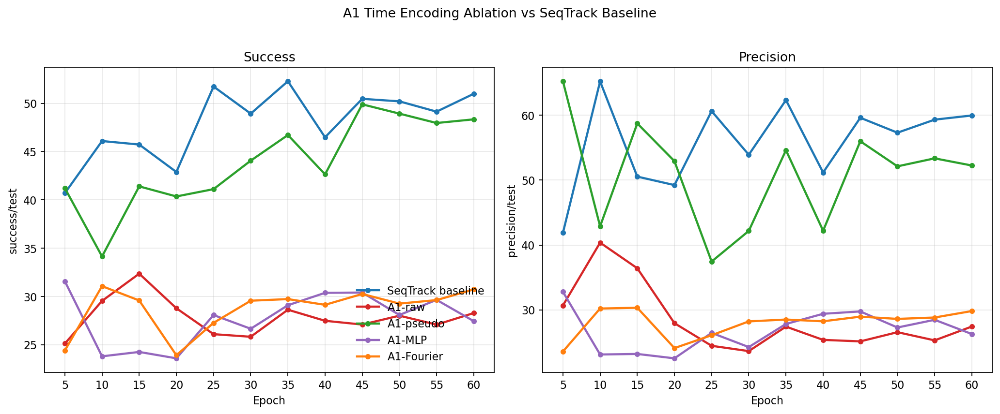
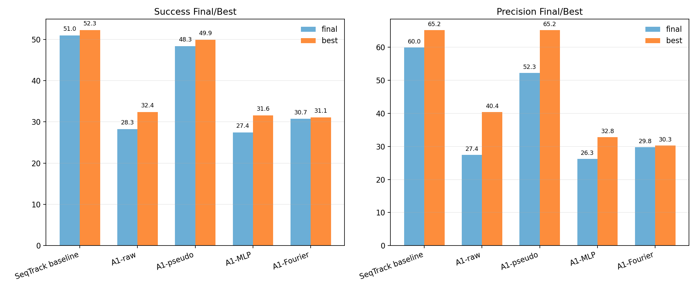

# A1 Time Encoding Ablation vs Baseline

Compared runs: SeqTrack baseline, A1-pseudo, A1-MLP, A1-Fourier. A1-raw is included as a reference because it is the direct raw-real-time A1 setting from the previous ablation.

## Main Summary

| model | final success | best success | final dS | best dS | final precision | best precision | final dP | best dP | mean success | mean precision |
| --- | ---: | ---: | ---: | ---: | ---: | ---: | ---: | ---: | ---: | ---: |
| SeqTrack baseline | 50.9858 | 52.2834 | 0.0000 | 0.0000 | 59.9617 | 65.2144 | 0.0000 | 0.0000 | 47.9679 | 55.9259 |
| A1-pseudo | 48.3381 | 49.8917 | -2.6477 | -2.3917 | 52.2505 | 65.2385 | -7.7112 | 0.0241 | 43.8953 | 50.8270 |
| A1-MLP | 27.4387 | 31.5700 | -23.5471 | -20.7134 | 26.2779 | 32.7757 | -33.6838 | -32.4387 | 27.7453 | 26.7794 |
| A1-Fourier | 30.7232 | 31.0646 | -20.2626 | -21.2188 | 29.8151 | 30.3228 | -30.1466 | -34.8916 | 28.7062 | 27.9561 |

## Reference: Previous A1-raw

| model | final success | best success | final dS | best dS | final precision | best precision | final dP | best dP | mean success | mean precision |
| --- | ---: | ---: | ---: | ---: | ---: | ---: | ---: | ---: | ---: | ---: |
| A1-raw | 28.2768 | 32.3556 | -22.7090 | -19.9278 | 27.4289 | 40.3611 | -32.5328 | -24.8533 | 27.8534 | 28.3937 |

## Curves

## Interpretation

1. A1-pseudo is the only A1 variant that gets close to the SeqTrack baseline on success. Its final success is 48.3381, only 2.6477 lower than baseline final 50.9858. This strongly suggests the CT A1 code path itself is not completely broken.
2. A1-pseudo still loses precision: final precision is 52.2505, 7.7112 lower than baseline. So even when pseudo time restores the old time scale, the current CT implementation still has some center-localization gap versus the original baseline.
3. A1-MLP and A1-Fourier do not rescue real-time A1. Their final success/precision are close to A1-raw and far below baseline. This means the current scalar-preserving MLP/Fourier time encoders are not yet useful in this training setup.
4. The key conclusion changes from "raw real time alone is the only problem" to a sharper statement: pseudo time largely repairs success, but real-time A1 remains unstable even after MLP/Fourier normalization. The real-time injection location, time scale, or training adaptation still needs work.
5. Because A2 Dynamics previously reached final precision 58.8315 and final success 45.2659, P3 dynamics is still more useful than the current A1 time-encoding variants. The next useful direction is likely A2 + better time encoding, or keeping P3 while redesigning P5 gate.

## Files

- `a1_time_encoding_metrics_points.csv`: epoch-level scalar points.
- `a1_time_encoding_metrics_summary.csv`: final/best/mean/std summary.
- `a1_time_encoding_curves.png`: success and precision curves.
- `a1_time_encoding_success_curve.png`: success-only curve.
- `a1_time_encoding_precision_curve.png`: precision-only curve.
- `a1_time_encoding_best_final_summary.png`: final/best bar chart.
