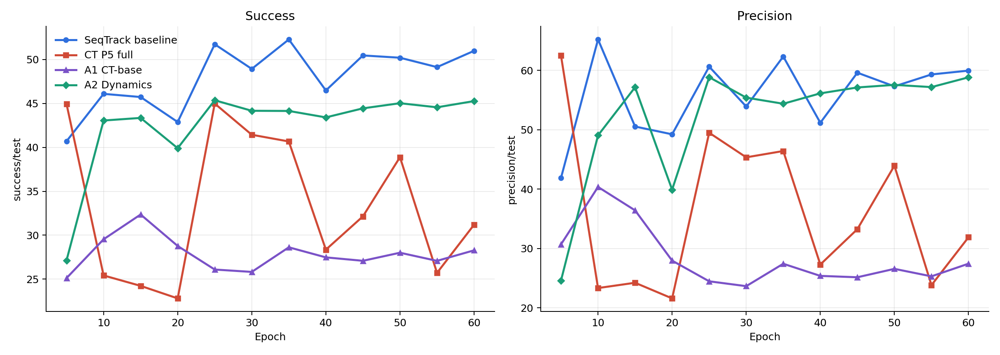
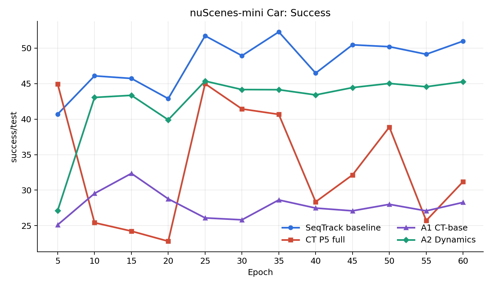
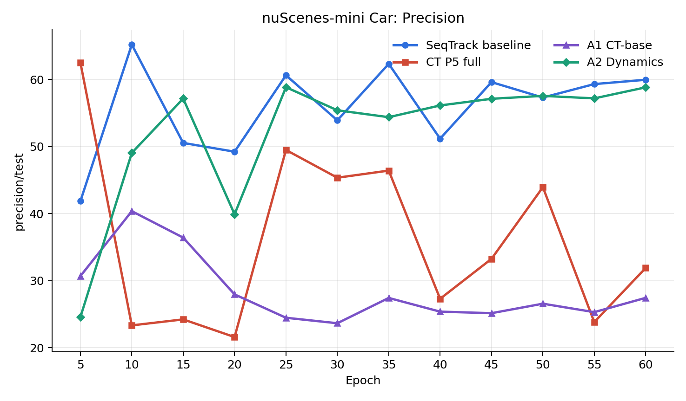
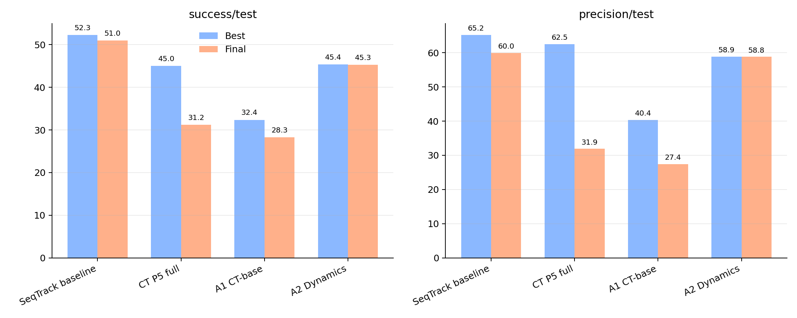

# A1/A2 Ablation Comparison

Compared runs: SeqTrack baseline, CT P5 full, A1 CT-base, A2 Dynamics.

## Summary

| model | metric | final | best | mean | std | final delta vs baseline | best delta vs baseline |
|---|---|---:|---:|---:|---:|---:|---:|
| SeqTrack baseline | success/test | 50.9858 | 52.2834 | 47.9679 | 3.4748 | 0.0000 | 0.0000 |
| CT P5 full | success/test | 31.1937 | 44.9836 | 33.3975 | 7.9882 | -19.7921 | -7.2998 |
| A1 CT-base | success/test | 28.2768 | 32.3556 | 27.8534 | 1.8437 | -22.7090 | -19.9278 |
| A2 Dynamics | success/test | 45.2659 | 45.3600 | 42.4847 | 4.8331 | -5.7199 | -6.9234 |
| SeqTrack baseline | precision/test | 59.9617 | 65.2144 | 55.9259 | 6.3958 | 0.0000 | 0.0000 |
| CT P5 full | precision/test | 31.8851 | 62.5120 | 36.0892 | 12.5834 | -28.0766 | -2.7024 |
| A1 CT-base | precision/test | 27.4289 | 40.3611 | 28.3937 | 4.8781 | -32.5328 | -24.8533 |
| A2 Dynamics | precision/test | 58.8315 | 58.8523 | 52.1803 | 9.7694 | -1.1302 | -6.3621 |

## Figures

## Files

- `ablation_a1_a2_metrics_points.csv`
- `ablation_a1_a2_metrics_summary.csv`