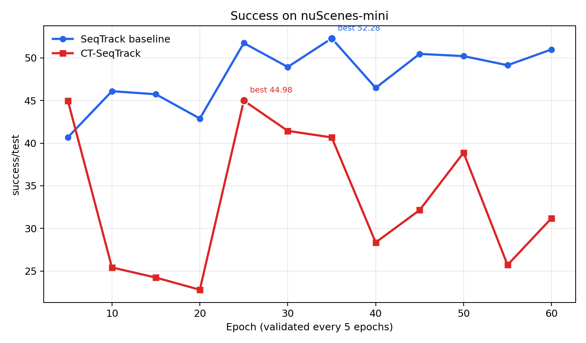
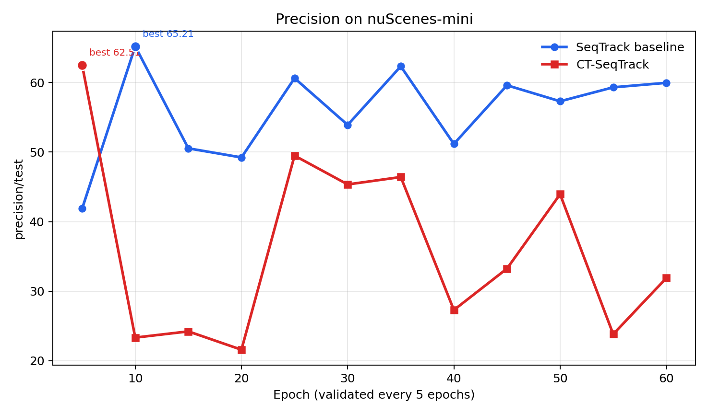
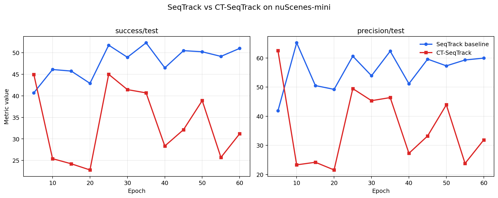
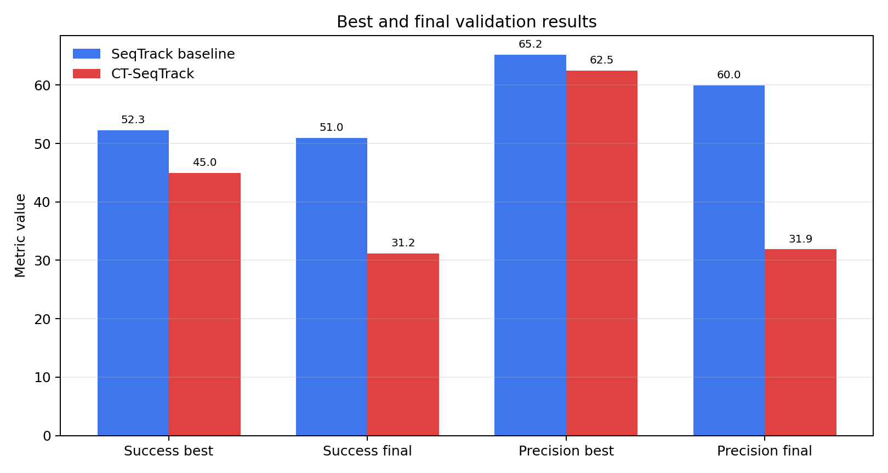

# Experiment Comparison Figures

Source: `../seqtrack_vs_ct_seqtrack_metrics.md`

Validation points are plotted as epochs 5, 10, ..., 60 because training used `check_val_every_n_epoch=5`.

## Summary

| Metric | SeqTrack best | CT-SeqTrack best | Delta best | SeqTrack final | CT-SeqTrack final | Delta final |
|---|---:|---:|---:|---:|---:|---:|
| success/test | 52.2834 | 44.9836 | -7.2998 | 50.9858 | 31.1937 | -19.7921 |
| precision/test | 65.2144 | 62.5120 | -2.7024 | 59.9617 | 31.8851 | -28.0766 |

## Figures

## Files

- `metrics_points.csv`: tidy per-validation-point data.

- `metrics_summary.csv`: final/best summary.
