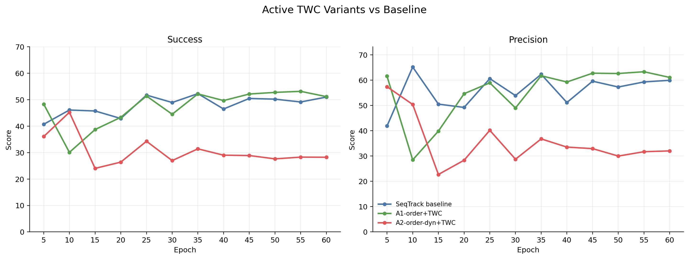
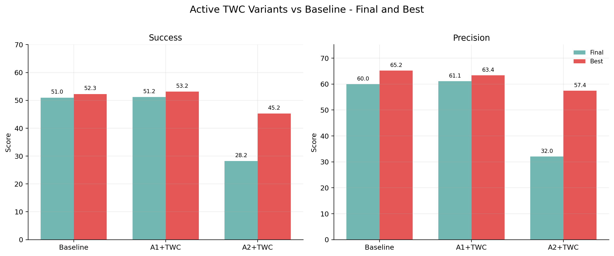

# Active TWC Variants vs Baseline

Compared models: SeqTrack baseline and the two validity-fixed active TWC variants.

| Model | Succ final | Succ best | Succ delta vs baseline | Prec final | Prec best | Prec delta vs baseline |
| --- | ---: | ---: | ---: | ---: | ---: | ---: |
| SeqTrack baseline | 50.99 | 52.28 | 0.00 | 59.96 | 65.21 | 0.00 |
| A1-order+TWC | 51.16 | 53.16 | 0.17 | 61.10 | 63.35 | 1.14 |
| A2-order-dyn+TWC | 28.23 | 45.24 | -22.75 | 32.04 | 57.43 | -27.92 |

## Figures

## Data

- `../data/active_twc_vs_baseline_metrics_points.csv`
- `../data/active_twc_vs_baseline_metrics_summary.csv`
