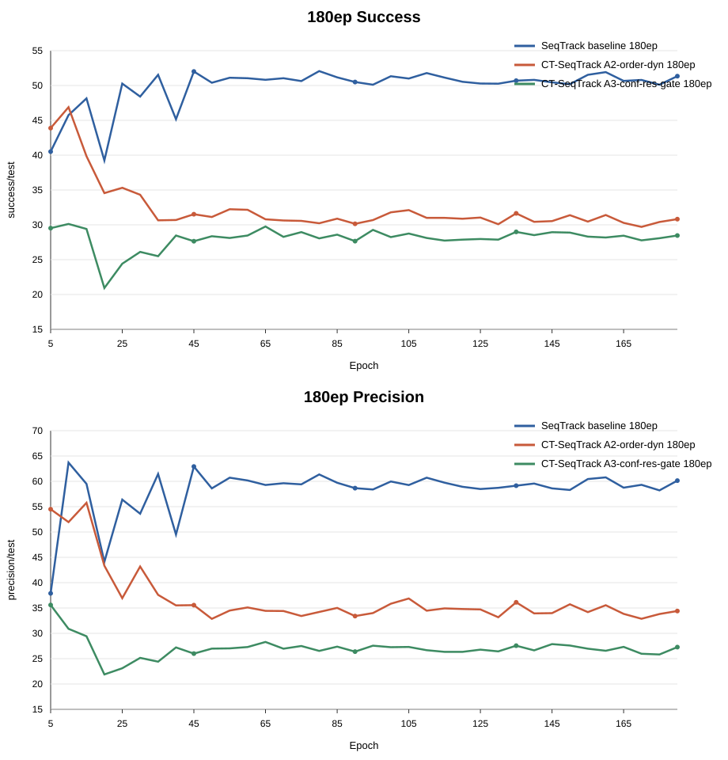
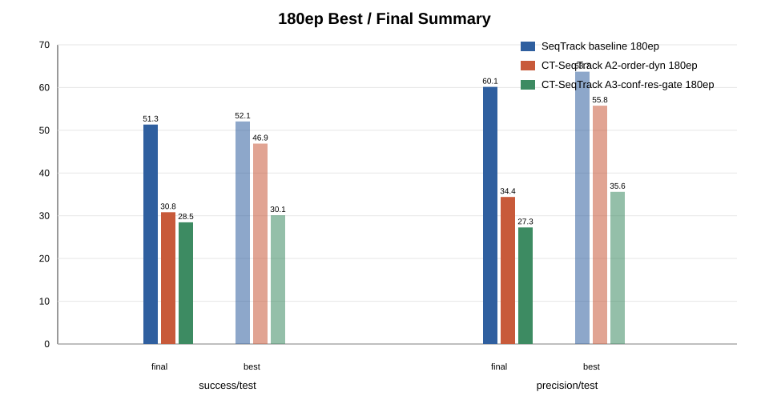

# Baseline vs A2 vs A3 180ep

## Summary

| model | metric | final | best | best epoch | late mean 120-180 | final delta vs baseline | best delta vs baseline |
| --- | --- | ---: | ---: | ---: | ---: | ---: | ---: |
| SeqTrack baseline 180ep | success/test | 51.34 | 52.06 | 80 | 50.74 | 0.00 | 0.00 |
| SeqTrack baseline 180ep | precision/test | 60.15 | 63.70 | 10 | 59.18 | 0.00 | 0.00 |
| CT-SeqTrack A2-order-dyn 180ep | success/test | 30.82 | 46.89 | 10 | 30.70 | -20.52 | -5.17 |
| CT-SeqTrack A2-order-dyn 180ep | precision/test | 34.41 | 55.76 | 15 | 34.39 | -25.74 | -7.94 |
| CT-SeqTrack A3-conf-res-gate 180ep | success/test | 28.46 | 30.13 | 10 | 28.33 | -22.87 | -21.94 |
| CT-SeqTrack A3-conf-res-gate 180ep | precision/test | 27.28 | 35.60 | 5 | 26.86 | -32.87 | -28.11 |

## Figures

## Files

- `../data/baseline_a2_a3_180ep_metrics_points.csv`
- `../data/baseline_a2_a3_180ep_metrics_summary.csv`
- `../figures/line_charts/baseline_a2_a3_180ep_curves.svg`
- `../figures/bar_charts/baseline_a2_a3_180ep_best_final_summary.svg`
