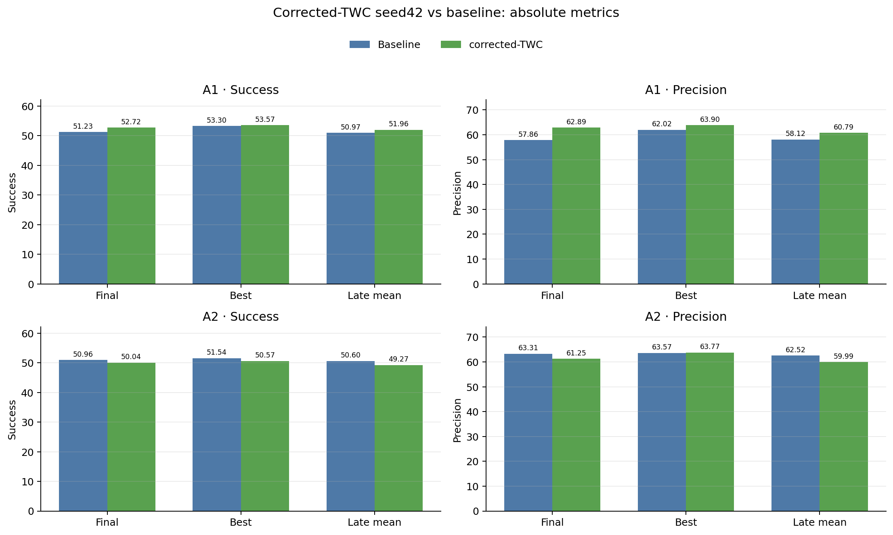
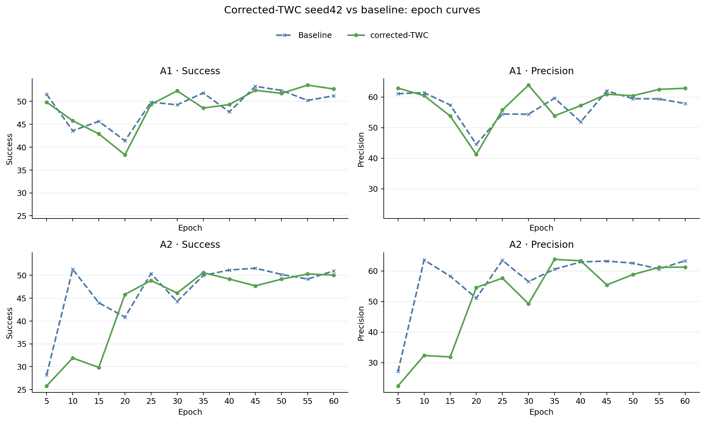
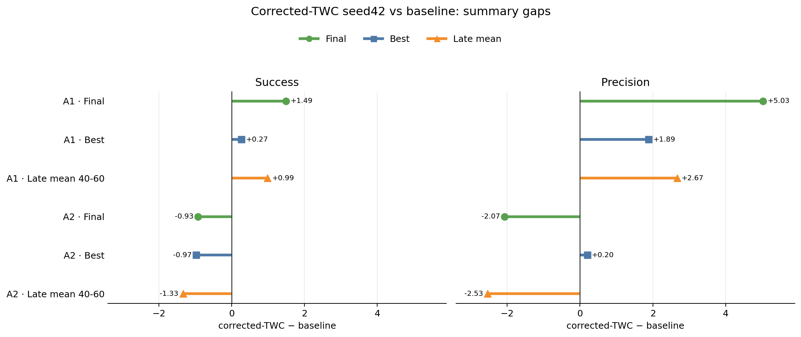
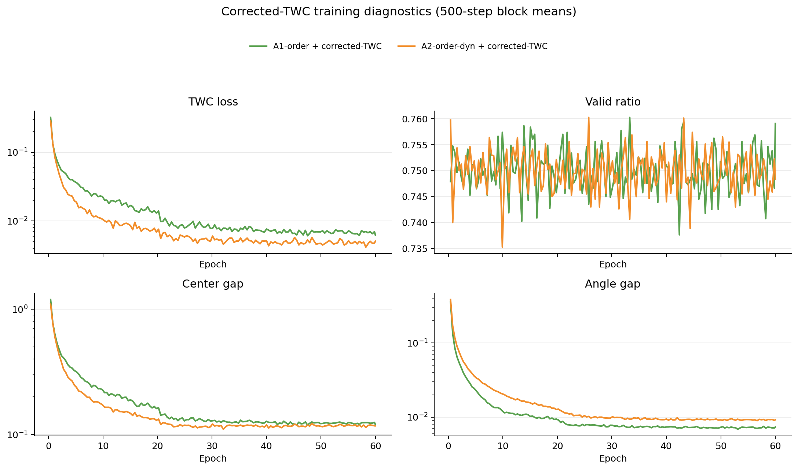

# Corrected-TWC seed42 与 Baseline 对比

> **TrajTrack 参考状态（2026-08-16）**：自本标注起，TrajTrack 不再作为
> CT-SeqTrack 后续方法设计、Gate/proposal 机制选择、超参数设定或性能有效性的
> 参考依据；仅保留为必须引用的相关工作、历史审计对象和 GT-free 评测警示。
> 下文既有 TrajTrack 内容均为历史记录，不再驱动当前或未来方案。

## 实验完整性与口径

- corrected-TWC 两组均有 12 个评测点、epoch-59 checkpoint 和 75720 optimizer steps。
- A1/A2 baseline 与 corrected-TWC 均为 seed42、60 epoch、batch16、candidate4、每 5 epoch 评测，外层 DataLoader 均为 1262 steps/epoch。
- baseline 是 2026-05-31 的旧 run，hparams 未记录 git commit；当前只能确认关键配置对齐。因此下列差距是配置级参考，不视为严格同代码提交的因果配对实验。
- 指标来自 mini_val，但日志命名为 `metrics/test`，属于开发集证据。
- 差距统一定义为 `corrected-TWC - baseline`：正值表示 corrected-TWC 更好，负值表示更差。
- `Final` 是 epoch60 评测，`Best` 是各 run 自己的最佳评测点，`Late mean` 是 epoch40-60 的均值。

## Tracking 指标

| family | condition | metric | final | best | best epoch | late mean 40-60 |
| --- | --- | --- | ---: | ---: | ---: | ---: |
| A1 | Baseline | Success | 51.23 | 53.30 | 45 | 50.97 |
| A1 | Baseline | Precision | 57.86 | 62.02 | 45 | 58.12 |
| A1 | corrected-TWC | Success | 52.72 | 53.57 | 55 | 51.96 |
| A1 | corrected-TWC | Precision | 62.89 | 63.90 | 30 | 60.79 |
| A2 | Baseline | Success | 50.96 | 51.54 | 45 | 50.60 |
| A2 | Baseline | Precision | 63.31 | 63.57 | 10 | 62.52 |
| A2 | corrected-TWC | Success | 50.04 | 50.57 | 35 | 49.27 |
| A2 | corrected-TWC | Precision | 61.25 | 63.77 | 35 | 59.99 |

## corrected-TWC 相对 baseline 的差距

| family | metric | final delta | best delta | late-mean delta |
| --- | --- | ---: | ---: | ---: |
| A1 | Success | 1.49 | 0.27 | 0.99 |
| A1 | Precision | 5.03 | 1.89 | 2.67 |
| A2 | Success | -0.93 | -0.97 | -1.33 |
| A2 | Precision | -2.07 | 0.20 | -2.53 |

## 坐标修复后的 TWC 诊断

| model | valid mean | TWC loss tail1000 | center gap tail1000 | angle gap tail1000 | anchor max | current XYZ max |
| --- | ---: | ---: | ---: | ---: | ---: | ---: |
| A1 + corrected-TWC | 0.7500 | 0.00675 | 0.12400 | 0.00720 | 0.0 | 0.0 |
| A2 + corrected-TWC | 0.7499 | 0.00479 | 0.11738 | 0.00919 | 0.0 | 0.0 |

## 结论

1. 以关键配置对齐的 baseline 为参考，corrected-TWC 在 A1 上形成 seed42 的正信号：final Success/Precision 分别提升 1.49/5.03，late mean 提升 0.99/2.67。
2. corrected-TWC 没有给 A2 带来 tracking 收益：final Success/Precision 分别下降 0.93/2.07，late mean 下降 1.33/2.53。
3. 两组 corrected-TWC 的 anchor gap max 和 current-point XYZ gap max 均为 0，说明坐标修正路径已正确生效；但更低的 TWC loss 不等价于更高的 tracking 指标。
4. 当前只有 seed42。A1 的正信号需要 seed43/44 才能升级为稳定结论；A2 暂不建议接入 TWC 主线。

## 图表目录

| 图表类型 | 文件夹 | 内容 |
| --- | --- | --- |
| 柱状图 | `../figures/bar_charts/` | baseline 与 corrected-TWC 的 Final/Best/Late mean 绝对指标 |
| 线性图 | `../figures/line_charts/` | 两组方法随 epoch 的 Success/Precision 曲线 |
| 差距图 | `../figures/delta_charts/` | `corrected-TWC - baseline` 的 Final/Best/Late mean 差距 |

### 柱状图

### 线性图

### 差距图

### corrected-TWC 训练诊断（补充）

## 数据文件

- `../data/corrected_twc_seed42_baseline_vs_twc_points.csv`：逐 epoch 原始评测点。
- `../data/corrected_twc_seed42_baseline_vs_twc_summary.csv`：Final/Best/Late mean 汇总。
- `../data/corrected_twc_seed42_baseline_vs_twc_gaps.csv`：corrected-TWC 与 baseline 的长表差距数据。
- `../data/corrected_twc_seed42_diagnostics_summary.csv`
- `../data/corrected_twc_seed42_diagnostics_block_points.csv`

## 独立扩展参考

- [TrajTrack GT-assisted 与 plain SeqTrack3D 参考对比](trajtrack_gt_assisted_vs_plain_seqtrack_reference.md)：单独保存，不与 corrected-TWC 的公平差距图混合。
