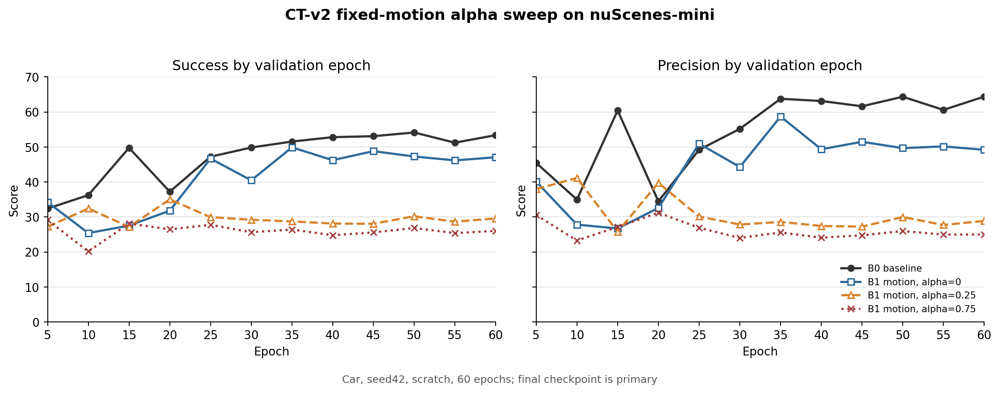

# CT-v2 Motion Fixed-Alpha 复核

更新时间：2026-07-30

## 技术结论

**当前 `proposal_innovation` motion 模块不能涨点，固定全局 alpha 路线应判定
No-Go。** 同代码、同 seed、同 scratch 合同下，`alpha=0.25` 的 epoch60 为
`29.581/28.862`，相对
`alpha=0` 下降 `-17.468/`
`-20.322`；late-3 同样下降
`-17.357/-20.820`。旧 `alpha=0.75`
更低至 `26.021/24.972`。

`alpha=0` 虽恢复到
`47.049/49.184`，仍比 B0 低
`-6.311/`
`-15.198`。但它是精确关闭
innovation 的负对照，不是 motion 的正贡献；它与 B0 还存在可选模块改变共享层
随机初始化的已知混杂。因此当前数据能强否定正 alpha 的直接融合，不能把
`alpha=0` 与 B0 的差全部归因于 dynamics 辅助学习。

正式判定：

```text
NO_GO_FIXED_GLOBAL_MOTION_INNOVATION
ALPHA025_REDUCES_BUT_DOES_NOT_REMOVE_FAILURE
ALPHA000_IS_A_FALLBACK_CONTROL_NOT_A_GAIN
BROADER_MOTION_PRIOR_IDEA_REMAINS_UNRESOLVED
```

## 四组完整曲线均不支持涨点

下图使用统一 0–70 纵轴和全部 12 个固定验证点。`alpha=0.25` 在 epoch25–60
的 8/8 个验证点上，Success 和
Precision 同时低于 `alpha=0`；不是 epoch60 单点选择问题。



| arm | final Success | final Precision | best Success | best Precision | late-3 S/P |
|---|---:|---:|---:|---:|---:|
| B0 baseline | 53.360 | 64.382 | 54.135 (e50) | 64.382 (e60) | 52.905/63.104 |
| motion alpha=0 | 47.049 | 49.184 | 49.876 (e35) | 58.691 (e35) | 46.828/49.669 |
| motion alpha=0.25 | 29.581 | 28.862 | 35.027 (e20) | 41.130 (e10) | 29.472/28.849 |
| motion alpha=0.75 | 26.021 | 24.972 | 29.115 (e5) | 31.211 (e20) | 26.080/25.299 |

没有一个正 alpha 运行在任一验证点同时超过同阶段 B0 的两项指标。
`alpha=0` 的最好点出现在 epoch35（
`49.876/58.691`），
同阶段 B0 仍为
`51.539/63.763`。

## 数据和可比性通过完整性检查

- 数据：nuScenes v1.0-mini，Car；mini_train 274 tracklets / 5,051 frames，
  mini_val 106 tracklets / 2,285 frames。
- 四组都是 seed42、batch16、candidate4、60 epoch、75,720 training steps、
  每 5 epoch 验证，共 12 个点；主比较固定使用 epoch60 `last.ckpt`。
- 新 `alpha=0/0.25` 来自同一 commit `5f260e7`，tracked source clean，
  仅两个 alpha YAML 为 untracked；其内容已由 provenance SHA256 精确还原。
- 两个新运行的 resolved config 仅有 `cfg`、`tag` 和
  `dynamics_innovation_alpha` 三项差异，训练/验证 selection hash 一致。
- B0/旧 alpha0.75 来自 `d86990c`；中间代码变化对本分支主要是 inert PFTC
  默认项与 singleton shape 防护，但跨 commit 对比仍只作为上下文。

## 较小 alpha 只是减少伤害，没有改变错误方向

`alpha=0.25` 在 warmup 后实际平均系数为
`0.184`，
约 73.7%
训练样本应用修正；平均修正范数仅
`0.083 m`，
仍造成 final `−17.468/−20.322`。这说明问题不只是旧 `0.75` 数值过大。

| diagnostic | alpha=0 | alpha=0.25 | alpha=0.75 |
|---|---:|---:|---:|
| post-warmup effective alpha | 0.000 | 0.184 | 0.553 |
| post-warmup applied ratio | 0.0% | 73.7% | 73.7% |
| post-warmup correction norm | 0.000 m | 0.083 m | 0.292 m |
| post-warmup clamp ratio | 30.1% | 33.0% | 40.7% |
| epoch60 mean training loss | 0.223 | 0.217 | 0.215 |

## 主要根因是训练/递归语义错位

### 1. dynamics 在训练和验证读取的历史不是同一种分布

训练时 CT-v2 dynamics 显式读取由 GT 历史构造的
`ct_motion_ref_boxs/canonical_ref_boxs`，再叠加合成 correlated candidate
误差；递归验证时 `self.training=False`，改为读取 tracker 自己累计的
`ref_boxs`。前者是有界、局部、受控误差，后者包含闭环漂移和错误速度。
离线 M0-3 的 `alpha≈0.775` 又来自 GT-history、candidate0、
crop-reachable oracle，不能校准这种递归输入。

### 2. `dynamics_valid` 只表示“有历史 transition”，不表示方向可靠

固定融合没有在线可靠性判断。alpha0.25 在约 73.7% 样本上持续应用，
而 empty-search fallback 只覆盖极端无点情况。只要历史已漂移，错误 prior
仍会被当作有效方向；递归更新再把误差写回下一帧历史。

### 3. innovation 接在 coarse proposal 与 Transformer query 之前

修正后的 coarse center 被立即用于构造 `aux_box` 和 box-corner query。
因此一个看似很小的 `0.083 m` 平均修正不仅改变最终坐标，还改变后续
Transformer 的查询几何；错误方向可被 refinement 和下一帧 crop 放大。

### 4. 本地训练 loss 奖励 fusion，闭环指标却单调恶化

epoch60 mean training loss 从 alpha0 的
`0.223` 降到
alpha0.25 的
`0.217`，旧 alpha0.75
进一步降到
`0.215`；
Success/Precision 却反向下降。局部 teacher-forced objective 无法约束
closed-loop stability，继续训练或按 training loss 选 alpha 不会修复。

### 5. alpha0 与 B0 的差不能用于证明 dynamics 本身有害

alpha0 在 `apply_proposal_innovation` 中是精确零回退；DynamicsEncoder 的
velocity/displacement loss只更新独立 dynamics 参数，不给 observation 主干
提供正向信息。同时 DynamicsEncoder 在部分共享层之前实例化，会消耗 RNG，
导致 B0 与 B1 即使同 seed 也不是同一份共享初始化。alpha0 低于 B0 主要说明
旧 B 组缺少 shared-init control；它不是 “motion 学了但没有融合仍掉点”
的充分证据。

## 局限和稳健性边界

- 只有 seed42；alpha0/0.25 虽共享实验合同，但两卡 CUDA 训练未声明完全
  deterministic。二者第一步 loss 完全相同，随后即出现微小数值分叉。
- 没有 validation endpoint 导出，当前不能直接计算 recursive history 下
  dynamics 相对 observation 的 helpful rate、最优 alpha 分布或错误集中桶。
- 没有同一 checkpoint 的 alpha on/off 评测，因此还未完全分离
  “推理时直接位移伤害”和“训练期共同适配伤害”。
- 本结论否定当前固定全局 innovation，不等价于否定所有 motion feature、
  adapter、distillation 或条件使用方式。

## 分析验证：固定融合结论可决策，广义 motion 结论需保留 caveat

完整性、配置差异、final/late-3、训练组件 loss 和图表已经由独立 CSV
交叉核对；固定全局 alpha 的 No-Go 可直接用于停止后续长训。由于只有一个
seed、B0 共享初始化不匹配且缺少 endpoint proposal export，报告不能升级为
“所有 motion prior 无效”。整体置信度为 **Share with caveats**：停止当前
fixed-global 模块是高置信决策，更广义 motion 方向仍需下述无训练归因。

## 下一步：停止长训，先完成两个无训练诊断

1. **同 checkpoint 2×2。** 分别将 alpha0 与 alpha0.25 的 epoch60
   checkpoint 在推理时以 alpha0/0.25 运行，endpoint 和采样固定：

   - alpha0 checkpoint：0 → 0.25，测直接开启 prior 的即时伤害；
   - alpha0.25 checkpoint：0.25 → 0，测关闭 prior 后能否恢复，分离
     training co-adaptation。

2. **导出逐 endpoint proposal attribution。** 对同一 validation forward
   同时保存 observation proposal、dynamics proposal、GT、previous prediction
   error、disagreement、有效历史、点数、速度和 delta_t；至少报告：

   - `P(error_dyn < error_obs)`；
   - recursive 条件下的 oracle alpha 分布；
   - correction 与 GT residual 的 cosine；
   - 按 previous error、speed、foreground points、delta_t 分桶的净增益；
   - 首次失控帧与连续漂移长度。

只有当训练集/独立诊断 split 上存在稳定的可识别 helpful subgroup，并且
GT-free selector 在冻结 split 上通过，才允许研究条件 alpha。已有 P0-B4
已经否定过一版 observation reliability gate，因此不能直接重启相同 learned
gate。若同-checkpoint开启 0.25 立即退化、关闭后恢复，直接 fusion 路线永久
停止；若关闭仍不恢复，则还要处理训练期 co-adaptation，但也不再扫更多全局
alpha。

在完成这两个低成本诊断前，不再训练 alpha0.05/0.1、seed43/44、full
nuScenes 或 motion+search。当前 GPU 主线仍按既定 PFTC 修复 kill-test
推进；motion 只保留为不占训练资源的机制归因任务。

## 仍待回答的问题

- recursive history 下 dynamics proposal 真正优于 observation 的 endpoint
  比例是多少，是否存在跨 split 稳定子群？
- 退化主要由测试时 correction 造成，还是训练期 coarse-query
  co-adaptation 已破坏共享表示？
- 若 direct proposal correction 被永久停止，历史 A2 feature-concat/R1
  adapter 的正信号在 matched initialization、matched data contract 下是否
  仍存在？
