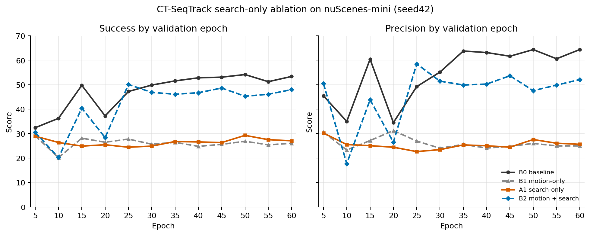

# CT-SeqTrack Search-only seed42 技术复核

更新时间：2026-07-27

## Technical Summary

**当前 Search-only 实现不具备独立正贡献。** A1 final 为 27.036 Success / 25.596 Precision，相对 B0 分别下降 26.324 / 38.786。其 best、final 和 late-3 全部远低于 B0，因此不能通过选 checkpoint 挽救结论。

A1 的训练 loss 与 B0 几乎相同，search 的训练激活和扩展比例又与 B2 一致，但递归验证从 epoch5 起就崩溃。这支持“训练与递归推理的 search 分布/历史误差不匹配”或“search 与 motion 存在强交互”的诊断，不支持把失败简单归因于训练不足，也不能把它扩大为“任何搜索扩展都无效”。

Overall Assessment: **Share with caveats**。结果足以否决当前 A1，但在缺少 validation/test 逐 endpoint search 使用率和服务器初始化等价 preflight 日志时，还不足以锁定唯一故障机制。

## Search-only 在所有验证阶段都显著低于 baseline

| arm | final Success | final Precision | best Success (epoch) | best Precision (epoch) | late-3 Success | late-3 Precision |
|---|---:|---:|---:|---:|---:|---:|
| B0 baseline | 53.360 | 64.382 | 54.135 (50) | 64.382 (60) | 52.905 | 63.104 |
| B1 motion-only | 26.021 | 24.972 | 29.115 (5) | 31.211 (20) | 26.080 | 25.299 |
| A1 search-only | 27.036 | 25.596 | 29.257 (50) | 30.202 (5) | 27.933 | 26.400 |
| B2 motion + search | 47.973 | 52.088 | 50.080 (25) | 58.499 (25) | 46.437 | 49.818 |

| comparison | final Success delta | final Precision delta | interpretation |
|---|---:|---:|---|
| A1 − B0: search-only | -26.324 | -38.786 | standalone search fails |
| B1 − B0: motion-only | -27.339 | -39.410 | standalone motion fails |
| B2 − B1: add search after motion | +21.952 | +27.116 | positive rescue interaction |
| B2 − B0: combined model | -5.387 | -12.294 | still below baseline |

按四格 final 结果计算的描述性交互项为 +48.276 Success / +65.902 Precision。它说明 search 的方向依赖于是否存在 motion 分支，而不是一个可直接相加的独立模块。由于两种网络结构的共享初始化没有统一 artifact 证明，该交互项只能作为诊断量，不能作为论文级因果效应。

下图使用相同的 0–70 纵轴展示 12 个固定验证点。A1 曲线从未接近 B0；B2 仅作为 search 与 motion 交互的上下文，不替代 A1−B0 的主比较。

## 训练侧几乎正常，问题集中在递归验证语义

| diagnostic | B0 | A1 search-only | B2 motion+search |
|---|---:|---:|---:|
| epoch60 mean training loss | 0.2208 | 0.2221 | 0.2128 |
| training search-used sample ratio | 0.000% | 3.460% | 3.458% |
| mean expansion token share | 0.000% | 0.865% | 0.865% |
| mean expansion-only available points | 0.000 | 10.257 | 10.296 |

A1 与 B0 的 epoch60 training loss 只差约 0.0013；A1 与 B2 的 search-used ratio、expansion token share 和 expansion points 也近乎相同。因此 A1 不是因为 search 没有执行，也没有显示常规训练 loss 发散。最合理的待验证假设是：训练中 mostly canonical/correlated history 只让少量样本启用 tube，而递归预测历史一旦产生偏差，tube 可能抽入背景并形成误差反馈。当前 events 没有记录验证阶段的 search 激活率，所以这仍是机制推断。

## 范围、数据和指标口径

- 数据：nuScenes v1.0-mini，Car；mini_train 274 tracklets / 5,051 frames，mini_val 106 tracklets / 2,285 frames。
- 协议：normal cadence、seed42、candidate4、batch16、60 epoch，每 5 epoch 验证一次；主结果固定使用 epoch60 `last.ckpt`。
- Success/Precision 直接读取 TensorBoard validation scalars；best 和 late-3 只用于稳定性诊断。
- A1 与 B0 的 checkpoint 都有 320 个同名、同 shape state tensors，模型拓扑检查为 PASS。
- A1/B0 resolved-config 的实质变化只包括 search 开关以及仅供 search 使用的 correlated history；配置名和 tag 属于 provenance。

## 完整性和方法核验

| arm | status | commit | train steps | validation points | last checkpoint |
|---|---|---|---:|---:|---|
| B0 | COMPLETE | `d86990c` | 75,720/75,720 | 12/12 | epoch 60 |
| B1 | COMPLETE | `d86990c` | 75,720/75,720 | 12/12 | epoch 60 |
| A1 | COMPLETE | `052ae8d` | 75,720/75,720 | 12/12 | epoch 60 |
| B2 | COMPLETE | `d86990c` | 75,720/75,720 | 12/12 | epoch 60 |

A1/B0 resolved-config 差异字段为：`cfg, ct_history_training_mode, ct_search_training_history, experiment_name, tag, use_time_guided_search`。B0 使用 `d86990c`，A1 使用 `052ae8d`；中间代码变化包括 batch1 shape 修复、search-only 解耦和测试，不改变 B0 的共享层定义。

## 限制、稳健性与未解决证据

1. **缺少服务器初始化等价日志。** 本地结果证明 checkpoint topology 完全一致，源码也提供 seeded exact-init checker，但 `search_only_model_equivalence.log` 未随结果拉回，不能声称该 preflight artifact 已审计通过。
2. **缺少验证阶段 search diagnostics。** 当前只有训练阶段 search 使用率；无法从现有 event 判断递归验证中 tube 的激活率、扩展点数及首次导致漂移的 endpoint。
3. **单 seed、mini。** 该限制不妨碍否决幅度巨大的当前 A1，但不能估计更保守 search 设计的方差。
4. **非因果时间结论。** A1 使用 true effective time，但尚未通过正常集 guardrail，因此不运行或解释 fixed/shuffled。

## 推荐下一步：先做同 checkpoint 的 Search 开/关 2×2

暂不训练 A2，也不调低 75/25 或加入新 gate。先用现有两个 checkpoint 做四次无训练评测：

| checkpoint | baseline crop | search-on crop | purpose |
|---|---|---|---|
| B0 final | 已有 B0 | 待测 | search 的纯推理影响 |
| A1 final | 待测 | 已有 A1 | 训练暴露与推理 search 的分离 |

若两个 checkpoint 都只在 search-on 时崩溃，可确认递归 search 路径是主因；若 A1 在 search-off 下仍崩溃，则训练时稀疏的 expansion 已改变模型。完成 2×2 后再决定删除当前 Search，还是增加 fail-closed 条件、递归历史训练和更小扩展预算。

## Further Questions

- A1 checkpoint 关闭 search 后能否恢复到 B0 水平？
- B0 checkpoint 仅在推理开启 search 是否立即跌到 A1 水平？
- 递归验证的 search 激活率、扩展点数和首次漂移帧分别是多少？
- B2 的恢复来自 motion proposal 抵消 search 背景，还是来自不同网络初始化/优化路径？
