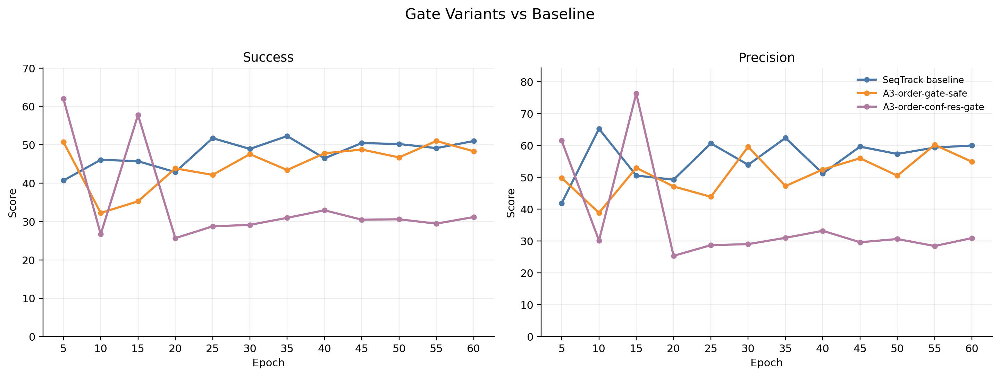
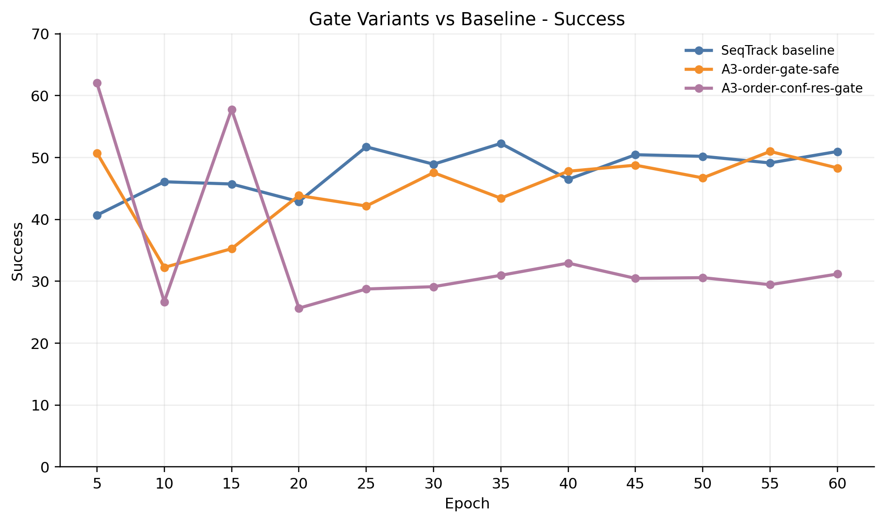
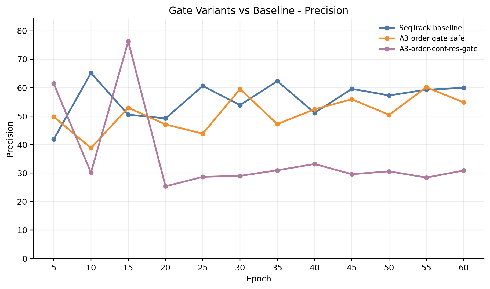
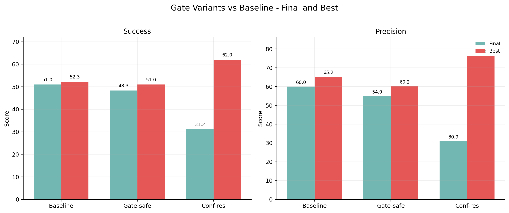

# Gate Variants vs Baseline

Compared models: SeqTrack baseline, gate-safe, and conf-res gate.

| Model | Succ final | Succ best | Succ delta vs baseline | Prec final | Prec best | Prec delta vs baseline |
| --- | ---: | ---: | ---: | ---: | ---: | ---: |
| SeqTrack baseline | 50.99 | 52.28 | 0.00 | 59.96 | 65.21 | 0.00 |
| A3-order-gate-safe | 48.32 | 50.99 | -2.67 | 54.87 | 60.17 | -5.10 |
| A3-order-conf-res-gate | 31.17 | 62.04 | -19.81 | 30.92 | 76.30 | -29.04 |

## Figures

## Data

- `../data/gate_variants_vs_baseline_metrics_points.csv`
- `../data/gate_variants_vs_baseline_metrics_summary.csv`
