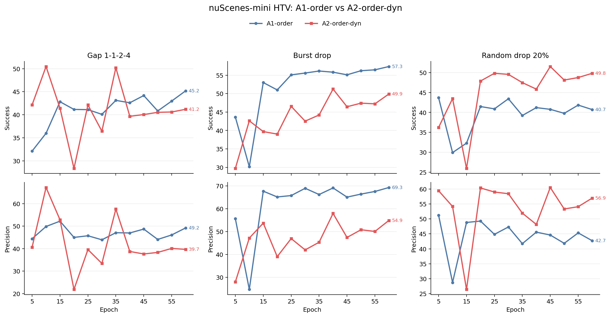
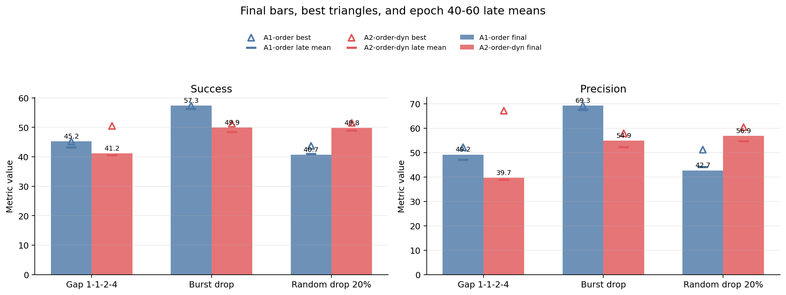
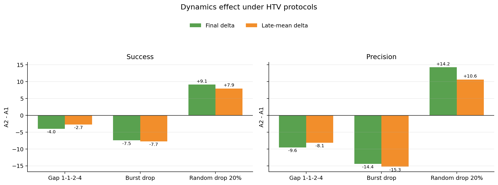

# nuScenes-mini HTV 六组实验总结

## 协议与公平性

六组实验均为 seed 42、60 epoch、batch size 16、candidate 4、每 5 epoch 评测一次。
同一协议内 A1/A2 的 DataLoader 长度和总 optimizer steps 一致；三种协议之间样本数不同，因此只做协议内 A2-A1 配对比较。
`virtual_rate_manifest` 为空，但 virtual-rate seed 固定为 42；本轮是确定性配置配对，不是冻结 manifest 配对。
当前指标来自 `mini_val` 上记录为 `metrics/test` 的开发评测，不应写成正式 held-out test 结果。

| protocol | train batches/epoch | total steps |
| --- | ---: | ---: |
| Gap 1-1-2-4 | 714 | 42840 |
| Burst drop | 706 | 42360 |
| Random drop 20% | 1018 | 61080 |

## 模型指标

| protocol | model | metric | final | best | best epoch | best-final gap | late mean 40-60 |
| --- | --- | --- | ---: | ---: | ---: | ---: | ---: |
| Gap 1-1-2-4 | A1-order | Success | 45.19 | 45.19 | 60 | 0.00 | 43.15 |
| Gap 1-1-2-4 | A1-order | Precision | 49.21 | 52.21 | 15 | 3.00 | 47.00 |
| Gap 1-1-2-4 | A2-order-dyn | Success | 41.18 | 50.47 | 10 | 9.29 | 40.40 |
| Gap 1-1-2-4 | A2-order-dyn | Precision | 39.66 | 67.18 | 10 | 27.53 | 38.88 |
| Burst drop | A1-order | Success | 57.35 | 57.35 | 60 | 0.00 | 56.18 |
| Burst drop | A1-order | Precision | 69.28 | 69.28 | 60 | 0.00 | 67.48 |
| Burst drop | A2-order-dyn | Success | 49.90 | 51.23 | 40 | 1.33 | 48.44 |
| Burst drop | A2-order-dyn | Precision | 54.88 | 57.93 | 40 | 3.05 | 52.22 |
| Random drop 20% | A1-order | Success | 40.72 | 43.69 | 5 | 2.97 | 40.86 |
| Random drop 20% | A1-order | Precision | 42.71 | 51.22 | 5 | 8.51 | 44.01 |
| Random drop 20% | A2-order-dyn | Success | 49.81 | 51.51 | 45 | 1.70 | 48.81 |
| Random drop 20% | A2-order-dyn | Precision | 56.94 | 60.48 | 45 | 3.53 | 54.59 |

## A2-order-dyn 相对 A1-order

| protocol | metric | final delta | best delta | late-mean delta | all-eval mean delta |
| --- | --- | ---: | ---: | ---: | ---: |
| Gap 1-1-2-4 | Success | -4.01 | 5.28 | -2.75 | 0.08 |
| Gap 1-1-2-4 | Precision | -9.55 | 14.97 | -8.12 | -4.65 |
| Burst drop | Success | -7.45 | -6.12 | -7.75 | -8.25 |
| Burst drop | Precision | -14.40 | -11.34 | -15.25 | -15.68 |
| Random drop 20% | Success | 9.09 | 7.83 | 7.94 | 5.76 |
| Random drop 20% | Precision | 14.23 | 9.25 | 10.58 | 9.21 |

## 结论

1. **A2 dynamics 只在 random20 上形成一致的 final 正收益。** Success 9.09，Precision 14.23；late mean 也为正。
2. **在更强的 gap1124 和 burst-drop 上，A2 明显低于 A1。** gap1124 final 为 -4.01 / -9.55，burst-drop 为 -7.45 / -14.40。
3. **gap1124 的 A2 存在明显早期高点和后期回落。** Precision best=67.18（epoch 10），final=39.66，best-final gap=27.53。这更像训练/监督稳定性问题，而不是稳定的时间建模收益。
4. **当前结果不支持‘时间间隔越不规则，feature-concat dynamics 越有效’。** 相反，旧 A2 feature-concat 只在温和 random20 上受益，在强 gap/burst 下退化，支持继续验证 observation-first bounded residual，而不支持把旧 A2 直接作为主方法。
5. **这仍是单 seed、mini_val 筛选证据。** 尚不能形成统计结论，也没有 true-dt/fixed-dt/shuffled-dt 因果对照；下一步应优先冻结 manifest，运行 residual 的三 seed 配对矩阵和困难分桶。

## 图表

## 数据文件

- `../data/htv_6runs_metrics_points.csv`
- `../data/htv_6runs_metrics_summary.csv`
- `../data/htv_6runs_paired_deltas.csv`
- `../data/htv_6runs_paired_delta_points.csv`
