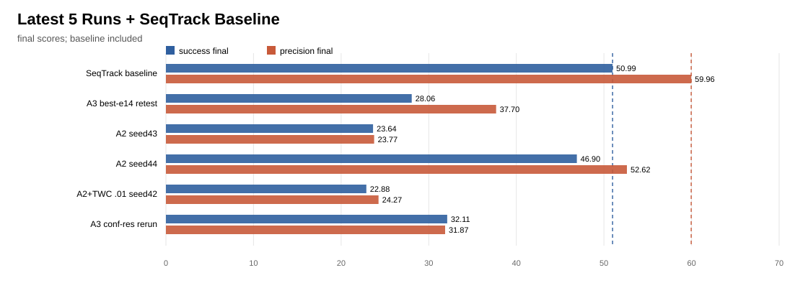
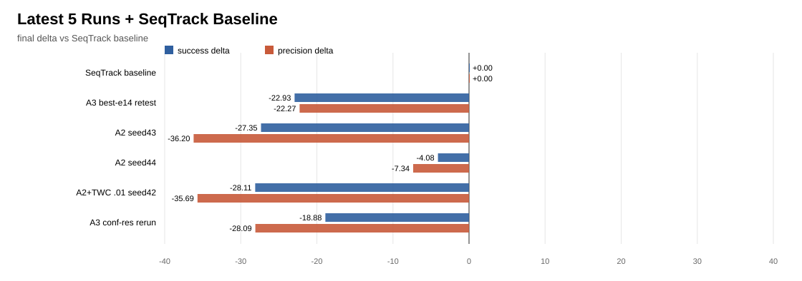
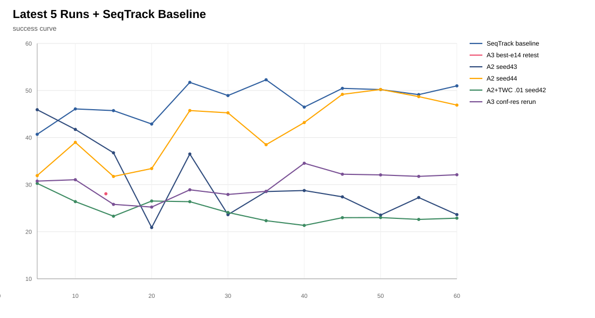
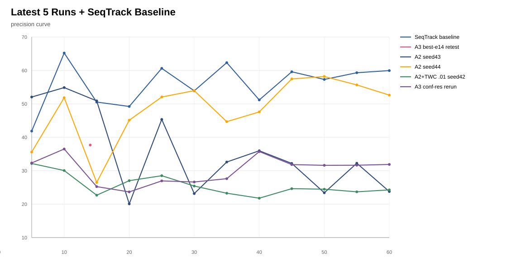

# Latest 5 Runs + SeqTrack Baseline

This report combines the latest five local runs with the 60ep SeqTrack baseline.
The baseline row is taken from `twc_gate_ablation_metrics_*` to match the 60ep protocol.

## Figures

## Summary

| model | succ final | succ delta | succ best | prec final | prec delta | prec best | note |
| --- | ---: | ---: | ---: | ---: | ---: | ---: | --- |
| SeqTrack baseline | 50.99 | 0.00 | 52.28 | 59.96 | 0.00 | 65.21 | 60ep baseline |
| A3 best-e14 retest | 28.06 | -22.93 | 28.06 | 37.70 | -22.27 | 37.70 | single checkpoint test |
| A2 seed43 | 23.64 | -27.35 | 45.92 | 23.77 | -36.20 | 54.88 | large seed regression |
| A2 seed44 | 46.90 | -4.08 | 50.23 | 52.62 | -7.34 | 58.19 | partial recovery |
| A2+TWC .01 seed42 | 22.88 | -28.11 | 30.27 | 24.27 | -35.69 | 32.16 | low TWC weight still collapses |
| A3 conf-res rerun | 32.11 | -18.88 | 34.55 | 31.87 | -28.09 | 36.50 | rerun remains low |

## Generated files

- `../data/latest_5runs_with_baseline_metrics_summary.csv`
- `../data/latest_5runs_with_baseline_metrics_points.csv`
- `../figures/bar_charts/latest_5runs_with_baseline_final_scores.svg`
- `../figures/delta_charts/latest_5runs_with_baseline_final_delta_vs_baseline.svg`
- `../figures/line_charts/latest_5runs_with_baseline_success_curve.svg`
- `../figures/line_charts/latest_5runs_with_baseline_precision_curve.svg`