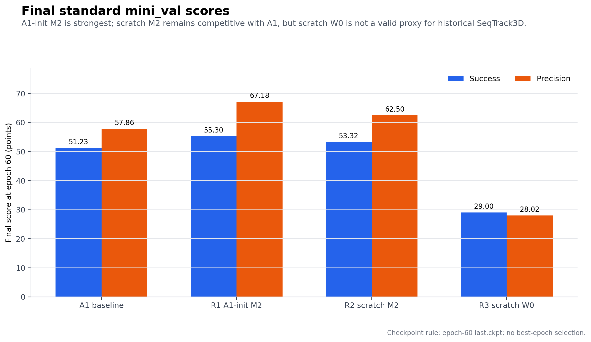
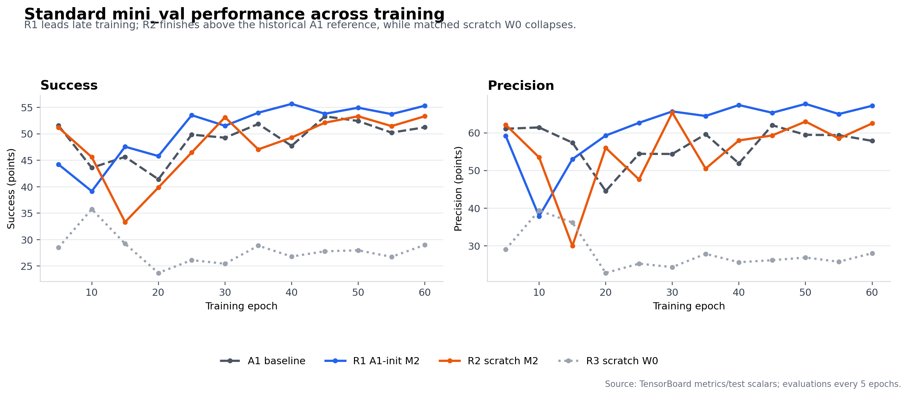
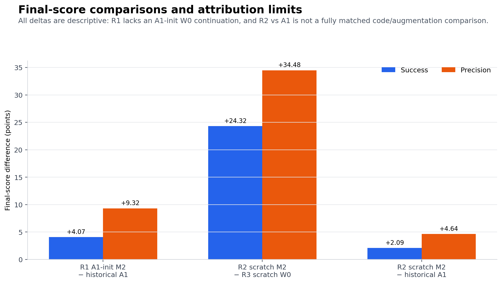
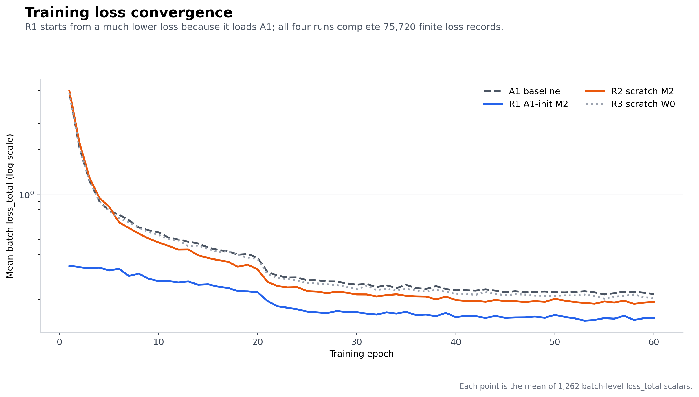

# CT-SeqTrack M2 三组训练结果复核

更新时间：2026-07-23  
代码版本：`473738fa2cf3def246e4e6b1bce35d8692c416c7`  
实验：R1 A1-init M2、R2 scratch M2、R3 scratch matched W0  
历史参考：A1-order seed42 epoch60 `last.ckpt`

## 技术摘要

三组新训练均完整结束且可以进入结果分析：R1/R2/R3 都来自 clean commit `473738f`，退出码为 0，最终 checkpoint 都是 epoch 59、global step 75720；每组包含 12 个 standard mini_val 评测点和 75720 条 batch-level `loss_total`。R1 的 35 项 artifact manifest 在本地逐文件复算后全部匹配。

按冻结的 epoch60 `last.ckpt` 口径，R1 A1-init M2 得到 **55.303 Success / 67.182 Precision**，相对历史 A1 的 51.229/57.863 高 **+4.074/+9.318**；R2 scratch M2 得到 **53.318/62.503**，相对历史 A1 高 **+2.090/+4.640**；R3 scratch W0 只有 **28.999/28.023**。后 5 个评测点的均值也保持相同排序，不是只由最后一个点造成。

这些结果支持两个阶段性判断：

1. M2 proposal innovation 可以从 A1 或随机初始化稳定训练到结束，且 standard 指标出现值得继续验证的正信号。
2. M2 在当前 `shared_se2` 训练路径上是关键组成部分；不含 M2 的 R3 出现严重性能塌陷。

但现在仍不能写成“M2 已被证明超过 SeqTrack3D”：

- R1 在已经训练 60 epoch 的 A1 上又训练了 60 epoch，缺少同预算的 **A1-init W0 continuation**；R1−A1 混合了 M2 与额外训练预算。
- R2/R3 虽然 seed、数据、步数、commit 和 `shared_se2` 匹配，但 R3 的大幅塌陷说明 **M2 与 shared-SE(2) augmentation 存在强交互**。历史 A1 使用旧 candidate 路径，不等于 R3。
- 三组训练都只使用 `dynamics_time_mode=true` 和 standard cadence，没有 same-checkpoint fixed/shuffled 控制，因此完全不能据此声称“正确物理时间有效”或“变帧率鲁棒性提高”。

正式阶段状态应更新为：

```text
M2 STANDARD SIGNAL: POSITIVE
M2 TRAINING INTEGRITY: PASS
M2 METHOD ATTRIBUTION: INCOMPLETE
CAUSAL PHYSICAL-TIME CLAIM: HOLD
M3/M4: LOCKED
```

## 关键结果

### Epoch60 final

| Run | 初始化 | 结构 | Success | Precision | 相对历史 A1 |
| --- | --- | --- | ---: | ---: | ---: |
| A1 | scratch | 历史 SeqTrack3D order-time | 51.229 | 57.863 | reference |
| R1 | A1 `last.ckpt` | full M2 | **55.303** | **67.182** | **+4.074 / +9.318** |
| R2 | scratch | full M2 | 53.318 | 62.503 | +2.090 / +4.640 |
| R3 | scratch | W0、M2/adapter/dynamics loss 关闭 | 28.999 | 28.023 | −22.230 / −29.840 |



### 训练后期稳定性

“后期均值”固定为 epoch 40/45/50/55/60 五个评测点的算术平均，不进行 best-checkpoint 选择。

| Run | Late Success mean | Late Precision mean | Best Success（epoch） | Best Precision（epoch） |
| --- | ---: | ---: | ---: | ---: |
| A1 | 50.975 | 58.123 | 53.299（45） | 62.015（45） |
| R1 | **54.677** | **66.514** | 55.649（40） | 67.685（50） |
| R2 | 51.894 | 60.254 | 53.318（60） | 65.357（30） |
| R3 | 27.664 | 26.488 | 35.758（10） | 39.369（10） |

R1 相对 A1 的 late mean 为 **+3.702 Success / +8.391 Precision**；R2 相对 A1 为 **+0.919/+2.130**。因此 R1、R2 的 final 正差不是单纯由一次异常评测产生，但目前仍只有单 seed，不能估计训练随机性。



### 比较效应与归因边界

| 比较 | Final ΔSuccess | Final ΔPrecision | 能回答什么 | 不能回答什么 |
| --- | ---: | ---: | --- | --- |
| R1−A1 | +4.074 | +9.318 | A1 权重上继续训练 full M2 后最终模型更强 | 不能分离额外 60 epoch、shared-SE(2)、adapter 与 innovation |
| R2−R3 | +24.319 | +34.480 | 当前 shared-SE(2) scratch 设置中，full M2 对训练结果至关重要 | 不能把 R3 当成历史 SeqTrack3D，也不能把全部差值归为 physical time |
| R2−A1 | +2.090 | +4.640 | scratch M2 相对历史 A1 有正向参考信号 | 不同代码时代和 candidate augmentation，不是完全匹配实验 |



最重要的解释不是“R2 比 R3 高 24/34 点”，而是：

> `shared_se2` 并不是一个可以单独替换旧 candidate augmentation 的无损 baseline 改动；在当前 scratch W0 中它与原模型路径不兼容或显著提高了学习难度，而 M2 能恢复并超过历史参考。这个结果说明 M2 与 M1 数据定义存在强耦合，需要二因素对照拆开。

## 定义与实验臂

| 标识 | 定义 |
| --- | --- |
| A1 | 历史 SeqTrack3D order-time seed42，scratch 训练 60 epoch；旧配置没有 `candidate_trajectory_mode` 字段，属于 legacy candidate 路径 |
| R1 | 加载 A1 epoch60 `last.ckpt`，再以 full M2 配置训练 60 epoch；optimizer/trainer state 不继承 |
| R2 | 与 R1 相同 full M2 配置，但模型从随机初始化开始训练 60 epoch |
| R3 | 与 R2 相同 commit/seed/data/steps/`shared_se2`，关闭 DynamicsEncoder、physical-time adapter、velocity/displacement loss；它是当前 M1 数据路径下的 W0，不是历史 A1 的精确复现 |
| Final | epoch60、global step 75720 的 `last.ckpt` 对应 standard mini_val 评测点 |
| Late mean | epoch 40、45、50、55、60 五个评测点均值 |

四组共有 seed42、batch size16、workers12、60 epoch、1262 steps/epoch 和 75720 optimizer steps。R1/R2 使用 `proposal_innovation`、`alpha=0.75`、5-epoch warmup、DynamicsEncoder 与 zero-init physical-time adapter；R3 关闭上述分支。

## 数据与训练完整性

| Run | Commit/provenance | Exit | Checkpoint | Tensor count | Event counts | SHA256 |
| --- | --- | ---: | --- | ---: | --- | --- |
| A1 | legacy reference；无本批 run provenance | n/a | epoch59 / step75720 | 320 | 12 Success / 12 Precision / 75720 loss | `a2fbffb1...f24a82` |
| R1 | clean `473738f` | 0 | epoch59 / step75720 | 334 | 12 / 12 / 75720 | `362b3314...9658f` |
| R2 | clean `473738f` | 0 | epoch59 / step75720 | 334 | 12 / 12 / 75720 | `00a10b88...e48ae` |
| R3 | clean `473738f` | 0 | epoch59 / step75720 | 320 | 12 / 12 / 75720 | `d1ce4ea8...34280` |

R1 从 A1 加载 320/334 个匹配 tensor，新增加的 14 个 tensor 属于 M2/adapter；R2 scratch checkpoint 同样有 334 个 tensor，R3 与 A1 一样为 320 个。R1 manifest 共 35 项，35 项本地哈希完全一致，无缺失或失配。

训练 loss 也支持“任务完成且数值稳定”，但不应被解释为模型优劣：

- R1 因 A1 初始化，首轮 epoch mean loss 显著低于 scratch 组，这是预期现象。
- R2 与 R3 从相近的高 loss 起步，都稳定收敛；R2 最终验证表现远高于 R3，不是训练中断造成。
- 各模型的 `loss_total` 定义并不完全相同：R1/R2 包含 dynamics/velocity 项，R3 不包含，因此不同结构间不能仅按 loss 高低排名。



## 方法

分析从每个 `lightning_logs/version_0` 的 TensorBoard 子目录读取：

- `metrics_test_success`
- `metrics_test_precision`
- `loss_loss_total`

评测 epoch 由 `step / 1262` 重建；训练 loss 按连续 1262 个 batch 聚合为每 epoch 的 mean、median、P10、P90。checkpoint 使用 CPU `torch.load` 读取 epoch/global_step/state_dict 数量，并对文件流式计算 SHA256。R1 的服务器绝对路径 manifest 被映射到本地同名 run root 后逐文件验证。所有最终比较只使用 epoch60 `last.ckpt`，best epoch 仅作为曲线诊断，不参与模型选择。

可复现入口：

```powershell
python tools/analyze_m2_three_runs.py
```

产物包括 6 份 tidy CSV、4 张图和已从头执行的 notebook：

- `compare_results/data/m2_three_run_metric_points_20260723.csv`
- `compare_results/data/m2_three_run_metric_summary_20260723.csv`
- `compare_results/data/m2_three_run_comparisons_20260723.csv`
- `compare_results/data/m2_three_run_loss_epoch_20260723.csv`
- `compare_results/data/m2_three_run_integrity_20260723.csv`
- `compare_results/data/m2_three_run_config_diff_20260723.csv`
- `compare_results/notebooks/m2_three_run_analysis_20260723.ipynb`

## 结论

### 可以正式记录

1. R1/R2/R3 训练与回传完整性通过，三个结果均有效。
2. standard seed42 上，R1 final 与 late mean 都高于历史 A1；R2 final 与 late mean 也高于历史 A1。
3. full M2 可从 scratch 训练，不依赖 A1 才能工作；A1 初始化主要带来更好的收敛起点和更高的最终水平。
4. R2/R3 表明 current shared-SE(2) pipeline 与 M2 有强交互，M2 能避免 W0 的严重退化。
5. 当前最合理的阶段决定是 **M2 evaluation Conditional-Go**，立即进入冻结 checkpoint 的因果时间控制和 matched attribution，而不是直接进入 M3/M4。

### 现在不能写进论文主张

1. 不能声称 R1 的 +4.07/+9.32 全部来自 M2；没有同预算 A1-init W0 continuation。
2. 不能声称 R2 相对 R3 的 +24.32/+34.48 就是“M2 超过 SeqTrack”；R3 是 shared-SE(2) 下塌陷的 W0，不是历史 A1。
3. 不能声称真实 `delta_t` 有效；尚未对 R1 final checkpoint 做 true/fixed/shuffled。
4. 不能声称 long-gap、burst-drop 或 held-out cadence 鲁棒性提高；目前只有 standard。
5. 不能声称统计显著或可泛化；目前只有 seed42、nuScenes-mini 和 aggregate curve，没有本批 per-tracklet paired 输出。

## 下一步

### P0：先做，不需要重新训练

用 **R1 epoch60 `last.ckpt`** 执行预注册的 same-checkpoint 评测：

1. standard / gap1124 / burst-drop；
2. 每个协议的 true / fixed / shuffled；
3. 同 endpoints 的 A1 matched reference；
4. 导出 endpoint、per-tracklet、summary、provenance、manifest 与 SHA256；
5. 计算 tracklet-level paired bootstrap、`delta_t`/位移/点数分桶、首次失控、连续失败和 fallback。

判定必须同时满足：

- standard 不低于 A1 guardrail；
- irregular cadence 上 R1 true 优于 matched A1；
- 同一 R1 checkpoint 的 true 同时优于 fixed 和 shuffled；
- 正效应不是由少数失控 tracklet 或 empty fallback 变化主导。

这是当前最高优先级，因为无需新训练，且直接决定“physical time”叙事能否保留。

### P1：补两个归因缺口

1. **A1-init W0 continuation**：同 A1 init、60 epoch、75720 steps、shared-SE(2)、相同数据/seed/checkpoint rule，但关闭 adapter、innovation 与 dynamics contribution。它用于拆分 R1 的额外训练预算。
2. **current-code scratch legacy-candidate W0**：在当前 commit、相同 seed/steps 下恢复与历史 A1 等价的 candidate augmentation。它用于判断 R3 塌陷来自 shared-SE(2) 还是其他实现变化。

更完整的设计是二因素表：

| Candidate path | W0 | M2 |
| --- | --- | --- |
| legacy candidate | current-code A1 replication（缺） | 可选 |
| shared-SE(2) | R3（已有） | R2（已有） |

若预算有限，先补 shared-SE(2) 的 A1-init W0 continuation，再补 current-code legacy W0。

### P2：只有 P0/P1 通过后

- seeds 43/44；
- full nuScenes；
- 第二数据集或与 HVTrack 对齐的 variable-rate protocol；
- 公平现代 baseline、效率和显存；
- 再决定是否启动 M3 asymmetric path distillation。

M4 filter/tube 继续锁定。当前 standard seed42 的正信号不构成进入 M4 的授权。

## 限制与稳健性

- A1 是历史参考，没有本批 clean `run_provenance.json`；其 checkpoint/event 完整，但代码与 augmentation 不是完全匹配。
- R1/R2/R3 的 standard metric 是每 5 epoch 的 aggregate，不能从这些事件文件恢复 per-tracklet paired distribution 或置信区间。
- 本报告没有用 best epoch 选模型，避免用 mini_val 调 checkpoint；但 mini_val 已被多次开发查看，最终论文仍需要独立 held-out 测试。
- 单 seed 曲线会受训练随机性影响；late mean 只能说明正差不是最后一点独有，不能替代多 seed。
- R1 累计经历 A1 的 75720 步和 M2 continuation 的 75720 步；两阶段 optimizer 不连续，但权重训练暴露累计为 151440 步。
- standard cadence 的 `delta_t` 波动很小，本批 standard 结果主要是性能 guardrail，而不是物理时间可辨识性证据。

## 仍需回答的问题

- R1 的提升有多少来自 extra continuation，有多少来自 adapter/innovation？
- R3 为什么在 shared-SE(2) 下塌陷：candidate diversity、label/path mismatch，还是 W0 本身无法适配新的数据分布？
- R2 在 true/fixed/shuffled 下是否真的依赖正确时间，还是 M2 只提供了额外容量/运动先验？
- long-gap 的收益是否来自 failure recovery，且能否在 standard 不退化的前提下保持？
- full data、多 seed 和独立测试上，R2 相对 matched current-code A1 的正差是否仍存在？
