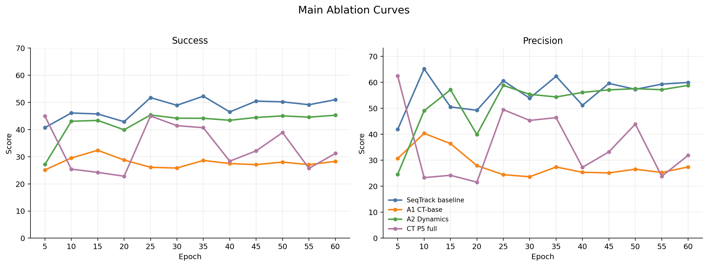
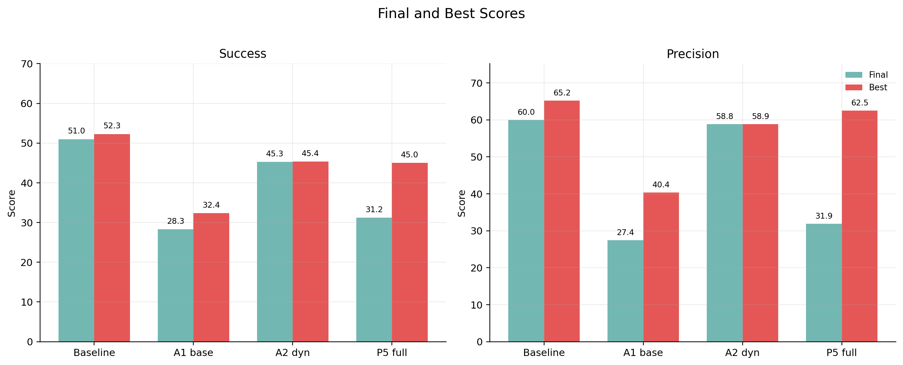

# Main Ablation Results

Curated set: SeqTrack baseline, A1 CT-base, A2 Dynamics, and CT P5 full.

This report keeps only the main cumulative ablation path: baseline -> base -> dynamics -> P5 full.

| Model | Stage | Succ final | Succ best | Succ delta vs baseline | Prec final | Prec best | Prec delta vs baseline |
| --- | --- | ---: | ---: | ---: | ---: | ---: | ---: |
| SeqTrack baseline | Baseline | 50.99 | 52.28 | 0.00 | 59.96 | 65.21 | 0.00 |
| A1 CT-base | Base: real timestamp only | 28.28 | 32.36 | -22.71 | 27.43 | 40.36 | -32.53 |
| A2 Dynamics | Innovation 1: dynamics prior | 45.27 | 45.36 | -5.72 | 58.83 | 58.85 | -1.13 |
| CT P5 full | Full: real time + dynamics + gate | 31.19 | 44.98 | -19.79 | 31.89 | 62.51 | -28.08 |

## Figures

## Files

- `../data/main_ablation_metrics_points.csv`
- `../data/main_ablation_metrics_summary.csv`
- `../figures/line_charts/main_ablation_curves.png`
- `../figures/main_ablation_success_curve.png`
- `../figures/main_ablation_precision_curve.png`
- `../figures/bar_charts/main_ablation_best_final_summary.png`

## Notes

- `A1 CT-base` is the base CT path with real timestamps and without dynamics/gate.
- `A2 Dynamics` adds the DynamicsEncoder to the CT base path.
- `CT P5 full` is the cumulative full setting with real time, dynamics, and gate.
