# Related CT-SeqTrack Comparisons

This report is generated from existing CSV exports under `compare_results/data`.
Each group recomputes deltas against the baseline row included in that group.

## Generated data

- `../data/related_comparisons_metrics_summary.csv`
- `../data/related_comparisons_metrics_points.csv`

## Main A1/A2/P5 Progression (60ep)

Protocol: 60ep seed42 nuScenes-mini

Shows the raw real-time path, dynamics recovery, and old full P5 collapse.

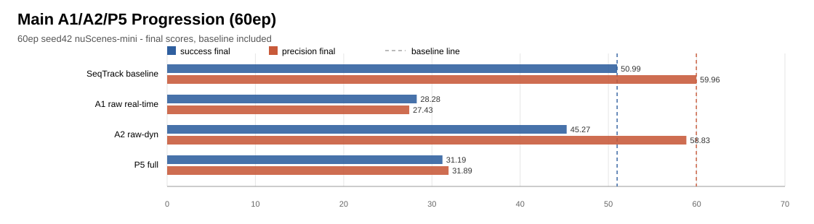

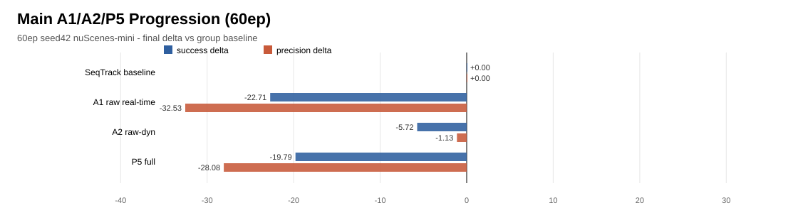

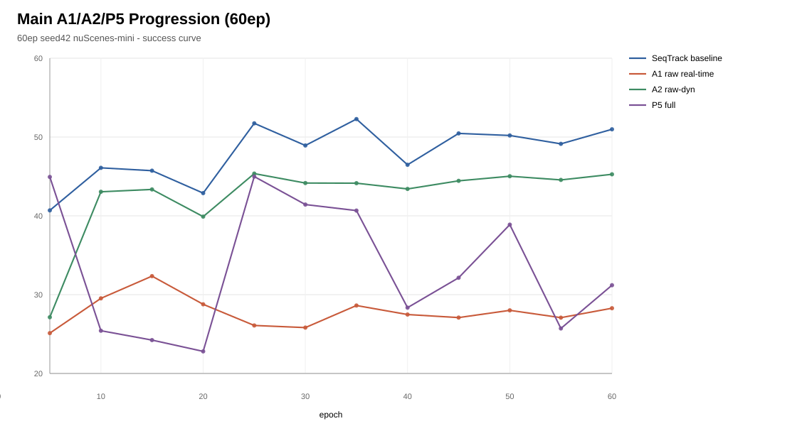

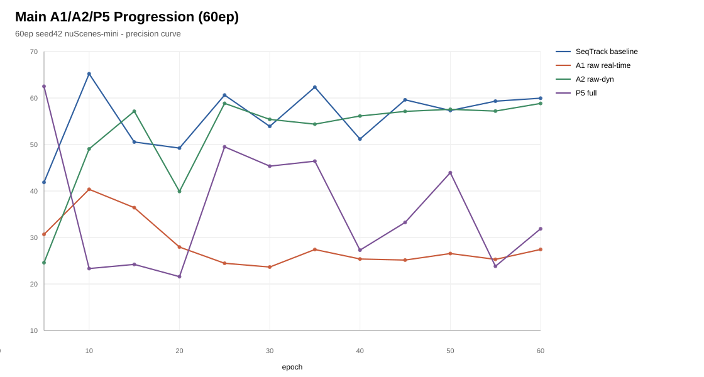

| model | succ final | succ delta | succ best | prec final | prec delta | prec best | note |
| --- | ---: | ---: | ---: | ---: | ---: | ---: | --- |
| SeqTrack baseline | 50.99 | 0.00 | 52.28 | 59.96 | 0.00 | 65.21 | baseline |
| A1 raw real-time | 28.28 | -22.71 | 32.36 | 27.43 | -32.53 | 40.36 | raw real timestamp main branch |
| A2 raw-dyn | 45.27 | -5.72 | 45.36 | 58.83 | -1.13 | 58.85 | raw real-time + dynamics |
| P5 full | 31.19 | -19.79 | 44.98 | 31.89 | -28.08 | 62.51 | raw real-time + dynamics + gate |

## A1 Time Encoding / Main-Branch Variants (60ep)

Protocol: 60ep seed42 nuScenes-mini

Collects A1 variants that modify the main time token semantics.

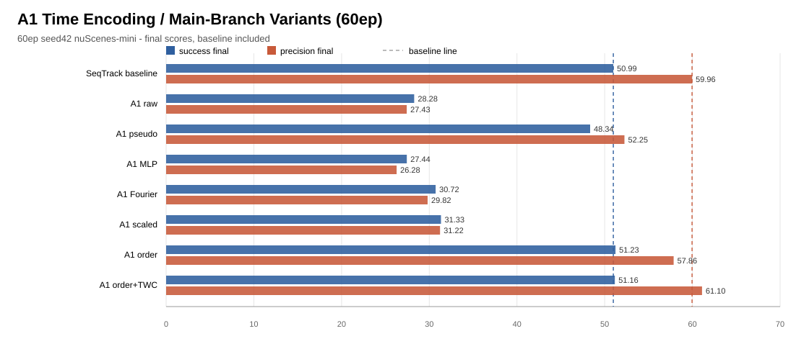

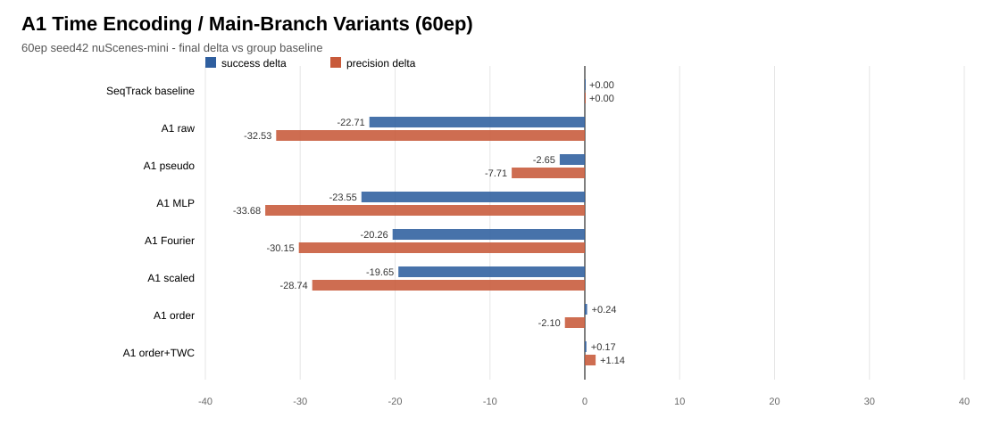

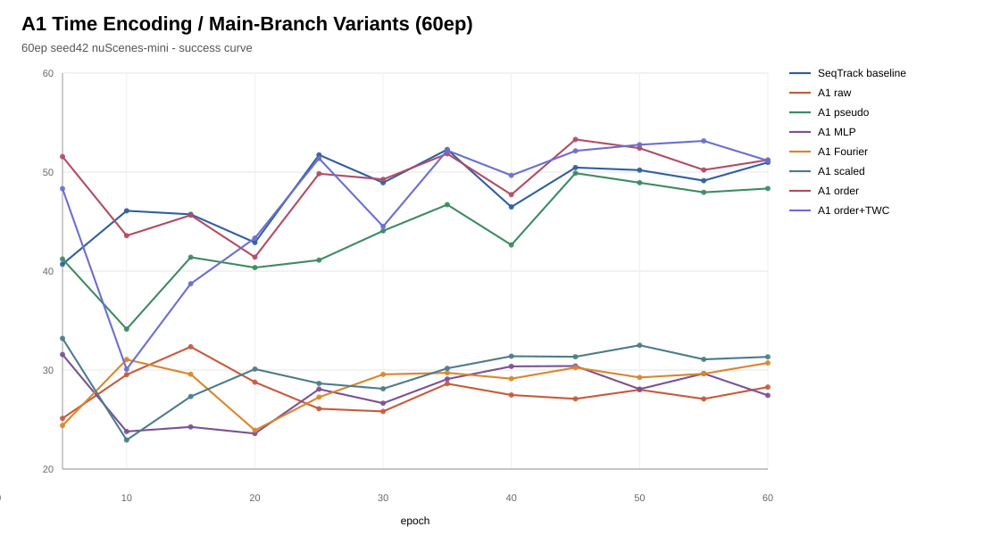

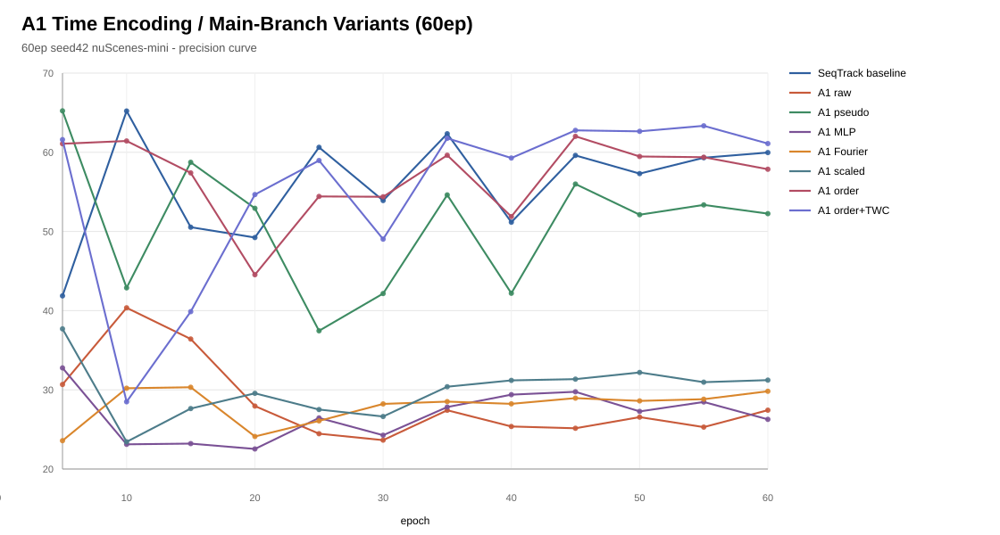

| model | succ final | succ delta | succ best | prec final | prec delta | prec best | note |
| --- | ---: | ---: | ---: | ---: | ---: | ---: | --- |
| SeqTrack baseline | 50.99 | 0.00 | 52.28 | 59.96 | 0.00 | 65.21 | baseline |
| A1 raw | 28.28 | -22.71 | 32.36 | 27.43 | -32.53 | 40.36 | real seconds in main branch |
| A1 pseudo | 48.34 | -2.65 | 49.89 | 52.25 | -7.71 | 65.24 | pseudo time sanity check |
| A1 MLP | 27.44 | -23.55 | 31.57 | 26.28 | -33.68 | 32.78 | scalar-preserving MLP time encoding |
| A1 Fourier | 30.72 | -20.26 | 31.06 | 29.82 | -30.15 | 30.32 | scalar-preserving Fourier time encoding |
| A1 scaled | 31.33 | -19.65 | 33.20 | 31.22 | -28.74 | 37.70 | real time rescaled near pseudo range |
| A1 order | 51.23 | 0.24 | 53.30 | 57.86 | -2.10 | 62.02 | restore SeqTrack order-time semantics |
| A1 order+TWC | 51.16 | 0.17 | 53.16 | 61.10 | 1.14 | 63.35 | active TWC on A1-order |

## A2 Dynamics Variants (60ep)

Protocol: 60ep nuScenes-mini; cand1 has fewer optimizer steps

Compares dynamics injection choices and diagnostics against the same baseline.

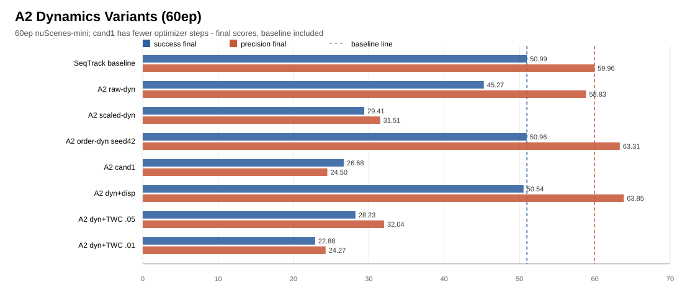

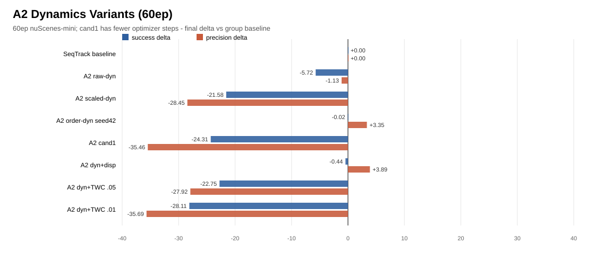

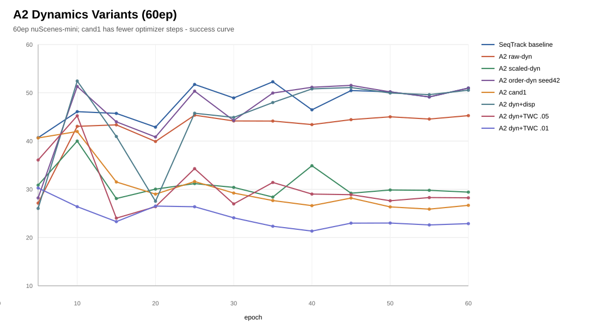

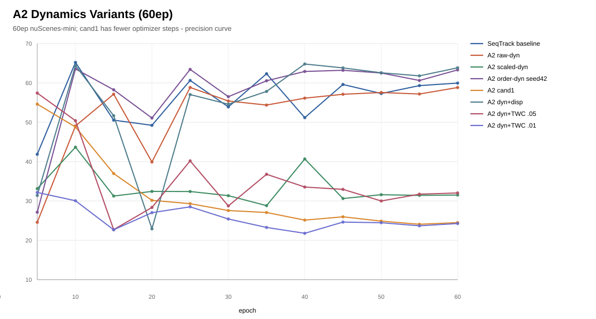

| model | succ final | succ delta | succ best | prec final | prec delta | prec best | note |
| --- | ---: | ---: | ---: | ---: | ---: | ---: | --- |
| SeqTrack baseline | 50.99 | 0.00 | 52.28 | 59.96 | 0.00 | 65.21 | baseline |
| A2 raw-dyn | 45.27 | -5.72 | 45.36 | 58.83 | -1.13 | 58.85 | raw real-time + dynamics |
| A2 scaled-dyn | 29.41 | -21.58 | 40.00 | 31.51 | -28.45 | 43.68 | scaled real time + dynamics |
| A2 order-dyn seed42 | 50.96 | -0.02 | 51.54 | 63.31 | 3.35 | 63.57 | order main branch + dynamics |
| A2 cand1 | 26.68 | -24.31 | 41.99 | 24.50 | -35.46 | 54.62 | num_candidates=1, not step-aligned |
| A2 dyn+disp | 50.54 | -0.44 | 52.44 | 63.85 | 3.89 | 64.81 | small dynamics displacement loss |
| A2 dyn+TWC .05 | 28.23 | -22.75 | 45.24 | 32.04 | -27.92 | 57.43 | active TWC weight 0.05 |
| A2 dyn+TWC .01 | 22.88 | -28.11 | 30.27 | 24.27 | -35.69 | 32.16 | active TWC weight 0.01 |

## TWC-Related Runs (60ep)

Protocol: 60ep nuScenes-mini; active TWC validity fixed

Separates TWC on A1 from the unstable A2+dynamics combination.

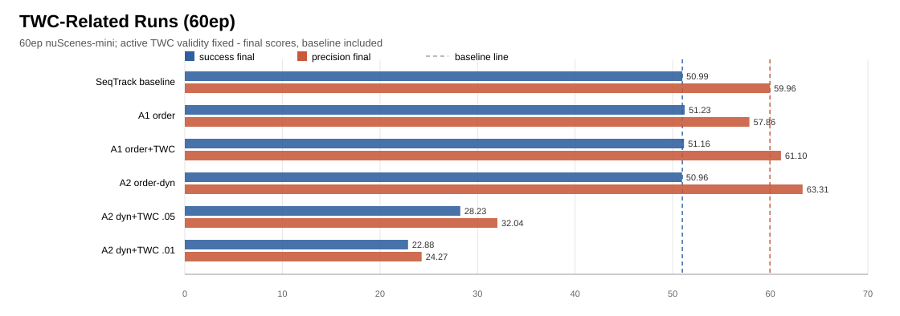

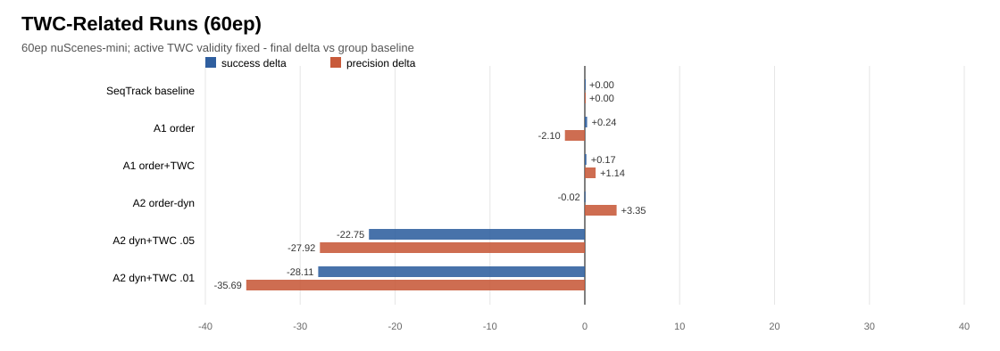

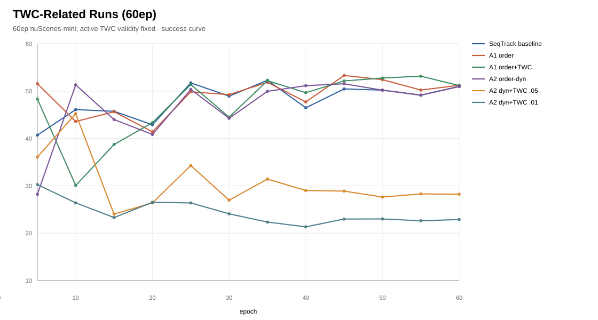

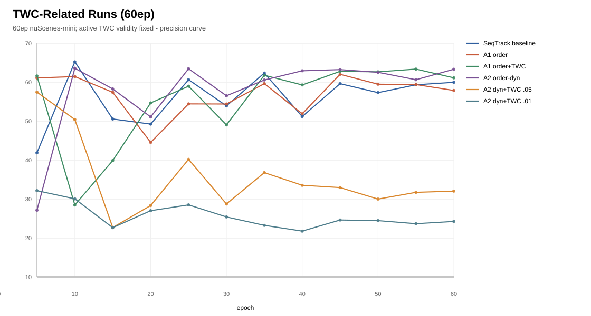

| model | succ final | succ delta | succ best | prec final | prec delta | prec best | note |
| --- | ---: | ---: | ---: | ---: | ---: | ---: | --- |
| SeqTrack baseline | 50.99 | 0.00 | 52.28 | 59.96 | 0.00 | 65.21 | baseline |
| A1 order | 51.23 | 0.24 | 53.30 | 57.86 | -2.10 | 62.02 | parent for A1+TWC |
| A1 order+TWC | 51.16 | 0.17 | 53.16 | 61.10 | 1.14 | 63.35 | active TWC |
| A2 order-dyn | 50.96 | -0.02 | 51.54 | 63.31 | 3.35 | 63.57 | parent for A2+TWC |
| A2 dyn+TWC .05 | 28.23 | -22.75 | 45.24 | 32.04 | -27.92 | 57.43 | active TWC weight 0.05 |
| A2 dyn+TWC .01 | 22.88 | -28.11 | 30.27 | 24.27 | -35.69 | 32.16 | active TWC weight 0.01 |

## A3 / Gate Variants (60ep)

Protocol: 60ep nuScenes-mini plus latest retests

Compares gate variants and latest conf-res retests to baseline and A2.

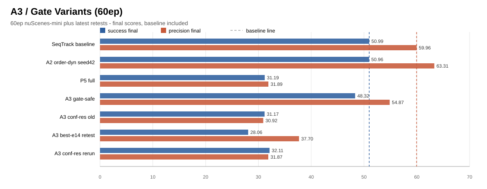

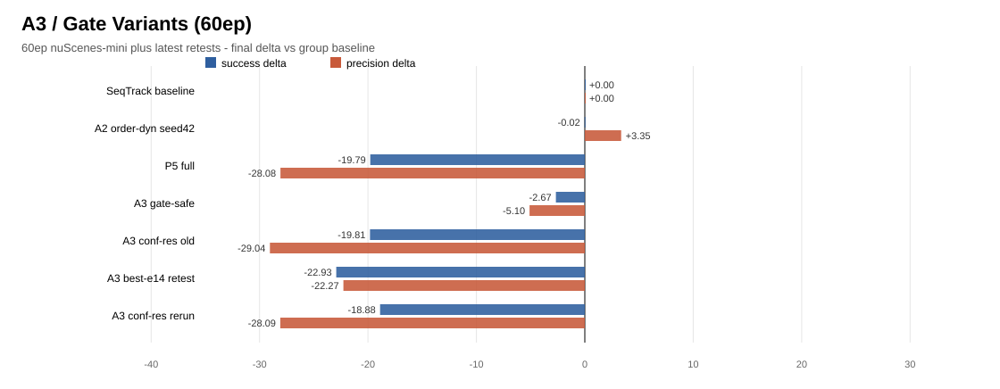

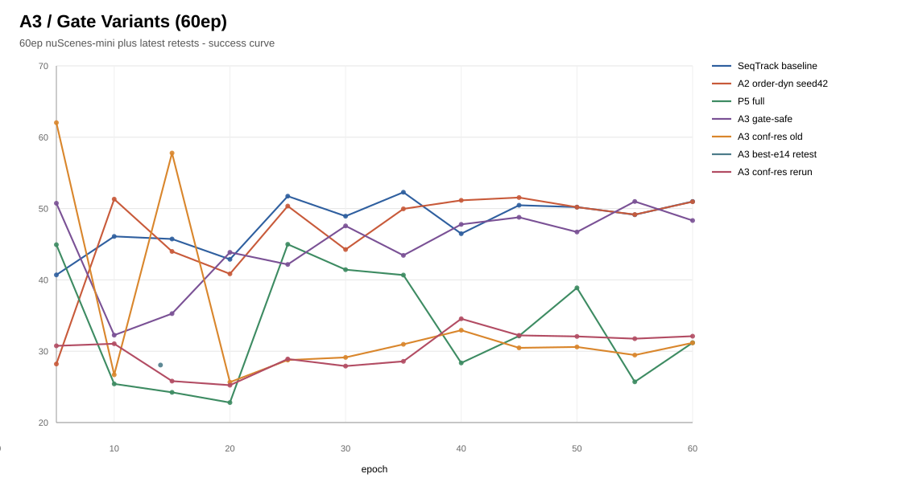

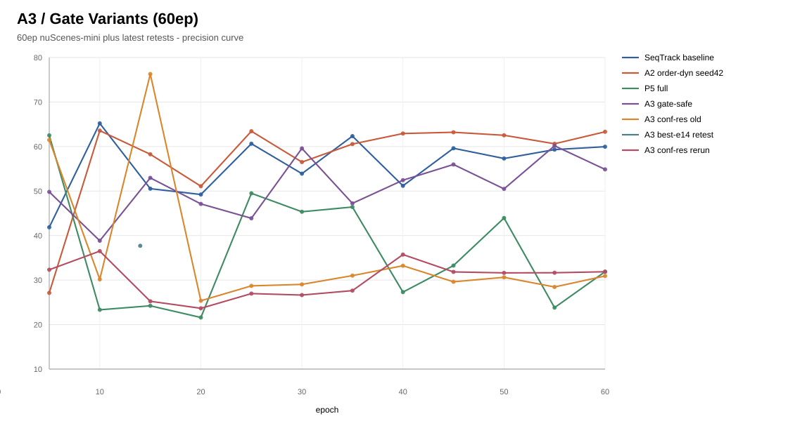

| model | succ final | succ delta | succ best | prec final | prec delta | prec best | note |
| --- | ---: | ---: | ---: | ---: | ---: | ---: | --- |
| SeqTrack baseline | 50.99 | 0.00 | 52.28 | 59.96 | 0.00 | 65.21 | baseline |
| A2 order-dyn seed42 | 50.96 | -0.02 | 51.54 | 63.31 | 3.35 | 63.57 | cleaner A2 parent |
| P5 full | 31.19 | -19.79 | 44.98 | 31.89 | -28.08 | 62.51 | old full model with raw real-time path |
| A3 gate-safe | 48.32 | -2.67 | 50.99 | 54.87 | -5.10 | 60.17 | observation-biased feature gate |
| A3 conf-res old | 31.17 | -19.81 | 62.04 | 30.92 | -29.04 | 76.30 | old run; high best not reproduced |
| A3 best-e14 retest | 28.06 | -22.93 | 28.06 | 37.70 | -22.27 | 37.70 | single checkpoint retest |
| A3 conf-res rerun | 32.11 | -18.88 | 34.55 | 31.87 | -28.09 | 36.50 | latest seed42 rerun |

## A2 Seed Stability (60ep)

Protocol: 60ep nuScenes-mini

Puts seed42, seed43, and seed44 against the same SeqTrack baseline.

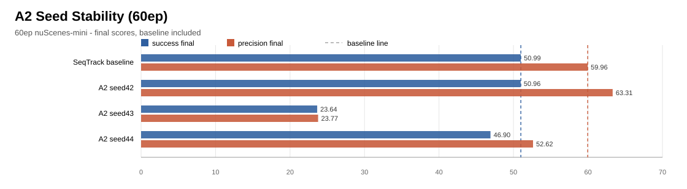

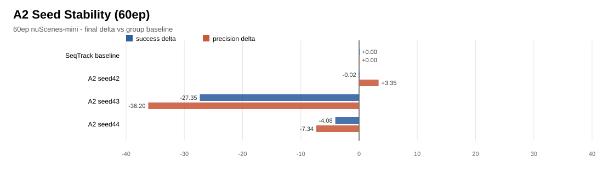

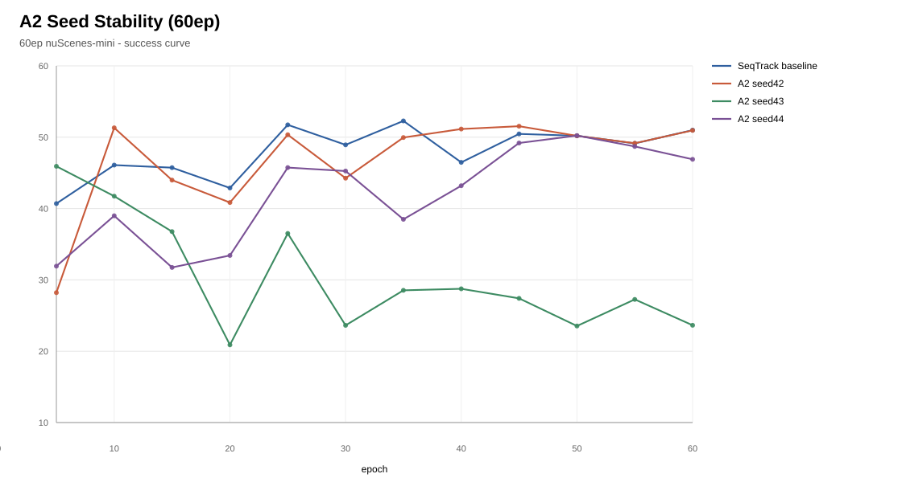

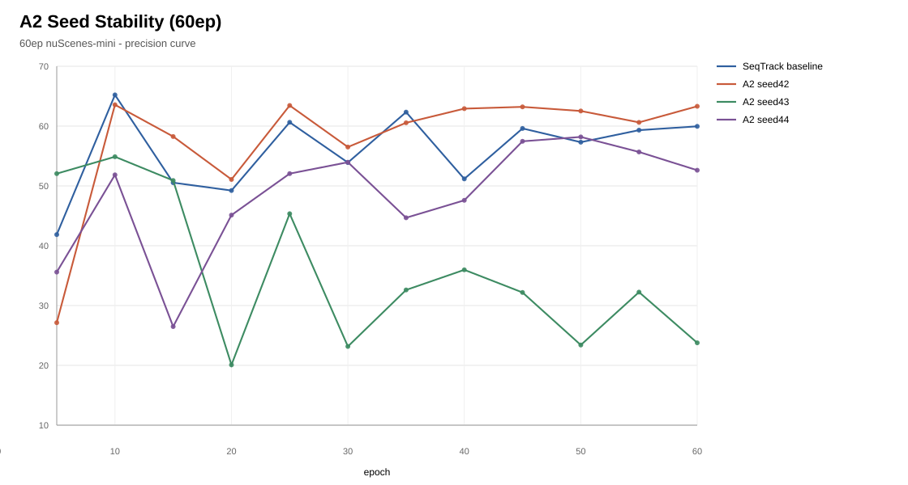

| model | succ final | succ delta | succ best | prec final | prec delta | prec best | note |
| --- | ---: | ---: | ---: | ---: | ---: | ---: | --- |
| SeqTrack baseline | 50.99 | 0.00 | 52.28 | 59.96 | 0.00 | 65.21 | baseline |
| A2 seed42 | 50.96 | -0.02 | 51.54 | 63.31 | 3.35 | 63.57 | old positive seed42 signal |
| A2 seed43 | 23.64 | -27.35 | 45.92 | 23.77 | -36.20 | 54.88 | latest seed43 collapse |
| A2 seed44 | 46.90 | -4.08 | 50.23 | 52.62 | -7.34 | 58.19 | latest seed44 partial recovery |

## Long Training Stability (180ep)

Protocol: 180ep nuScenes-mini

Keeps the 180ep stability evidence separate from 60ep ablations.

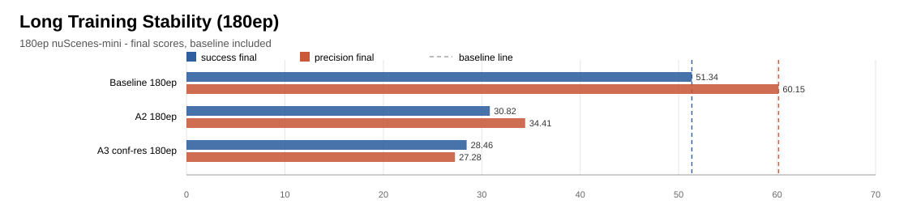

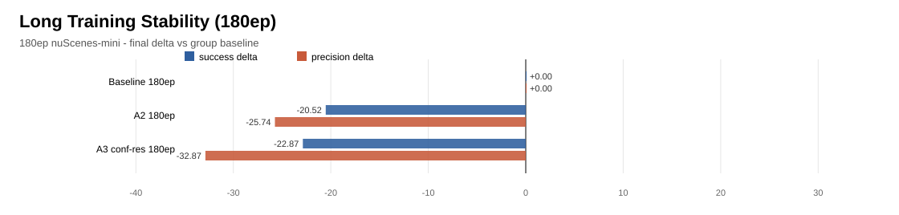

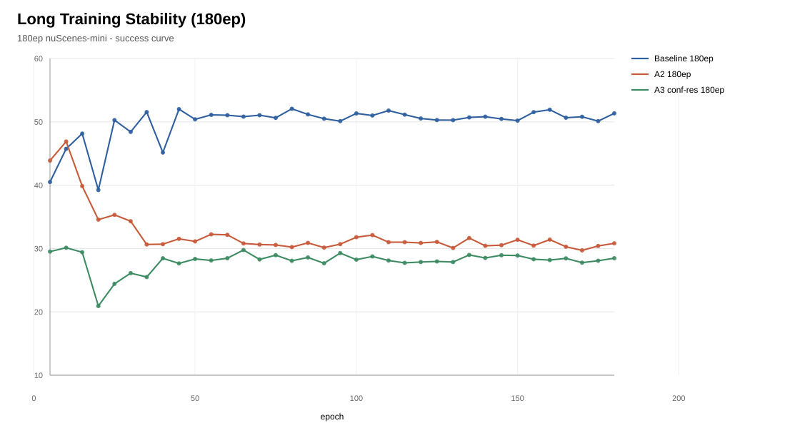

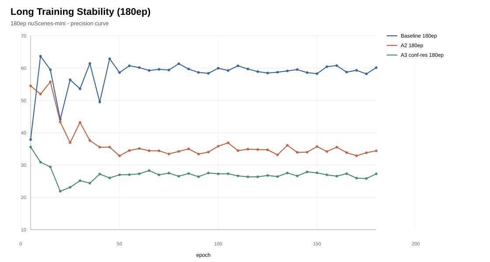

| model | succ final | succ delta | succ best | prec final | prec delta | prec best | note |
| --- | ---: | ---: | ---: | ---: | ---: | ---: | --- |
| Baseline 180ep | 51.34 | 0.00 | 52.06 | 60.15 | 0.00 | 63.70 | baseline |
| A2 180ep | 30.82 | -20.52 | 46.89 | 34.41 | -25.74 | 55.76 | A2 long training |
| A3 conf-res 180ep | 28.46 | -22.87 | 30.13 | 27.28 | -32.87 | 35.60 | A3 long training |
