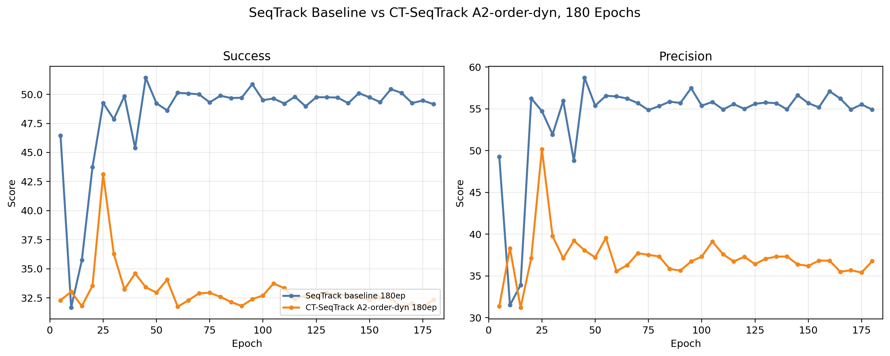
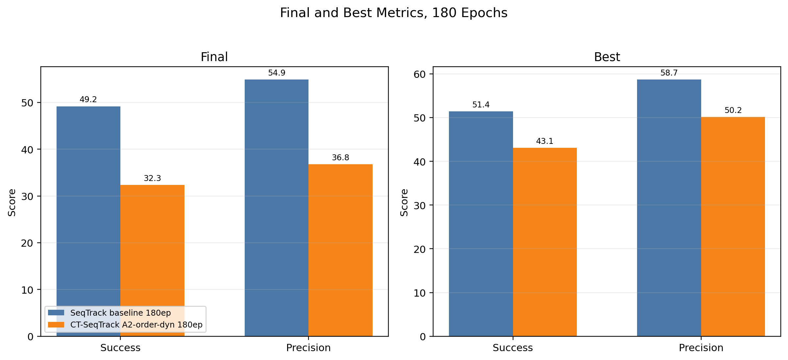

# SeqTrack baseline vs CT-SeqTrack A2-order-dyn 180ep

## Summary

| model | metric | final | best | best epoch | late mean 120-180 | final delta vs baseline | best delta vs baseline |
| --- | --- | ---: | ---: | ---: | ---: | ---: | ---: |
| SeqTrack baseline 180ep | success/test | 49.1543 | 51.4212 | 45 | 49.6168 | 0.0000 | 0.0000 |
| SeqTrack baseline 180ep | precision/test | 54.9070 | 58.7068 | 45 | 55.6189 | 0.0000 | 0.0000 |
| CT-SeqTrack A2-order-dyn 180ep | success/test | 32.3403 | 43.1149 | 25 | 32.4024 | -16.8140 | -8.3064 |
| CT-SeqTrack A2-order-dyn 180ep | precision/test | 36.7637 | 50.1630 | 25 | 36.5327 | -18.1433 | -8.5438 |

## Figures

## Files

- `../data/seqtrack_vs_a2_order_dyn_180ep_metrics_points.csv`
- `../data/seqtrack_vs_a2_order_dyn_180ep_metrics_summary.csv`
- `../figures/line_charts/seqtrack_vs_a2_order_dyn_180ep_curves.png`
- `../figures/line_charts/seqtrack_vs_a2_order_dyn_180ep_success_curve.png`
- `../figures/line_charts/seqtrack_vs_a2_order_dyn_180ep_precision_curve.png`
- `../figures/bar_charts/seqtrack_vs_a2_order_dyn_180ep_best_final_summary.png`
