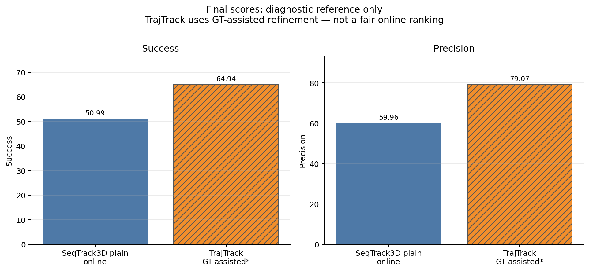
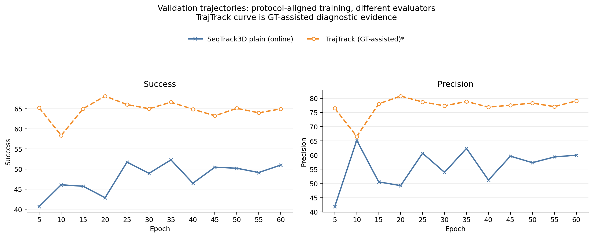

# TrajTrack GT-assisted 与 Plain SeqTrack3D 参考对比

> **TrajTrack 参考状态（2026-08-16）**：自本标注起，TrajTrack 不再作为
> CT-SeqTrack 后续方法设计、Gate/proposal 机制选择、超参数设定或性能有效性的
> 参考依据；仅保留为必须引用的相关工作、历史审计对象和 GT-free 评测警示。
> 下文既有 TrajTrack 内容均为历史记录，不再驱动当前或未来方案。

> **边界：这不是公平在线排名。** TrajTrack 当前 evaluator 使用当前帧 GT overlap 触发 refinement，并用 GT overlap 从 proposals 中选择结果。下面数值只能作为实现诊断和带 oracle 辅助的参考。

## 运行完整性

- run: `trajtrack_car_mini_seqtrack_protocol_seed42_gpu0_20260714-175518`
- `epoch_60.pth` 已生成（492,332,184 bytes；`ls -lh` 显示 470 MB），`last_checkpoint` 指向该文件。
- 日志包含 `Saving checkpoint at 60 epochs`，随后完成 epoch60 的 `116/116` validation。
- scalars 中有 12 个唯一验证点（epoch5-60，每 5 epoch 一次），日志四位小数与全精度 scalars 一致。

## 协议与 evaluator

| 项目 | Plain SeqTrack3D | TrajTrack |
| --- | --- | --- |
| dataset/category | nuScenes-mini / Car | nuScenes-mini / Car |
| split | mini_train / mini_val | mini_train / mini_val |
| seed / epochs / batch | 42 / 60 / 16 | 42 / 60 / 16 |
| candidates / workers | 4 / 12 | 4 / 12 |
| steps per epoch / val interval | 1262 / 5 | 1262 / 5 |
| evaluator | GT-free online | GT-assisted refinement |
| fair online ranking | reference | **no** |

## Final 指标

| method | evaluation mode | Success | Precision | fair online ranking |
| --- | --- | ---: | ---: | --- |
| SeqTrack3D plain | GT-free online | 50.99 | 59.96 | reference |
| TrajTrack | GT-assisted refinement | 64.94 | 79.07 | no |

## 完整汇总

| method | metric | final | best observed | best epoch | late mean 40-60 | late std |
| --- | --- | ---: | ---: | ---: | ---: | ---: |
| SeqTrack3D plain | Success | 50.99 | 52.28 | 35 | 49.45 | 1.61 |
| SeqTrack3D plain | Precision | 59.96 | 65.21 | 10 | 57.47 | 3.28 |
| TrajTrack | Success | 64.94 | 68.13 | 20 | 64.42 | 0.71 |
| TrajTrack | Precision | 79.07 | 80.78 | 20 | 77.78 | 0.81 |

## 算术差值（仅描述，不代表方法增益）

| metric | final difference | best-observed difference | late-mean difference |
| --- | ---: | ---: | ---: |
| Success | 13.96 | 15.85 | 14.97 |
| Precision | 19.11 | 15.57 | 20.30 |

这些差值混合了模型差异与 evaluator 的 GT oracle 信息，不能写成‘TrajTrack 提升了 X 点’。因此没有生成 `delta_charts` 性能增益图。

## 结论

1. TrajTrack aligned seed42 run 已完整训练到 60 epoch，训练预算与 plain SeqTrack3D 基本对齐。
2. TrajTrack 的 Success 和 Precision 都在 epoch20 达到最高 observed value；epoch40-60 的波动较小。
3. 当前数值较高，但 evaluator 使用 GT-assisted refinement，只能作为实现诊断，不能支持 TrajTrack 优于 SeqTrack3D 的论文结论。
4. 公平比较需要改用 `pre_wo_refine()` 或单独实现不读取当前帧 GT 的 evaluator，并用固定 epoch60 checkpoint 重新评测。

## 图表

## 数据文件

- `../data/trajtrack_gt_assisted_vs_plain_seqtrack_points.csv`
- `../data/trajtrack_gt_assisted_vs_plain_seqtrack_summary.csv`
- `../data/trajtrack_gt_assisted_vs_plain_seqtrack_run_manifest.csv`

## 数据来源

- SeqTrack3D events: `D:\desktop\research\seqtrack\output\20260528-1633-seqtrack3d_nuscenes_mini-seqtrack_mini_baseline_car_60ep_bs16\lightning_logs\version_0`
- TrajTrack scalars: `/home/lishengjie/study/lcyu/trajtrack/work_dirs/trajtrack_car_mini_seqtrack_protocol_seed42_gpu0_20260714-175518/20260714_175547/vis_data/scalars.json`
- TrajTrack log: `/home/lishengjie/study/lcyu/trajtrack/logs/seqtrack_protocol/trajtrack_car_mini_seqtrack_protocol_seed42_gpu0_20260714-175518.log`
- TrajTrack final checkpoint: `/home/lishengjie/study/lcyu/trajtrack/work_dirs/trajtrack_car_mini_seqtrack_protocol_seed42_gpu0_20260714-175518/epoch_60.pth`
- Local terminal evidence: `C:\Users\25227\.codex\attachments\036135a9-87df-421f-afab-20c87599ad0d\pasted-text.txt`
