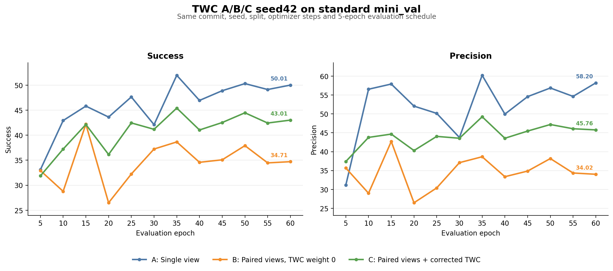
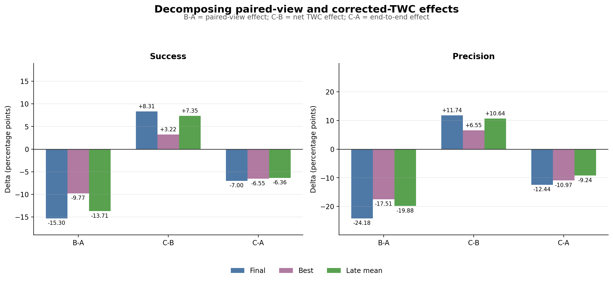
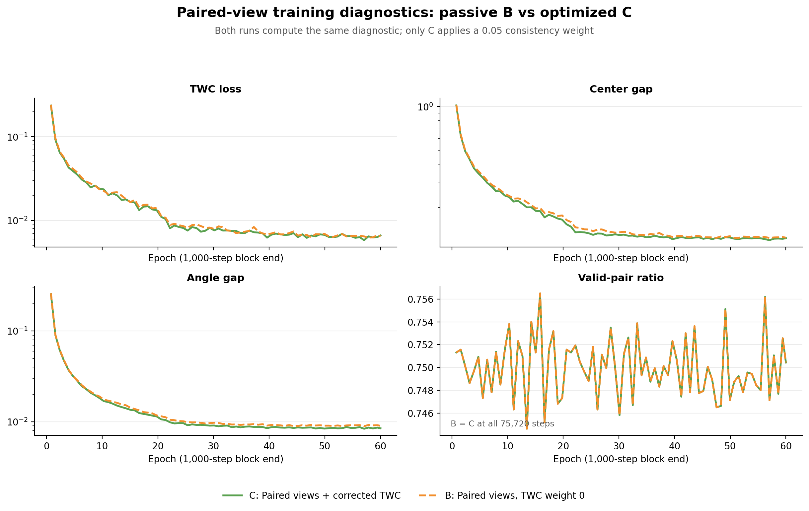

# TWC A/B/C seed42 同提交因果对照

更新时间：2026-07-21

## 结论先行

这批结果完成了 standard mini_val 上的同提交 A/B/C 训练对照，但没有支持 corrected-TWC 升级为当前主方法：

```text
C_MINUS_B_POSITIVE_ON_STANDARD_SEED42
NO_GO_TWC_MAIN_METHOD_PROMOTION
```

- `B-A` 在 Final、Best、Late mean 上全部明显为负，说明当前 paired-view 训练路径本身不是有效 augmentation。
- `C-B` 在三个汇总口径上全部为正；Final 为 `+8.31 Success / +11.74 Precision`，证明 corrected-TWC 相对相同 paired-view 训练具有净正效应。
- 但 `C-A` 的 Final 仍为 `-7.00 / -12.44`，Late mean 为 `-6.36 / -9.24`。TWC 只恢复了 paired-view 所损失的大约一半性能，没有恢复到 single-view A1。
- 因此最准确的机制解释是：**TWC 对一个明显受损的 paired-view 路径具有部分修复/正则化作用，而不是对 single-view baseline 的端到端提升。**
- 原预注册 gate 还要求 strong cadence 上的 `C-B`、standard 无明显退化，以及 held-out evaluation-only 同 endpoint 路径方差下降。当前输出只含 standard mini_val 训练期评测，没有 gap1124、burst-drop、unseen schedule、per-tracklet 输出或 evaluation-only path variance；不能据此补多 seed 或写成稳定方法贡献。



## 1. 数据与可比性审计

原始结果目录：`output/paper_twc_abc_20260720_183711/`

| 项目 | 审计结果 |
| --- | --- |
| 源码版本 | 三组均为 `343145dd50fa11fb63bbb8b7583a0a267ff5ca0d` |
| 工作树 | `dirty_any=true`，但三组均为 `dirty_tracked=false`；脏状态只来自未跟踪日志/传输文件 |
| 数据 | mini_train `274 tracklets / 5051 frames`；mini_val `106 / 2285` |
| selection hash | train `7b4e9cca...a25100`；val `35498888...58826`，三组一致 |
| 训练口径 | seed42、batch16、candidate4、60 epoch、1262 steps/epoch、共 75720 optimizer steps |
| 评测口径 | 每 5 epoch 一次，共 12 个相同步点；最后一点为 epoch60 / step75720 |
| B/C 关键差异 | 除路径、tag 等运行元数据外，唯一差异为 `twc_weight: 0.0 -> 0.05` |
| 坐标/输入约束 | B/C 全部 75720 步的 `twc_anchor_gap_max=0`、`twc_current_point_gap_max=0` |
| 有效样本 | B/C 的 `twc_valid_ratio` 在全部训练步完全一致，均值 `0.749970` |

A 的 `use_twc=false`，因此虽然解析配置保留默认 `twc_weight=0.05`，该值不参与训练。B/C 均使用 paired views；B 只把同一 TWC 项作为被动诊断量计算，权重严格为 0。

三个 final `last.ckpt` 的 SHA256：

| run | checkpoint SHA256 |
| --- | --- |
| A | `08b27a6548bcfd9e11c4cec618e5edf7ce5055d5dbc17b6e81d6200b4e9d7de1` |
| B | `24f2c20d4f2bb658220e884d4471e6a9c340797081136432f986f6b8b0fa04c9` |
| C | `a26c59de0fa779a6e6069385af6fa21bfdf7e4b570baf4a7dd1c18c6f297b2ca` |

A/C 的显式 `epoch=59-step=75720.ckpt` 与各自 `last.ckpt` hash 完全一致；B 的 final 只保存在 `last.ckpt`，其 top-k 文件没有包含 epoch60。日志字段名为 `metrics/test`，但训练配置实际是在 mini_val 上做 validation，不能把下列数字称为隐藏 test 结果。

## 2. Tracking 结果

`Final` 为 epoch60；`Best` 是各 run 在 12 个开发集评测点中的自身最佳值，只用于诊断；`Late mean` 为 epoch40/45/50/55/60 五个点的均值。

| run | metric | Final | Best | Best epoch | Late mean 40-60 | Late std |
| --- | --- | ---: | ---: | ---: | ---: | ---: |
| A: single view | Success | 50.01 | 51.97 | 35 | 49.06 | 1.18 |
| A: single view | Precision | 58.20 | 60.21 | 35 | 54.84 | 2.81 |
| B: paired, weight0 | Success | 34.71 | 42.19 | 15 | 35.35 | 1.30 |
| B: paired, weight0 | Precision | 34.02 | 42.70 | 15 | 34.96 | 1.68 |
| C: paired + TWC | Success | 43.01 | 45.41 | 35 | 42.70 | 1.10 |
| C: paired + TWC | Precision | 45.76 | 49.24 | 35 | 45.60 | 1.18 |

### 效应分解

差值均按前者减后者计算，单位为百分点。

| comparison | 解释 | Success Final / Best / Late | Precision Final / Best / Late |
| --- | --- | ---: | ---: |
| `B-A` | paired-view 训练效应 | -15.30 / -9.77 / -13.71 | -24.18 / -17.51 / -19.88 |
| `C-B` | corrected-TWC 净效应 | +8.31 / +3.22 / +7.35 | +11.74 / +6.55 / +10.64 |
| `C-A` | 相对 single-view 的端到端效应 | -7.00 / -6.55 / -6.36 | -12.44 / -10.97 / -9.24 |

按 `C-B` 除以 `A-B` 计算，TWC 在 Final 恢复 paired-view 损失的 `54.3% Success / 48.6% Precision`，在 Late mean 恢复 `53.6% / 53.5%`。这是描述性比例，不是独立样本上的统计估计。



## 3. TWC 训练诊断

B 和 C 使用完全相同的有效 paired-view 样本序列。C 相对 B 的末 1000 步均值变化为：

| diagnostic | B tail1000 | C tail1000 | C 相对 B |
| --- | ---: | ---: | ---: |
| TWC loss | 0.006683 | 0.006425 | -3.86% |
| center gap | 0.125112 | 0.122394 | -2.17% |
| angle gap | 0.009059 | 0.008503 | -6.13% |
| valid ratio | 0.752563 | 0.752563 | 0.00% |

TWC 的确让训练期 paired-view gap 更低，但幅度温和。`center/angle gap` 是训练 batch 上的两路预测差，不是原计划中的 held-out evaluation-only、同 endpoint 多合法历史路径方差，不能用它替代机制终点。



## 4. 可以说与不能说

当前可以说：

- 同 commit、同 seed、同数据和同步数下，corrected-TWC 相对 weight0 paired-view control 有明确的单 seed 净正效应。
- paired-view 训练单独造成大幅退化；TWC 约恢复其中一半，并把后期曲线稳定在 B 之上。
- 共享 candidate offset、坐标 anchor 和 current points 的修复在完整训练中保持成立。

当前不能说：

- 不能说 corrected-TWC 超过 single-view SeqTrack3D/A1；C 在所有主要汇总口径上仍低于 A。
- 不能说 TWC 已通过完整预注册 gate；strong cadence 和 held-out path variance 均缺失。
- 不能从一个 seed、12 个相关的 epoch 评测点估计跨 seed 显著性，也不能把 epoch 当独立样本做置信区间。
- 不能说 TWC 验证了 physical timestamp；A/B/C 主干使用 order-time，TWC 贡献至多是 history-resampling/path consistency。
- 不能比较三组训练时间或 FPS：A/C 与 B 位于不同 GPU 调度路径，日志中的 runtime 标量也不是公平的训练成本测量。

## 5. 决策与下一步

按照原先“seed42 不通过则不补 seed43/44”的停止规则，当前不启动 TWC 多 seed 和更大训练。原因不是 `C-B` 失败，而是 `C-A` 在 standard 上的退化很大，并且关键的 strong-cadence 与 evaluation-only variance 证据缺失。

仍可对已经冻结的 B/C `last.ckpt` 做一次**不重训的输出型收尾**：

1. 在 standard、gap1124、burst-drop 和一个 unseen fixed-gap schedule 上，使用完全相同 endpoint 与合法历史路径评估 A/B/C final checkpoint。
2. 保存 endpoint/per-tracklet prediction，报告 `C-B` paired delta、center/angle path variance、首次失控、连续失败和 empty fallback。
3. 若 C 只降低路径方差但仍不提升 tracking，可将其写为失败分析中的稳定性 regularizer；若 strong cadence 也不能让 C 接近或超过 A，则停止 TWC 方法路线。
4. 方法路线下一项只保留 P0-A crop-reachable oracle convex-blend feasibility；该 oracle 也失败时，按既定计划转为 variable-rate benchmark/diagnosis。

## 6. 可复现产物

- 汇总脚本：`tools/summarize_twc_abc_seed42.py`
- `compare_results/data/twc_abc_seed42_provenance.csv`
- `compare_results/data/twc_abc_seed42_metrics_points.csv`
- `compare_results/data/twc_abc_seed42_metrics_summary.csv`
- `compare_results/data/twc_abc_seed42_deltas.csv`
- `compare_results/data/twc_abc_seed42_diagnostics_summary.csv`
- `compare_results/data/twc_abc_seed42_diagnostics_block_points.csv`
- PNG 图表位于 `compare_results/figures/line_charts/`、`delta_charts/` 和 `diagnostics/`。

运行：

```bash
python tools/summarize_twc_abc_seed42.py
```
