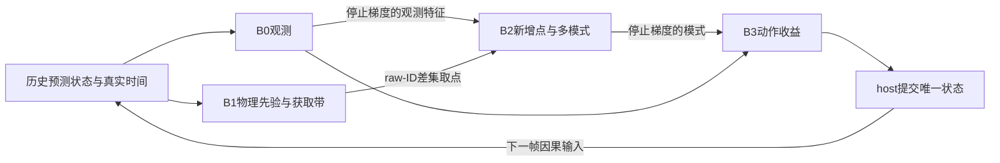

# CT-SeqTrack 最新问题：代码、创新、梯度耦合与漂移恢复审查

2026-09-17。基于当前 HEAD `93414e4`、工作区最新文档、实际四组 epoch60 结果、Git 演化、真实 checkpoint 诊断及本次新增 CPU/逐动作复算。当前方法是 **v30**，不能继续按早期 v24 的接口、损失和实验状态判断。

## 1. 先给出判断

**项目值得继续，主线也有研究价值，但当前版本并不是已经验证的最合适组合。应该修改，而且优先修改实际启用的目标与接口，而不是先全面删旧代码或解除所有隔离。**

最需要解决的是一条相互放大的链：**B0 弱观测下可能先跳错数米 → 带偏差的历史让 B1 物理预测从错误位置出发 → B2 取得正确新增证据的比例低 → B3 小步动作难以跨越失跟区域，而即时 S/P 又不给多数渐进恢复动作正收益。** 强梯度隔离限制共同学习，但不是这条链唯一、也不是第一处问题。

| 你的问题 | 本次判断 | 建议 |
|---|---|---|
| 是否存在很多冗余、重复和旧版本代码？ | 是。host 达9,349行、版本分支多、当前配置八层继承；还有无效开关和导出语义不一致。 | 清理有效接口、拆当前路径、隔离 legacy；不要按文件名版本号直接删除。 |
| 冗余是否直接降低模型效果？ | 不执行的旧代码不会自动改变网络输出。真正会影响效果的是错误启用、误导消融、重复目标和当前沿用的不合适设计。 | 将工程重构与方法修改分开验证。 |
| 反向传播是否有问题？ | 未发现整体反传失效或插件被冻结；**存在确定的目标函数退化，以及过强的部分梯度边界**。 | 先修 B0 motion/分类门，再开放 B1 acquisition→时序表示。 |
| B1 motion 能直接影响 B0 吗？ | 当前正式路径不直接融合本帧 B0。它影响获取，再经 B2/B3 和被接受的状态影响后续帧。 | 新增质量条件 prior-query 或特征残差接口。 |
| 能否按比例传入 B1 参数？ | 应融合输出、特征或 token；不同结构网络的参数没有可直接加权的对应语义。 | 显式坐标对齐、可靠性权重、物理监督与定位监督分工。 |
| 偏移最多能纠正多少？能完全恢复吗？ | B3 常规0.5秒单步最多修正XY约0.75m，半幅0.375m，Z/yaw不修；没有完全恢复保证。 | 分开局部微调与失跟重获取，联合解决证据、动作范围和未来价值。 |
| 动作幅度与收益目标是否不匹配？ | **是，且已从两组真实 Full 的逐动作数据定量确认。** 大偏移难获得即时收益，小偏移又缺细幅度。 | 显式连续收益/短未来收益对照，再引入质量条件恢复动作。 |
| 当前隔离、数据传播是否最合理？ | 适合共同 B0 的可归因插件实验，未证明最有利于整体性能。 | 保留 sigma、标签、离散几何和状态边界；按具体图边开放共同学习。 |
| 其他论文能否证明现在的组合最好？ | 能提供机制依据和对照，不能替代本项目闭环实验。 | 用论文定位问题和已有技术；用本项目实验决定模块取舍。 |

## 2. 当前进展：已经训练完成，完整 Full 效果仍待补评测

本次采用9月17日最新结果，覆盖较早文档中“未实跑”的状态：

- B0 BN重算false/true、Full-CfC、Full-GRU均完成60轮，每组B0更新75,720次；每个Full插件参数组更新18,000次。
- 四组12次验证曲线一致，final **Success=40.473742、Precision=47.840262**。
- 四组B0的320个参数/缓冲张量，包括84个BN缓冲，以及236个参数的Adam状态逐位相同。
- 这是隔离、确定性共同B0和**未校准Full回退 observation**共同导致的结果。两Full未加载策略，验证实际修正动作均为0；不是插件没训练，也不是四组串用了同一个结果文件。
- epoch58/59权重已保存，尚未完成对应评测，late-3未齐。BN重算true已验证节省约1.84GiB张量峰值，属于执行优化；当前默认仍为false。
- 本地旧GRU output目录误装了v29内容。本次GRU分析使用已只读取回的真实v30 `server_gru/`，没有混用旧目录。

**现有权重应补各自的策略拟合和闭环评测，不需要为此重新训练。新版本的明确目标修复可以同时推进。** 正式结果仍按固定final与late-3报告，不能挑不同模型各自最好的一轮。当前协议是在至少一个Full final60的S/P均超过同版本B0后进入后续full/KITTI，不额外增加未要求的seed门槛。

依据：[四组结果](artifacts/ct_checks/reports/20260917_v30_mini_four_arm/REPORT.md)、[真实权重根因](artifacts/ct_checks/reports/20260917_v30_root_cause/REPORT.md)、[模块实际作用](artifacts/ct_checks/reports/20260917_v30_coupling_hparams/REPORT.md)。

## 3. 冗余与 Git 历史：真正的问题是当前语义不够集中

本轮统计 `models/utils/datasets/tools/tests` 共221个Python文件、66,673行，其中测试15,100行。`models/seqtrack3d.py` 有9,349行、702个AST if节点；单个 `compute_loss` 2,092行、`forward` 1,570行。当前Full配置解析后424个键，具体实验到v24 base共八层。

Git表明，当前主要采用“增加版本能力、保留旧分派”的演化方式：

| 提交 | 改动对当前版本的意义 |
|---|---|
| `001951a` / `cd08b9d`，8月22日 | candidate协议与源码瘦身；清理大量外围资产，但host仍7,725行。 |
| `62e1f90`，8月24日 | 恢复SeqTrack B0，继续加入隔离与恢复逻辑。 |
| `b8222bb`，8月25日 | sigma/NLL学习修复、CfC；当前不确定性隔离有这个历史动因。 |
| `5225ff0`，8月28日 | 获取与证据恢复继续演化，获取头自引入时已隔离时序context。 |
| `a43a8ee`，9月5日 | v27 raw-ID、获取语义与utility；当前动作半径与H1标签已存在，合法H3行仍混合即时/未来监督。 |
| `69461f1`，9月8日 | v28共享观测reference batch与观测损失。 |
| `608f963`，9月10日 | v29修正帧布局，改变roll-in、物理motion目标与状态提交；q改为H1-only，H3退为诊断。 |
| `8b3a4df`，9月15日 | v30有效测量、三模式、六动作、长roll-in和跨数据集接口。 |
| `93414e4`，9月15日 | CUDA排序与masked BN显存修复；host增至9,349行。 |

**版本更新包含真实进步，也包含尚未证明适合的设计变化。** 比如保留真实1/2点、修正帧布局和去掉当前GT尺寸依赖值得保留；soft门、训练状态分布、六动作的尺度则需要单独审视。既不能因为v30更新就认为最好，也不宜整版退回旧高分配置。

当前旧代码大多通过分支禁用：旧motion fusion被formal配置关闭，v28+使用共享观测loss，v30的多模式与旧consensus互斥，单Adam路径代替旧多optimizer路径。**没有发现全部旧模块同时执行、全部旧loss叠加的证据。** 相同Tensor的多个输出别名也不等于多份大型显存。

但以下接口问题已核实：

1. **formal入口不完全封闭。** v30 B0设置 `use_point_feature_tc=True` 后仍通过scratch校验，并真实增加PFTC loss；Full却拒绝该组合。本次CPU实际前向得到该loss约0.128277、权重0.2。当前正式配置为false，所以不是已跑分数的原因。完整resume仍比较resolved config并拦截变化，不能误报为恢复校验绕过。
2. **旧CLI可让消融名不副实。** `--motion_v3_fusion_scale` 在v30没有所描述的融合控制作用；`--disable_uncertainty_geometry`控制旧搜索路径，不能代表当前B2 geometry消融。
3. **导出版本不一致。** `base_model.py`的proposal行仍按v29标记，endpoint schema却是v30；网络没有因此退回v29，但分析容易误读。
4. **无效继承字段与静默参数。** `ct_router_shadow_fraction`、`ct_search_activation_mode`、`ct_utility_init_probability`、`ct_exact_metric_audit`、`ct_evidence_label_box_scale`等没有对应当前生产消费路径；B3的 `**unused`还会吞掉旧参数及潜在拼写错误。
5. **存在真实复制。** nuScenes与通用时间协议多个函数AST相同，有限性检查已略有漂移；当前有效默认配置没有因此出错，但后续时间控制应该统一实现。
6. **单位别名容易误导。** 旧 `expected_iou_gain/expected_center_gain`实际映射Success/Precision收益，不能当连续IoU和米制距离改善；H3字段也不能凭名字理解为未来价值。

清理顺序建议：**先有效控制清单和统一schema → 拆出当前loss/训练事务/导出 → 后续版本使用短继承typed配置 → 隔离legacy适配 → 合并时间协议。** 保留旧24–30配置和历史output；`v27_input/v27_evaluation/v29_rollin/v29_policy`仍服务v30，不能按旧名字删。

纯重构要求固定batch的采样ID、mask、预测、loss、梯度，以及一次Adam更新保持一致；改变detach、loss或采样是方法修改。校准artifact绑定源码身份，清理前先完成现有评测，或在旧worktree完成，不要绕过校验。详见[冗余与接口专项](artifacts/ct_checks/reports/20260917_comprehensive_review/legacy_interfaces.md)。

## 4. 最高优先级：B0 当前有可复现的目标与弱观测问题

### 4.1 static raw motion无直接监督，soft门存在确定退化方向

当前raw motion只在moving行回归，但所有行的coarse采用 `p_moving * raw_motion`，并对整个XYZ/yaw一起乘概率。moving标签依据三维中心速度阈值，不包括旋转。

对被标为static的低速样本，设真实位移 `d=0.1m`：取 `raw=d/p`，coarse始终等于d，static raw回归为0，而分类loss随p下降继续变小。本次调用**实际生产loss**验证：

| moving概率p | raw X | 总loss |
|---:|---:|---:|
| 0.1 | 1m | 0.010536 |
| 0.01 | 10m | 0.001005 |
| 0.001 | 100m | 0.000100 |

这是目标允许的坏解，不是autograd计算错误。应在下一共同B0版本实施：

- 对所有合法运动标签回归raw物理位移，包括静态与低速行，采用明确历史有效mask。
- 将动静分类保留为辅助任务，解除它作为整个XYZ/yaw唯一乘法门的职责；“速度过阈值概率”不是通用运动可靠性。
- 如需运动收缩/融合，使用与连续误差和测量质量匹配的可靠性接口。
- 全行raw和coarse物理loss若变成同一函数，合并或明确总权重，避免无意翻倍。

### 4.2 已有真实权重证据：先错在motion，不能指望插件补救全部错误

此前实际epoch60权重和真实mini_val输入的前向已定位：轨迹14首次预测，历史只有1个真实点、当前0点，目标XY静止；raw X=5.619m、moving概率98.9%、coarse X=5.557m、final三维误差6.293m。**同状态只将raw motion置0，现有decoder误差降到0.0587m。**

这个真实例子是高p下错误预测，不是上面的低p数学反例；二者分别证明弱观测错误和目标退化。恢复argmax硬门没有救回轨迹14，因此不建议仅做soft→hard回退。

v28把同一真实1点清成无效、触发全空保持anchor；v30保留该点且不执行旧覆盖。仅恢复“全窗口空才hold”的条件救不了这个有效单点窗口。应**保留真实点，同时把有效性与可观测性分开**：motion/fusion读unique点数、当前与历史可见性、有效历史对；缺测时依赖可靠历史或受监督的缺测预测。首次只有一个历史框时B1也没有足够速度信息，不应强行相信其输出。

当前1个有效槽与1024个重复有效槽在这次eval中给出相同coarse，final仅约1e-6差异，不能说重复坐标被直接累加放大。人工全无效输入仍可被后续MLP偏置变成数米motion，说明mask正确归零还不够。

对比同population的v28：S由45.200219降至40.473742，P由47.242888升至47.840262；误差>2m预测帧513→775，这部分中位误差2.94→12.92m，同时≤0.5m帧603→701。问题更像**局部精度改善与严重失跟尾部并存**，不能仅优化平均loss。两条已定位轨迹贡献净S下降的31.11%，这是结果分解，不是单个代码变化的因果占比。

### 4.3 物理位移与定位纠偏需要明确分工

令上一真实位置为g，预测anchor为 `g+e`，真实位移为d。B0 coarse和B1物理监督要学d，而当前GT相对anchor的位置是 `d-e`。准确预测d仍保留e，final必须用观测估计纠偏。

当前final loss能经coarse角点query回到motion与分类门，所以motion同时承受物理与定位需求。**这条梯度不是天然错误**：[SeqTrack3D原文](https://arxiv.org/html/2402.16249v1)强调可微coarse-query的端到端作用；但v29改变目标以后，值得重新检查任务冲突。

先修4.1，再独立比较query梯度系数0/小值/1，或显式“物理先验 + 定位残差”。不要把query detach与所有其他修改打包后声称找到唯一原因。首帧e=0，所以这组目标冲突也不能解释首次6米跳跃。

### 4.4 角度目标有另一处确定别名

实际损失使用 `SmoothL1(sin(pred), sin(target))`。本次实际loss探针：target=0.3rad、pred=π−0.3rad时，角度loss约4e-15；两框模π仍相差0.6rad，并非同一姿态。当前配置是弧度，不是度/弧度错误。

建议使用成对sin/cos或 `1-cos(pred-target)`；若整个任务只区分无朝向矩形，则可用π周期的 `1-cos(2*(pred-target))`。同时解除yaw与平移动静门的绑定。该问题继承旧损失，目前未量化对Car分数的贡献，适合单独小对照。

### 4.5 训练分布与辅助任务值得后续检查

当前候选约25%teacher、62.5%短roll-in、12.5%长roll-in。真实roll-in值得保留，但从epoch0固定较高自身状态比例可能让尚未学会定位的B0频繁面对目标不可见的训练状态。建议在目标修复后对照相同最终比例的roll-in curriculum；所有启用模块仍从epoch0正常更新，不采用阶段冻结或额外预训练。

BC在所有有效点上监督到GT框的几何距离，包括漂移后的背景点；有效点不意味着含有足够目标身份信息。已有加权BC约占总loss27.53%，这不是梯度占比。先测BC与定位任务的共享梯度和按目标可见性分桶的误差，再决定重加权；不要直接删除。历史box query缺少直接self-attention是另一个可做架构对照的点，但已有历史点通路，不能据此说网络完全没使用历史。

## 5. 偏移到底能修多少：必须区分四种量

| 模块/量 | 当前边界 | 它实际上意味着什么 |
|---|---|---|
| B1运动增量 | 运动学项限12m；学习残差最大平行4m、垂直3m，总增量宽松范数界17m | 从历史anchor出发的位移，**不是纠正17m定位偏差**。 |
| B1常规学习残差 | dt=0.5s、速度差0时，平行约0.375m、垂直0.275m，范数约0.465m | 对运动学预测的修补，不直接改B0框。 |
| B1新增获取带 | 实际B0 crop与预测终点框的并包络外，再加平行/垂直0.25至4/3m | 是取点几何；不是距B0中心固定4m球，也不是最终动作。 |
| B2 vote | 每轴半径 `max(0.5*sqrt(l²+w²)+0.5, 4)`，模式由投票聚合 | 能给出较远模式，模式正确性决定是否可用；最终仍被B3限幅。 |
| B3实际动作 | `r=min(0.5+0.5*dt,2)m`，三个模式各半幅/全幅 | 正常0.5s最多XY 0.375/0.75m；Z、yaw、尺寸沿用B0。 |

B3准确公式为：

`delta(k,a) = a * min(1, r/||mode_k - observation||) * (mode_k - observation)`，其中a为0.5或1，只取XY。先clip再乘幅度，保证远模式仍有两个不同幅度；简单交换运算次序会让远模式半幅/全幅重合。

若XY误差为e_xy、竖直误差为e_z，本帧理想方向下：

`d_after >= sqrt(max(e_xy-r,0)^2 + e_z^2)`。

只知道三维距离d也有 `d_after >= d-r`。因此 **d>2+r时，本帧任何合法动作都不能进入Precision的2m范围**。实际共同2179个预测端点中有730个满足这一条件；这是共同B0的一批状态，不能把两Full相加当作两倍独立样本。

6.293m错误在r约0.75m时，单步最好仍至少约5.54m。理想不再出错、证据持续正确且只考虑可修正方向，约需6步才可能进入2m、9步才可能消除这一级距离。真实闭环里每次动作又改变下帧crop和B0输出，这个累加估计**不构成实际恢复保证**。

即便误差小于r，六个离散方向/幅度也未必正好命中；Z/yaw错误无法被B3消除。完整恢复取决于目标重新可见、身份可靠、模式正确、动作可达和后续决策共同成立。

## 6. 动作幅度与收益不匹配：现在已有充分证据应修改

### 6.1 当前不是错误地给未限幅框打标签，而是目标设计不适合部分恢复状态

本次核对发现，六动作标签使用**实际限幅后的框**，训练与执行几何一致。真正问题是主决策 `q=0.5*(预测ΔSuccess+预测ΔPrecision)`，只评价当步离散积分指标。

当距离20m→19.3m，仍无交叠且仍>2m，即时收益为0；小变化未跨指标阈值也可能为0。Success是21个阈值的积分，不等于连续IoU；IoU=0时有0阈值底值，因此应说“ΔS=0”，不应把绝对Success贡献也写成0。

当前确有连续距离和IoU辅助头，它们训练共享trunk，但**没有直接进入q**；help/harm同样如此。字段 `ct_b3_h3_utility/residual`是兼容别名，v30没有六动作未来价值监督，现有shadow是诊断。

Git也解释了这个取舍：v27曾在合法H3行混合即时与未来loss，v29为消除同一个q的回报语义混淆，改为仅即时q并用闭环校准选策略，见[当时改动依据](docs/CTSEQTRACK_V29_CHANGE_AUDIT.md)。这使目标更清楚，但没有消除长失跟的即时平台。因此建议的是**独立、明确的未来价值头和统一后续策略**，而非原样恢复旧的混合目标。

### 6.2 两组真实Full逐动作复算

这些是已保存B0/never轨迹上的同状态反事实；本次没有重新运行闭环。

| 指标 | Full-CfC | Full-GRU |
|---|---:|---:|
| 有合法动作的预测端点 | 2030/2179 | 2020/2179 |
| 合法动作总数，含半/全幅 | 11,444 | 11,340 |
| 距离改善动作 | 3,592 | 3,667 |
| 距离改善但H1无正收益 | **63.81%** | **63.81%** |
| 失跟后距离改善动作中H1=0 | **1644/1687，97.45%** | **1664/1707，97.48%** |
| 连续失跟≥8帧时，上述比例 | **958/964，99.38%** | **960/966，99.38%** |
| 有效模式全幅贴r边界 | **5714/5722，99.860%** | **5663/5670，99.877%** |
| B0误差<r/4且所有模式贴边的端点 | **260** | **259** |

失跟长度是进入本帧前连续IoU≤0的离线GT统计，不能作为在线模型输入。贴边以2e-5浮点容差复核，不冒充每模式未导出的raw norm测量。

这里存在两个方向的错配：

- **远距离恢复**：lost>0时约97.5%的距离改善动作无H1正收益；CfC全部“改善距离但U=0”动作平均实际改善0.340m，不是浮点噪声。
- **近距离微调**：几乎所有模式贴边，六动作常退化成三个方向各约0.375/0.75m。若d<r/4，最小非零动作r/2也会使距离变差。本次260/259个状态已逐动作验证，最轻微恶化仍约0.0308/0.0287m。

这不要求准确状态一定采取微调，保持observation当然合理；它说明当前动作空间无法表达许多可能有用的细修正。

### 6.3 扩大动作之前，必须同时解决B2候选质量

CfC获取漏斗：全局存在新增目标486帧→最大范围可达176帧→实际获取129帧→768池122帧→256池仍122帧→有正确模式45帧。GRU对应486→173→122→115→115→47。

所有有效模式中，正确模式仅CfC90/5722、GRU93/5670，采用现有诊断的正确性定义。高贴边率说明模式相对B0较远，正确模式比例则另外说明候选质量不足。无条件证据优先全幅的同状态ΔS/ΔP，CfC约为−11.234/−10.416个百分点。**统一把r扩大到4–6m很可能放大错误执行。**

可执行修改顺序：

1. **固定动作集合，显式测试连续收益进入选择。** 例如独立 `q_recover=q_SP+lambda*dense_gain`，dense_gain为归一化距离减少或log距离改善；保持q_SP单独可报告。lambda和门槛只在允许的内部拟合数据选择，官方val只评测。几何改善不总意味着IoU改善，害处仍需明确计入。
2. **独立未来效用头。** 对动作/不动分叉后，在统一后续策略下递归两步，学习未来ΔU；区分未抽样、终止和真实零。当前一条H3诊断候选不能直接当六动作标签，需补候选覆盖，可登记抽样1–2个动作控制成本。
3. **局部/恢复两个动作族。** 局部加入更细幅度；恢复在身份、独立点数、紧致度和可靠性足够时允许较长步或到达模式，所有候选按实际执行框计算标签。在线切换只用可见信息，不能读GT lost长度。
4. **针对获取与模式构建各自的损失环节。** 先查129→45等阶段的身份、投票几何和质量排序；对于486→176的范围损失，研究质量条件分层搜索/多假设。扩大空间必须配套背景拒绝及计算预算。

已有模式上的oracle可以帮助决定先改哪里：同状态GT选择六动作或不动，按全部2285端点（含106个初始化端点）平均，即时U改善约CfC+1.619、GRU+1.699个百分点；若只按2179个预测端点平均，则为+1.698/+1.781。它是固定状态下候选能力，**不是可部署成绩，也不是完整闭环上限**。下一步应比较“微幅/大幅候选oracle是否明显增加可用收益”，再投入对应训练。

完整公式、分桶与复算产物见[动作恢复专项](artifacts/ct_checks/reports/20260917_comprehensive_review/action_recovery.md)。

## 7. 数据传播和梯度隔离：应按边界分别调整

当前使用一个Adam，B0/B1/B2/B3参数组不相交；机制流额外B0为eval/no_grad，但观测流B0正常学习。B1 prepass不建图，随后会重做可微查询。detach不等于参数冻结。

B1没有把新增点送入B0的1024点输入。当前耦合主要通过几何、证据、候选和状态发生，而不是三个插件连续改写B0主干。接受动作会影响未来数据，但递归状态转成detach/CPU对象后，未来loss不能反传到过去动作；B1仍有窗口内时序反传。

| 隔离位置 | 判断 | 建议 |
|---|---|---|
| sigma误差与共享context detach | 有明确保护mean的理由，历史NLL问题也支持 | 保留；必要时加独立uncertainty adapter。 |
| acquisition→时序context detach | **值得首先重新考虑**：获取头能读时间表示，却不能让它为获取任务改变 | 开放梯度系数0/0.25/1对照。 |
| B3→B2全部detach | 有利于固定候选目标，但阻止收益塑造证据表示 | 先只开放pooled mode feature旁路。 |
| GT标签、模式成员/几何、离散crop/top-k | 保持目标与输入边界有必要；硬操作本身不可微 | 保留明确标签/几何边界；不要以为删除detach就能贯通。 |
| 机制B0的BN/RNG与观测流隔离 | 对共同B0归因实验合理，已验证确实等价 | 插件实验保留；新联合模型另定义训练所有权。 |
| 全轨迹状态无BPTT | 控制内存和训练复杂度，不是反传bug | 先用有限未来目标改善策略；暂不需要全轨迹展开。 |

本次真实B1类的CPU梯度探针：mean→GRU/CfC梯度非零；sigma/acquisition→时序均严格0。将获取输入改成：

`h_acq = h.detach() + gamma * (h - h.detach())`

同权重、同输入的探针中，gamma=0.25/1时获取前向完全不变，时序梯度恰为1:4。GRU梯度L2约0.008119/0.032477，CfC约0.022279/0.089115。说明这条边可以精确开放，不需要大改网络；训练后的模型当然可能不同。

**监督loss回到历史编码器本身不是GT泄露**；关键是推理输入仍然因果、标签不进入前向。先观测mean/acquisition共享梯度夹角和范数，再决定是否需要PCGrad等；无需一开始加复杂梯度处理。

B3→B2建议仅让收益梯度进入固定成员池化的模式特征，继续detach动作框、成员、中心和收益标签。这样能学“哪些证据值得行动”，不会通过移动监督目标取巧。但S/P为零的标签平台不会因为梯度开放自动消失，动作/目标问题仍要独立修复。

详见[梯度与融合专项](artifacts/ct_checks/reports/20260917_comprehensive_review/gradient_coupling.md)。

## 8. B1如何直接帮助B0：建议显式融合，优先prior-query

用户提出的方向可以做，**但应融合信息，不是混合异构网络权重**。当前旧 `ReliabilityGatedProposalFusion`代码仍在，却被formal配置禁用，不能认为已经具备这条能力。

推荐新版本建立一个明确接口：

1. 将B1均值、sigma、时序特征、dt与有效性转换到B0相同anchor坐标/时间单位。
2. 通过投影形成prior token，或 `q_new=q_B0+alpha*P(h_B1,mu,sigma,dt,valid)`，由decoder结合真实点测量处理。
3. alpha根据当前测量质量、有效历史对、先验与B0未融合coarse/query的分歧等因果信息学习；无可靠历史对时mask先验。不能读取本次融合后的final来决定先前query的权重，造成前向循环。先验应有身份标识，不能伪装成测量点。
4. 先比较detached prior与可微prior，再开放受控梯度；保留B1自己的物理运动监督，防止物理语义被完全吞掉。

FiLM/残差特征也是合理备选，可对少量decoder层使用零初始化残差投影。所有参数从epoch0正常训练；同时给同参数量B0 adapter对照，区分容量和先验的贡献。

低成本诊断可用 `x=(1-alpha)*x_B0+alpha*(anchor+mu_B1)`，但固定比例不是首选：B1与B0共享错误历史，先验可能把已经纠正的观测拉回去。B1 sigma只刻画位移不确定性，没有完整anchor状态协方差，双方误差也不独立，不能直接套逆方差就称最优融合。

若启用B1→B0的联合定位梯度，应在新的训练流中真实执行它，并承认B0会与独立baseline不同。**“联合模型更强”与“共同B0插件贡献”是两个实验问题**，不应为了继续保持逐位相等而把新融合路径又切断。公平性通过同数据、预算、初始化规则和消融保证，所有启用模块仍从头训练。

## 9. 当前创新点如何定位，哪些应保留

建议将论文主线收敛为：**面向不规则时间与弱观测的3D跟踪，按实际主裁剪缺失获取新增测量，形成多模式证据，并学习何时及如何修正递归状态。**

| 模块 | 当前最值得保留的内容 | 需要改变或尚未证明的内容 |
|---|---|---|
| B0 | 真实测量mask、保留1/2点、修正帧布局、初始尺寸协议、共同基线 | 物理motion监督、分类门、弱观测行为；这是基础正确性，别包装成插件带来的涨分。 |
| B1 | 真实Δt、物理增量+有界残差、以实际B0 crop为基准的获取 | acquisition应能塑造时间表示；CfC相对GRU尚无本任务优势证据；物理先验不能替代重定位。 |
| B2 | 整个B0 raw crop的ID差集、unique证据归约、三模式及模式质量 | 模式正确率与排序是瓶颈；token数量/多模式数量本身不是创新证明。 |
| B3 | 同状态反事实动作收益、显式不动选项、实际执行框标签与校准选择 | 固定半/全幅、仅H1 q与恢复不匹配；未来价值、细微动作和可靠重获取值得研究。 |
| 系统 | 唯一状态提交、可追踪获取→证据→动作链 | 从“严格隔离插件”走向联合优化时，需要清晰的新目标与实验身份。 |

CfC不是创新的唯一支点；时间获取是否确实更好、扩展证据是否确实正确、动作是否改善闭环，才决定组合价值。已有记忆、运动预测、扩展搜索、投票和选择性更新文献很多，当前组合的最接近新颖点是**围绕真实观测缺口与行动收益的一致设计**，新颖性强度还需要更完整的相关工作比较。

当前mini内部calib/dev来自训练场景拆分，不应称为相对训练的完全独立泛化集；官方mini_val保持只评测。校准是本方法组成部分，缺artifact回退合理，但训练结束后缺少自动衔接拟合/评测，会让“已训练Full”长期只得到B0分数，这个工具流程应补齐。

## 10. 相关论文能支持什么，其他方法怎么处理

| 论文 | 与本项目最相关的机制 | 对当前选择的启示 |
|---|---|---|
| [SeqTrack3D，2024](https://arxiv.org/html/2402.16249v1) | coarse框角点query、历史序列、可微定位 | query梯度有依据；改了coarse目标以后需要重新对照，不能直接判错。 |
| [M²-Track，CVPR 2022](https://arxiv.org/abs/2203.01730) | 运动估计后结合运动辅助形状信息精修 | 物理预测与测量纠偏分工，比要求一个motion输出同时承担两者清楚。 |
| [MBPTrack，ICCV 2023](https://arxiv.org/abs/2303.05071) | 历史特征/targetness、memory、框先验与投票 | 记忆和框先验已有充分先例，CT需展示新增证据与动作决策的独立贡献。 |
| [HVTrack](https://arxiv.org/html/2408.02049v2) | 大时间变化、相对姿态记忆、Base-Expansion交叉注意力及背景抑制 | 时间变化测试应覆盖搜索需求与背景干扰；扩大范围本身不充分。 |
| [ChronoTrack，2026](https://arxiv.org/html/2604.13789v1) | 紧凑长记忆、时间一致性与cycle约束 | 检查漂移污染和记忆一致性，再考虑增加memory数量；Base-Expansion属于HVTrack。 |
| [Closed-form continuous-time neural networks，Nature MI 2022](https://www.nature.com/articles/s42256-022-00556-7) | 显式时间的闭式动力学 | 支持CfC动机，不证明它在CT优于带Δt的GRU。 |
| [Faithful Heteroscedastic Regression，AISTATS 2023](https://proceedings.mlr.press/v206/stirn23a.html) | 避免方差学习损害均值，隔离相关梯度 | 支持保留sigma保护；不能借此证明获取任务也必须隔离。 |
| [DAgger，AISTATS 2011](https://proceedings.mlr.press/v15/ross11a.html) / [AggreVaTe](https://arxiv.org/html/1406.5979v1) | 自身访问状态训练、未来代价监督 | 支持roll-in与未来动作价值方向，不证明当前固定混合比例和H1足够。 |
| [Differentiable Particle Filters，RSS 2018](https://roboticsproceedings.org/rss14/p01.html) / [KalmanNet，2022](https://arxiv.org/abs/2107.10043) | 结构化状态估计与学习组件相结合 | 支持经明确定义的可微接口融合先验/测量，不支持异构参数直接平均。 |
| [LTMU，CVPR 2020](https://arxiv.org/abs/2004.00305) | 局部跟踪、验证、重检测、更新决策 | 可借鉴正常跟踪/失跟重获取的职责分离；这是2D长期跟踪，不是3D效果证据。 |

这些方法通过更好的测量、搜索、记忆、重检测或未来目标提高恢复机会，没有一篇能够保证在任意漂移、遮挡和目标不可见状态下完全恢复。详细适用边界与补充文献见[文献依据](artifacts/ct_checks/reports/20260917_comprehensive_review/literature.md)。

## 11. 建议的下一轮实施与实验顺序

不建议先开展大范围结构重写。先把确定问题和高信息量对照做完：

| 顺序 | 具体工作 | 要回答的问题 |
|---|---|---|
| 立即 | 用现有Full-CfC/GRU权重补独立策略拟合、final与58/59闭环评测 | 当前机制实际执行以后是否已有收益？无需重训。 |
| 第一版方法修改 | 新共同B0：全行物理motion、分类门职责；显式弱观测质量输入。yaw目标独立对照 | 能否降低首次大跳与长失跟尾部，同时维持正常定位？ |
| 第一组耦合实验 | B1 acquisition梯度系数0/0.25/1，保留sigma隔离 | 获取目标能否让时序表示更有用，是否损害均值？ |
| 第一组动作实验 | 固定候选：当前H1 vs 显式连续收益 vs 独立短未来目标 | 无正标签的平台和时域限制哪个更关键？ |
| 随后 | 先做候选oracle，再训练微幅/可靠恢复动作；同步定位B2获取后模式损失 | 候选质量与动作可达性各有多少改进空间？ |
| 随后 | B3→B2特征旁路，保持几何/标签边界 | 下游收益能否改善证据表示与有益动作排序？ |
| 联合版本 | prior-query，先detached再可微；同容量B0 adapter对照 | B1直接帮助B0的收益来自先验信息还是额外容量？ |
| 工程并行 | 有效CLI/schema、接口清理、职责拆分 | 让每次调参确实改变预期功能，降低实验误读。 |

每轮只改变要回答的因素；不需要把所有组合做成巨大网格。所有新正式臂从epoch0随机初始化，启用参数全程更新；旧权重只用于诊断和完成它自己的评测，不作为新方法热启动。

除整体S/P，关键诊断应包括：首次大跳概率、静态/动态与点数分桶、失跟长度和恢复时间、目标可达率/实际获取率/正确模式率、按初始误差与动作长度的即时/未来收益、误纠正率、B1共享梯度夹角/范数。GT仅用于训练标签和离线评价，不能驱动部署分支。

时间贡献继续做true/fixed/shuffled，并按nuScenes和KITTI对应采样间隔测试；CfC/GRU保持相同因果输入、预算和策略拟合协议。学习率调节可以后做，目前没有证据将主问题归为Adam选择或“18,000次插件更新太少”。loss乘0.2也不等于Adam学习率简单乘0.2，不能用权重数值代替真实梯度和更新统计。

## 12. 本次检查与交付范围

本次新增并实际执行三类诊断：

- [梯度探针](artifacts/ct_checks/reports/20260917_comprehensive_review/probe_gradient_coupling.py)：真实B1类的梯度连通/缩放、生产loss的soft门退化、sin-only角度别名；[结果JSON](artifacts/ct_checks/reports/20260917_comprehensive_review/probe_gradient_coupling.json)。
- [动作复算](artifacts/ct_checks/reports/20260917_comprehensive_review/analyze_action_recovery.py)：双Full全部合法动作、失跟/点数分桶、幅度与距离不等式检查；[结果JSON](artifacts/ct_checks/reports/20260917_comprehensive_review/action_recovery_stats.json)及同目录CSV。
- [接口与历史检查](artifacts/ct_checks/reports/20260917_comprehensive_review/inspect_legacy_interfaces.py)：AST规模/重复、Git节点、实际PFTC前向、formal与完整resume正反检查；[结果JSON](artifacts/ct_checks/reports/20260917_comprehensive_review/legacy_interfaces_evidence.json)。

三类脚本均执行完成；未修改模型、正式配置、历史output或现有用户改动，未启动服务器任务。本次没有以文档审查为由重新运行全套pytest，也没有运行要求旧HEAD的slimming门。新增探针证明接口、目标和几何事实，建议方案的涨分仍由上述正式实验验证。

**最值得立即投入的方向：修好B0物理motion与弱观测行为，开放B1获取对时序表示的监督，再让B3具备与恢复目标匹配的证据、动作和收益。代码清理应帮助这条研究主线更快验证，而不是替代它。**
